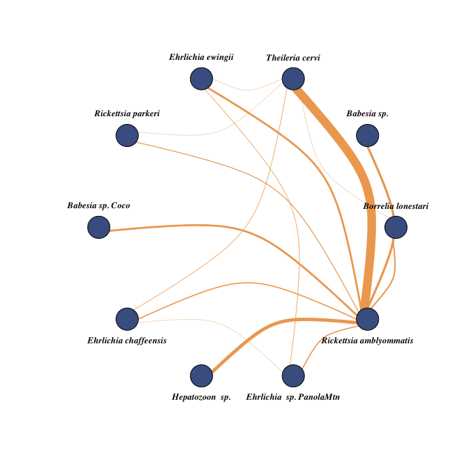

Amblyomma americanum microorganism coinfeciton network
================
Kimberly Ledger
3/11/2022

this code creates a network plot of pathogen co-infections found in
Amblyomma americanum

libraries

``` r
library(tidyverse)
library(igraph)
library(intergraph)
library(ggnetwork)
```

read in the data - this is an edge list where each row represents a
connection between a microbe in the column (micro1) and another column
(micro2)

``` r
edge_data <- read.csv("AA_pathogen_edgelist.csv")
```

make object with just co-infections

``` r
links <- edge_data[,c(4,5)]
```

create network object

``` r
network <- graph_from_data_frame(d=links, directed = F)
```

plot it

``` r
plot(network)
```

<!-- -->

plot in a circle

``` r
plot(network, layout = layout_in_circle(network))
```

<!-- -->

make an adjacency matrix

``` r
adj_mat <- get.adjacency(network)
adj_mat
```

    ## 10 x 10 sparse Matrix of class "dgCMatrix"
    ##                                                
    ## Borrelia lonestari       . .  1 . . . .  . .  5
    ## Babesia sp.              . .  . . . . .  . .  8
    ## Theileria cervi          1 .  . 1 1 . 2  . . 31
    ## Ehrlichia ewingii        . .  1 . . . .  . 2  7
    ## Rickettsia parkeri       . .  1 . . . .  . .  3
    ## Babesia sp. Coco         . .  . . . . .  . .  7
    ## Ehrlichia chaffeensis    . .  2 . . . .  . 1  4
    ## Hepatozoon  sp.          . .  . . . . .  . . 12
    ## Ehrlichia  sp. PanolaMtn . .  . 2 . . 1  . .  4
    ## Rickettsia amblyommatis  5 8 31 7 3 7 4 12 4  .

try making a prettier plot - weight the connections by coinfections

``` r
plot(network, vertex.label.color="black", 
     vertex.label.cex=.5,vertex.label.dist=0.2, 
     edge.curved=0.5, edge.width = E(network)$weight,
     layout=layout_in_circle(network))
```

<!-- -->

``` r
g2 = simplify(network)

E(g2)$weight = sapply(E(g2), function(e) { 
    length(all_shortest_paths(network, from=ends(g2, e)[1], to=ends(g2, e)[2])$res) } )

coinfection_plot <- plot(g2, 
     vertex.size = 15, vertex.color = "#486090", vertex.frame.color = "black",
     vertex.label.cex=.8, vertex.label.dist= 2,
     vertex.label.color = "black",
     vertex.label.font = 4, 
     vertex.label.degree = c(-pi/2,-pi/2,-pi/2, -pi/2,-pi/2,-pi/2, pi/2, pi/2, pi/2 , pi/2),
     edge.curved=0.5, edge.width = E(g2)$weight/2.5, edge.color = "#f0a860",
     layout=layout_in_circle(network))
```

<!-- -->

``` r
coinfection_plot
```

    ## NULL
