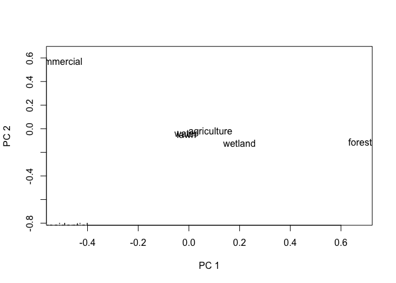

PCA of landcover composition in Alachua Co. Florida
================
Kimberly Ledger
3/3/2022

this code runs a principal components analysis (PCA) using land cover
composition proportions using a 1km buffer around potential tick
collection sites in Alachua County, Florida

last update: 20 May 2022

load libraries

``` r
library(tidyverse)
library(ggplot2)
library(ggbiplot)
```

read in the data

``` r
lc <- read.csv("AlCo_landcover_allscales_sort.csv")
head(lc)
```

    ##                                                            Site sampled Site_ID
    ## 1                Paynes Prairie Preserve State Park (Northside)      No    <NA>
    ## 2             San Felasco Preserve State Park (S of Millhopper)      No    <NA>
    ## 3                      Devils Millhopper Geological State Park       No    <NA>
    ## 4 Devils Millhopper Geological State Park (Trail around ravine)      No    <NA>
    ## 5                      Devils Millhopper Geological State Park       No    <NA>
    ## 6                                     Loblolly Woods (N of 8th)      No    <NA>
    ##   Field_Type p100m_1    p100m_2   p100m_3     p100m_4    p100m_5    p100m_6
    ## 1    Natural       0 0.01929261 0.9453376 0.000000000 0.00000000 0.00000000
    ## 2    Natural       0 0.08306709 0.9169329 0.000000000 0.00000000 0.00000000
    ## 3  Manicured       0 0.19551282 0.8012821 0.003205128 0.00000000 0.00000000
    ## 4  Manicured       0 0.02875399 0.9361022 0.000000000 0.01277955 0.02236422
    ## 5    Natural       0 0.16720257 0.7909968 0.041800643 0.00000000 0.00000000
    ## 6    Natural       0 0.00000000 1.0000000 0.000000000 0.00000000 0.00000000
    ##      p100m_7 p250m_1    p250m_2   p250m_3    p250m_4    p250m_5     p250m_6
    ## 1 0.03536977       0 0.04638124 0.6595311 0.00000000 0.01478084 0.012232416
    ## 2 0.00000000       0 0.05359878 0.9464012 0.00000000 0.00000000 0.000000000
    ## 3 0.00000000       0 0.12474542 0.6278004 0.08146639 0.16496945 0.001018330
    ## 4 0.00000000       0 0.11309221 0.6826286 0.00000000 0.19103413 0.006622517
    ## 5 0.00000000       0 0.10443199 0.6734590 0.08813041 0.13346918 0.000509424
    ## 6 0.00000000       0 0.06714140 0.8362157 0.00000000 0.09664293 0.000000000
    ##       p250m_7 p500m_1    p500m_2   p500m_3     p500m_4    p500m_5     p500m_6
    ## 1 0.267074414       0 0.02790164 0.5535737 0.000000000 0.02968531 0.023697286
    ## 2 0.000000000       0 0.10455935 0.8536679 0.027763627 0.01388181 0.000000000
    ## 3 0.000000000       0 0.23932713 0.3507073 0.022046642 0.36995030 0.002166433
    ## 4 0.006622517       0 0.14429573 0.5296367 0.021797323 0.26233270 0.002166985
    ## 5 0.000000000       0 0.23230907 0.3478261 0.022057886 0.38148668 0.002167538
    ## 6 0.000000000       0 0.11818645 0.5247071 0.003948039 0.35315843 0.000000000
    ##       p500m_7     p1km_1     p1km_2    p1km_3      p1km_4     p1km_5
    ## 1 0.365142056 0.03828757 0.02930496 0.4200803 0.000000000 0.05370453
    ## 2 0.000127356 0.00006370 0.06133894 0.8747092 0.020552528 0.01080203
    ## 3 0.015802217 0.00000000 0.26686843 0.3031539 0.005511309 0.39057024
    ## 4 0.039770554 0.00000000 0.27752827 0.3054308 0.005510432 0.36668259
    ## 5 0.014152748 0.00000000 0.26181297 0.3001434 0.005512187 0.39684563
    ## 6 0.000000000 0.00000000 0.20042664 0.2824440 0.034449822 0.47456062
    ##        p1km_6      p1km_7   p1.5km_1   p1.5km_2  p1.5km_3    p1.5km_4
    ## 1 0.029432376 0.429190291 0.06122680 0.03182378 0.3720183 0.004883988
    ## 2 0.001178982 0.031354555 0.07596155 0.05128750 0.7356210 0.009130675
    ## 3 0.002676011 0.031220134 0.00000000 0.20871264 0.2758626 0.003312899
    ## 4 0.005096353 0.039751553 0.00000000 0.20762250 0.2700013 0.003921680
    ## 5 0.002198502 0.033487335 0.00000000 0.20814396 0.2776905 0.002732589
    ## 6 0.000000000 0.008118951 0.00000000 0.25220456 0.1537177 0.047049498
    ##     p1.5km_5    p1.5km_6    p1.5km_7      p2km_1     p2km_2    p2km_3
    ## 1 0.04388511 0.026982262 0.459179773 0.052440034 0.02995094 0.3685376
    ## 2 0.07192707 0.004006172 0.052066081 0.144366674 0.04931400 0.6521743
    ## 3 0.41752439 0.013251596 0.081335919 0.000238903 0.19536687 0.2871852
    ## 4 0.40452763 0.009542282 0.104384636 0.000000000 0.17542728 0.3091302
    ## 5 0.41749140 0.013181554 0.080760028 0.000430053 0.19479795 0.2916713
    ## 6 0.54258376 0.000000000 0.004444507 0.000000000 0.29047156 0.1348681
    ##        p2km_4    p2km_5      p2km_6      p2km_7    p2.5km_1   p2.5km_2
    ## 1 0.018244513 0.0340681 0.048275093 0.448483738 0.049495464 0.03372235
    ## 2 0.005136045 0.1069810 0.005478449 0.036549533 0.131092480 0.05489157
    ## 3 0.011093061 0.4037540 0.013641359 0.088720595 0.007706069 0.18285604
    ## 4 0.006666030 0.3846626 0.012081681 0.112032303 0.004923071 0.17596155
    ## 5 0.011006164 0.4014144 0.013459057 0.087221063 0.008949230 0.18182837
    ## 6 0.045460337 0.5173114 0.005183864 0.006704783 0.000000000 0.32387339
    ##    p2.5km_3    p2.5km_4   p2.5km_5    p2.5km_6    p2.5km_7     p3km_1
    ## 1 0.3634441 0.019223321 0.03882377 0.060355723 0.434935277 0.03864300
    ## 2 0.6646925 0.005856120 0.11120512 0.003924467 0.028337708 0.12995268
    ## 3 0.3044101 0.007099572 0.39693898 0.010764032 0.090225219 0.01632678
    ## 4 0.3171762 0.007099211 0.38022312 0.011762368 0.102854464 0.02269429
    ## 5 0.3073928 0.007099247 0.39419931 0.010982683 0.089548359 0.01737478
    ## 6 0.1412162 0.029414313 0.48923972 0.006543309 0.009713042 0.00000000
    ##       p3km_2    p3km_3      p3km_4     p3km_5      p3km_6     p3km_7
    ## 1 0.03910312 0.3468561 0.020061231 0.06011999 0.057769834 0.43744669
    ## 2 0.06862173 0.6500359 0.005772450 0.11824498 0.003164053 0.02420819
    ## 3 0.17759484 0.3154575 0.005011644 0.38622930 0.014164266 0.08521565
    ## 4 0.16824993 0.3341285 0.004930310 0.36676483 0.012628390 0.09060374
    ## 5 0.17707478 0.3174887 0.004965739 0.38394045 0.014235354 0.08492015
    ## 6 0.36586523 0.1386646 0.021367854 0.45135787 0.007095486 0.01564900
    ##      p3.5km_1   p3.5km_2  p3.5km_3    p3.5km_4   p3.5km_5    p3.5km_6
    ## 1 0.031287461 0.04945354 0.3347748 0.014738807 0.07979187 0.052199510
    ## 2 0.122935751 0.08211231 0.6509310 0.006843776 0.10959923 0.003159266
    ## 3 0.040227688 0.18127943 0.3220113 0.004209995 0.36686247 0.013805352
    ## 4 0.048311980 0.17857932 0.3292854 0.004194371 0.35211916 0.014850623
    ## 5 0.040546584 0.18005305 0.3240424 0.004196895 0.36568115 0.013901240
    ## 6 0.000787825 0.38230851 0.1365824 0.018767404 0.43488740 0.006549611
    ##     p3.5km_7      p4km_1     p4km_2    p4km_3      p4km_4     p4km_5
    ## 1 0.43775402 0.024745774 0.07675968 0.3129673 0.011932918 0.09715951
    ## 2 0.02441866 0.143412018 0.07953399 0.6251331 0.008471016 0.10034820
    ## 3 0.07160372 0.044252844 0.18704088 0.3328569 0.004331917 0.35477924
    ## 4 0.07265910 0.046103555 0.18735268 0.3443134 0.004640616 0.33679206
    ## 5 0.07157865 0.044278548 0.18614429 0.3345437 0.004228380 0.35429607
    ## 6 0.02011685 0.001096878 0.38410423 0.1343227 0.017569948 0.43399723
    ##        p4km_6     p4km_7
    ## 1 0.044349284 0.43208549
    ## 2 0.003270947 0.03983070
    ## 3 0.013815949 0.06292229
    ## 4 0.013155380 0.06764230
    ## 5 0.013861682 0.06264732
    ## 6 0.008231559 0.02067744

this is the landcover classification

-   1 = Agriculture
-   2 = Commercial
-   3 = Forest
-   4 = Lawn
-   5 = Residential
-   6 = Water
-   7 = Wetland

sampling site selection was based on PC1 using land cover proportions
using a 1km buffer around all potential sites

filter data to only include land cover at 1km

``` r
lc_1km <- lc[,c(26:32)]
head(lc_1km)
```

    ##       p1km_1     p1km_2    p1km_3      p1km_4     p1km_5      p1km_6
    ## 1 0.03828757 0.02930496 0.4200803 0.000000000 0.05370453 0.029432376
    ## 2 0.00006370 0.06133894 0.8747092 0.020552528 0.01080203 0.001178982
    ## 3 0.00000000 0.26686843 0.3031539 0.005511309 0.39057024 0.002676011
    ## 4 0.00000000 0.27752827 0.3054308 0.005510432 0.36668259 0.005096353
    ## 5 0.00000000 0.26181297 0.3001434 0.005512187 0.39684563 0.002198502
    ## 6 0.00000000 0.20042664 0.2824440 0.034449822 0.47456062 0.000000000
    ##        p1km_7
    ## 1 0.429190291
    ## 2 0.031354555
    ## 3 0.031220134
    ## 4 0.039751553
    ## 5 0.033487335
    ## 6 0.008118951

log transform and apply z-score standardization to the data

``` r
lc_1km_log <- log1p(lc_1km)   
z_lc <- lc_1km_log
```

update column names

``` r
colnames(z_lc) <- c("agriculture", "commercial", "forest", "lawn", "residential", "water", "wetland")
```

run a PCA using the function princomp from the stats package

``` r
lc_pca <- princomp(z_lc, cor=F)
#cor=F, because we are using the covariance matrix instead of the correlation matrix 

summary(lc_pca)
```

    ## Importance of components:
    ##                           Comp.1    Comp.2     Comp.3     Comp.4      Comp.5
    ## Standard deviation     0.2456438 0.1177833 0.08908479 0.06842202 0.022253109
    ## Proportion of Variance 0.6892758 0.1584706 0.09065433 0.05347775 0.005656696
    ## Cumulative Proportion  0.6892758 0.8477464 0.93840072 0.99187847 0.997535168
    ##                             Comp.6       Comp.7
    ## Standard deviation     0.011723804 0.0088504129
    ## Proportion of Variance 0.001570068 0.0008947639
    ## Cumulative Proportion  0.999105236 1.0000000000

``` r
#get factor loadings for each PC
loadings(lc_pca)
```

    ## 
    ## Loadings:
    ##             Comp.1 Comp.2 Comp.3 Comp.4 Comp.5 Comp.6 Comp.7
    ## agriculture                0.427  0.795  0.180  0.379       
    ## commercial  -0.515  0.641        -0.259  0.251  0.439       
    ## forest       0.676         0.273 -0.475  0.230  0.434       
    ## lawn                                    -0.888  0.442  0.119
    ## residential -0.481 -0.762        -0.157  0.172  0.356       
    ## water                                                 -0.991
    ## wetland      0.199        -0.856  0.223  0.160  0.382       
    ## 
    ##                Comp.1 Comp.2 Comp.3 Comp.4 Comp.5 Comp.6 Comp.7
    ## SS loadings     1.000  1.000  1.000  1.000  1.000  1.000  1.000
    ## Proportion Var  0.143  0.143  0.143  0.143  0.143  0.143  0.143
    ## Cumulative Var  0.143  0.286  0.429  0.571  0.714  0.857  1.000

``` r
# get factor scores for each site 
lc_pca$scores
```

    ##            Comp.1       Comp.2       Comp.3        Comp.4       Comp.5
    ##  [1,]  0.29765840 -0.001993527 -0.234919965  1.218308e-01 -0.003526102
    ##  [2,]  0.42139673  0.052398600  0.102975791 -1.149195e-01 -0.013564726
    ##  [3,] -0.06877019 -0.061505167  0.033591356 -3.779931e-02  0.015005738
    ##  [4,] -0.06195148 -0.043375173  0.025584740 -3.620452e-02  0.015625870
    ##  [5,] -0.06999739 -0.067529460  0.031412540 -3.589145e-02  0.014639997
    ##  [6,] -0.08482679 -0.138361817  0.053582061 -3.128649e-02 -0.020668663
    ##  [7,] -0.14619687 -0.087748668  0.046748991 -2.314560e-02 -0.031543023
    ##  [8,] -0.26711929  0.230288596  0.002971967 -9.305874e-03  0.024357045
    ##  [9,] -0.26309444  0.213365705  0.004783167 -9.813673e-03  0.023886199
    ## [10,]  0.04897992 -0.050387597 -0.038274034 -1.160791e-02 -0.002375987
    ## [11,]  0.05792267 -0.048295621 -0.025475734 -1.922053e-02 -0.002417883
    ## [12,] -0.22778017  0.207737156  0.007746172 -1.520846e-02  0.011237486
    ## [13,] -0.36014044  0.141384493 -0.007828475  1.635418e-02 -0.001736442
    ## [14,] -0.23135998  0.390684440 -0.030594124 -5.280048e-03  0.021168858
    ## [15,] -0.15732219 -0.120562031  0.045198570 -1.742586e-02 -0.028649200
    ## [16,]  0.46045168  0.015732975 -0.039002594 -4.501090e-02  0.002692726
    ## [17,] -0.23796418 -0.113307092 -0.001700148  1.257528e-02  0.008498052
    ## [18,] -0.26911291 -0.123120284 -0.007395719  2.277937e-02  0.005371050
    ## [19,] -0.26501936 -0.125806678  0.026050292  4.534900e-03  0.007779400
    ## [20,] -0.25729846 -0.161763086  0.019934841  1.929605e-02 -0.029343662
    ## [21,] -0.08992318 -0.036879055  0.042916845 -4.084596e-02  0.011891043
    ## [22,] -0.18177593  0.074807410  0.024474016 -2.863110e-02  0.021757668
    ## [23,]  0.01872386 -0.097902458 -0.041396241 -5.253931e-03  0.014997909
    ## [24,]  0.46008299  0.025173999  0.006329528 -6.901614e-02  0.003684203
    ## [25,]  0.02340721 -0.059792948 -0.149876230  5.649482e-02  0.004240709
    ## [26,] -0.04853541 -0.046897476 -0.065676652  1.132182e-02  0.015497701
    ## [27,] -0.01893559 -0.074284505 -0.109954003  3.571417e-02  0.010582576
    ## [28,] -0.02238101 -0.093562507 -0.071401249  1.664766e-02  0.008967887
    ## [29,] -0.28376159 -0.147343413  0.009299279  2.326342e-02 -0.003454021
    ## [30,] -0.28963406 -0.149053938  0.008341744  2.474424e-02 -0.003885233
    ## [31,]  0.10896211 -0.067861131  0.015825439 -4.827652e-02  0.019096524
    ## [32,] -0.18459549 -0.005784719 -0.026194301  6.484547e-03  0.008285114
    ## [33,]  0.28104363  0.038076557  0.208240691  2.237232e-01  0.005046622
    ## [34,]  0.31689058  0.030369577  0.198797965  1.562479e-01  0.005280692
    ## [35,]  0.35117001  0.023910834 -0.308732844  1.096249e-01 -0.004886716
    ## [36,]  0.39176423  0.023252317 -0.184466606  3.384623e-02  0.003754734
    ## [37,]  0.18533103 -0.021496569  0.011957462 -3.583485e-02 -0.097577176
    ## [38,]  0.42320548  0.051121141  0.095647214 -1.113200e-01 -0.013758228
    ## [39,] -0.13581671 -0.077347879 -0.042606785  1.367219e-02  0.013639151
    ## [40,] -0.18162754  0.262086556 -0.024426906  2.862650e-03 -0.053094192
    ## [41,] -0.18004240  0.297005955 -0.025659173  1.072397e-05 -0.041260284
    ## [42,]  0.28062599  0.004593384  0.053213340 -8.625889e-02  0.015535892
    ## [43,]  0.30371060  0.005217450  0.068394741 -9.494973e-02  0.014311001
    ## [44,] -0.06461458 -0.027404555  0.047488375 -4.829162e-02  0.014477829
    ## [45,] -0.20069037  0.037192504  0.026651191 -2.375707e-02  0.019785863
    ## [46,]  0.11955730 -0.056249548 -0.024071074 -2.698143e-02  0.015118990
    ## [47,]  0.09494517  0.077864703 -0.029018875 -2.940164e-02 -0.014190758
    ## [48,]  0.46105346  0.025336456  0.011117925 -7.143300e-02  0.003609540
    ## [49,] -0.26509516 -0.057313606  0.023490449 -9.198222e-04  0.001683537
    ## [50,]  0.08982556 -0.059925851  0.024636524 -5.198864e-02  0.020175744
    ## [51,] -0.35055797 -0.043725411  0.001181013  3.180500e-02 -0.040591204
    ## [52,]  0.26923252  0.038980964  0.210087503  2.414464e-01  0.004840148
    ##              Comp.6        Comp.7
    ##  [1,] -0.0043447030 -1.151379e-02
    ##  [2,] -0.0172307079 -3.110629e-03
    ##  [3,]  0.0094112584  2.088448e-03
    ##  [4,]  0.0110282108  5.530248e-04
    ##  [5,]  0.0090548975  2.552222e-03
    ##  [6,]  0.0033623122  4.836549e-03
    ##  [7,]  0.0064467876  8.703550e-03
    ##  [8,] -0.0007008621  1.428924e-02
    ##  [9,] -0.0001389339  1.120099e-02
    ## [10,]  0.0159350812  5.829613e-04
    ## [11,]  0.0153147874 -2.009043e-03
    ## [12,] -0.0044798547 -2.625730e-02
    ## [13,] -0.0101663228  1.617913e-02
    ## [14,] -0.0100417558  1.073807e-02
    ## [15,]  0.0014612281  7.399943e-03
    ## [16,] -0.0161938642  2.873267e-03
    ## [17,] -0.0090853053  4.345242e-03
    ## [18,] -0.0143618237  3.570899e-03
    ## [19,] -0.0154223756  1.352658e-03
    ## [20,] -0.0188030091 -8.266829e-03
    ## [21,]  0.0085862024 -3.620794e-03
    ## [22,]  0.0056817489 -6.534939e-03
    ## [23,]  0.0105477124  2.492343e-03
    ## [24,] -0.0183984596  3.740863e-04
    ## [25,]  0.0033296807 -2.903514e-02
    ## [26,]  0.0116718964 -1.773075e-03
    ## [27,]  0.0095395395 -2.895795e-03
    ## [28,]  0.0099487558  1.784633e-03
    ## [29,] -0.0232473421 -1.173036e-02
    ## [30,] -0.0236105768 -9.170613e-03
    ## [31,]  0.0105123364 -1.163488e-03
    ## [32,]  0.0060146522  1.545260e-03
    ## [33,]  0.0035567232  6.832128e-04
    ## [34,]  0.0020428438 -8.924417e-04
    ## [35,] -0.0100601356  1.480304e-02
    ## [36,] -0.0041091172  1.283522e-02
    ## [37,]  0.0210614782  8.354709e-03
    ## [38,] -0.0168495757 -3.072978e-03
    ## [39,]  0.0048904944  2.851990e-03
    ## [40,]  0.0069161030 -1.299300e-02
    ## [41,]  0.0039273677 -1.336229e-02
    ## [42,]  0.0022154879 -1.691818e-03
    ## [43,] -0.0013240450 -1.692193e-03
    ## [44,]  0.0109007393 -1.171048e-03
    ## [45,]  0.0028718543 -5.494018e-03
    ## [46,]  0.0142152297  4.670102e-03
    ## [47,]  0.0221557210 -2.818633e-03
    ## [48,] -0.0189158406  6.967382e-05
    ## [49,] -0.0068591823  4.577420e-03
    ## [50,]  0.0111587999 -1.263431e-03
    ## [51,] -0.0131046391  1.411204e-02
    ## [52,]  0.0036885016  1.113711e-03

``` r
#access using a scree plot 
plot(lc_pca, type="lines")
```

<!-- -->

plot the first two axes of the PCA - landcovers

``` r
plot(lc_pca$loadings,type="n",xlab="PC 1", ylab="PC 2")
text(lc_pca$loadings, labels=as.character(colnames(z_lc)), pos=1, cex=1)
```

<!-- -->

plot the first two axes of the PCA - sites

``` r
plot(lc_pca$scores,type="n",xlab="PC 1", ylab="PC 2")
text(lc_pca$scores, labels=as.character(rownames(z_lc)), pos=1, cex=1)
```

<!-- -->

biplot

``` r
biplot(lc_pca$scores,lc_pca$loading,xlab="PC 1", ylab="PC 2",ylim=c(-0.2,0.4), xlim=c(-0.4,0.5))
```

<!-- -->

biplot - replace site numbers with ’\*’

``` r
biplot(lc_pca$scores,lc_pca$loading,xlabs= rep("*",52), xlab="PC 1", ylab="PC 2",ylim=c(-0.2,0.4), xlim=c(-0.4,0.5))
```

<!-- -->

now try ggbiplot

``` r
lc <- lc %>%
  unite("GS", Field_Type, sampled, sep = "/", remove = F)

unique(lc$GS)
```

    ## [1] "Natural/No"    "Manicured/No"  "Natural/Yes"   "Manicured/Yes"

``` r
lc.newgroups <- as.factor(lc$GS)
lc.new <- factor(lc.newgroups, levels = c("Manicured/Yes", "Natural/Yes", "Manicured/No", "Natural/No"))


biplot <- ggbiplot(lc_pca, groups = lc.new) +
  scale_color_manual(name = "Habitat Type/Sampled?", values = c("#440154FF", "#21908CFF", "#efb3fe", "#acecea")) + 
  theme_classic() + 
  xlim(c(-2,2))

biplot
```

<!-- -->

ggsave(“Figures/biplot.png”, dpi=300, height = 6, width = 8)

the issue here is that site points are overlapping… but i rearranged
sites so that all sampled sites plot on top

negative values of PC1 are associated with have high proportions of
commercial and residential and the positive values of PC1 are associated
with high proportions of forest cover (and to some extent wetland)
