tick_pathogens
================
Kimberly Ledger
4/18/2022

Code for analyses of pathogens in Alachua County ticks.  
Updated 20 May 2022

load libraries

``` r
library(tidyverse) # for data manipulation
library(ggplot2) # for visualizations
library(lme4) #for glm()
library(MuMIn) # for AICc() 
library(stargazer) # for stargazer() model comparison
library(MASS) # for glm.nb()
```

# Part 1: Prepare the data

Read in raw Alachua County tick data

``` r
ticks <- read.csv("AlachuaTicksAllSites.csv")
str(ticks)
```

    ## 'data.frame':    1825 obs. of  15 variables:
    ##  $ Sample_Code      : chr  "HW_3May21_AA_A" "HW_13Apr21_IS" "29RD_12Mar21_AA_A" "29RD_12Mar21_AA_B" ...
    ##  $ Collection_Sample: chr  "AA1007" "IS83" "AA144" "AA145" ...
    ##  $ Collection_Box   : chr  "AAB13" "IXB2" "AAB2" "AAB2" ...
    ##  $ gDNA_Sample      : chr  "NymAA103" "IS83" "NymAA104" "NymAA105" ...
    ##  $ gDNA_Box         : chr  "NymAADNAB1Nat" "ISgDNAB1" "NymAADNAB1Nat" "NymAADNAB1Nat" ...
    ##  $ Field_Type       : chr  "Natural" "Natural" "Natural" "Natural" ...
    ##  $ Site             : chr  "Harmonic Woods" "Harmonic Woods" "29th Rd" "29th Rd" ...
    ##  $ Site_ID          : chr  "HW" "HW" "29RD" "29RD" ...
    ##  $ Visit            : int  9 7 5 5 7 9 9 12 9 10 ...
    ##  $ Date             : chr  "5/3/21" "4/13/21" "3/12/21" "3/12/21" ...
    ##  $ Tick_No_Tube     : int  1 1 1 1 1 1 1 1 1 1 ...
    ##  $ Species          : chr  "AA" "IS" "AA" "AA" ...
    ##  $ Lifestage        : chr  "N" "A" "N" "N" ...
    ##  $ Sex              : chr  NA "M" NA NA ...
    ##  $ Collection_Method: chr  "Flagging" "Dragging" "Dragging" "Dragging" ...

Read in raw pathogen data

``` r
pathogen <- read.csv("AlCo_Pathogens.csv")
str(pathogen)
```

    ## 'data.frame':    1187 obs. of  20 variables:
    ##  $ Collection_Sample          : chr  "AM01" "AM02" "DV01" "DV02" ...
    ##  $ gDNA_Sample                : chr  "AM01" "AM02" "DV01" "DV02" ...
    ##  $ Babesia_sp                 : int  0 0 0 0 0 0 0 0 0 0 ...
    ##  $ Babesia_sp_Coco            : int  0 0 0 0 0 0 0 0 0 0 ...
    ##  $ Babesia_odocoieli          : int  0 0 0 0 0 0 0 0 0 0 ...
    ##  $ Borrelia_lonestari         : int  0 0 0 0 0 0 0 0 0 0 ...
    ##  $ Cryptoplasma_sp            : int  0 0 0 0 0 0 0 0 0 0 ...
    ##  $ Cytauxozoon_felis          : int  0 0 0 0 0 0 0 0 0 0 ...
    ##  $ Ehrlichia_chaffeensis      : int  0 0 0 0 0 0 0 0 0 0 ...
    ##  $ Ehrlichia_ewingii          : int  0 0 0 0 0 0 0 0 0 0 ...
    ##  $ Ehrlichia_sp_PanolaMountain: int  0 0 0 0 0 0 0 0 0 0 ...
    ##  $ Hepatozoon_sp_A            : int  0 0 0 0 0 0 0 0 0 0 ...
    ##  $ Hepatozoon_sp_B            : int  0 0 0 0 0 0 0 0 0 0 ...
    ##  $ Rickettsia_amblyommatis    : int  0 0 0 0 0 0 0 0 0 0 ...
    ##  $ Rickettsia_andeanae        : int  1 0 0 0 0 0 0 0 0 0 ...
    ##  $ Rickettsia_parkeri         : int  0 0 0 0 0 0 0 0 0 0 ...
    ##  $ Rickettsia_rhiphicephali   : int  0 0 0 0 0 0 1 0 0 0 ...
    ##  $ Rickettsia_sp_Iaff         : int  0 0 0 0 0 0 0 0 0 0 ...
    ##  $ Rickettsia_sp_Iscap        : int  0 0 0 0 0 0 0 0 0 0 ...
    ##  $ Theileria_cervi            : int  0 0 0 0 0 0 0 0 0 0 ...

Join pathogen results with the raw tick data by the gDNA_Sample and
Collection_Sample identities

``` r
data <- ticks %>%
  dplyr::left_join(pathogen, by = c("gDNA_Sample", "Collection_Sample")) %>%
  mutate_all(na_if, "")

head(data)
```

    ##         Sample_Code Collection_Sample Collection_Box gDNA_Sample      gDNA_Box
    ## 1    HW_3May21_AA_A            AA1007          AAB13    NymAA103 NymAADNAB1Nat
    ## 2     HW_13Apr21_IS              IS83           IXB2        IS83      ISgDNAB1
    ## 3 29RD_12Mar21_AA_A             AA144           AAB2    NymAA104 NymAADNAB1Nat
    ## 4 29RD_12Mar21_AA_B             AA145           AAB2    NymAA105 NymAADNAB1Nat
    ## 5   29RD_20Apr21_AA             AA639           AAB8    NymAA106 NymAADNAB1Nat
    ## 6 29RD_17May21_AA_A            AA1238          AAB16    NymAA107 NymAADNAB1Nat
    ##   Field_Type           Site Site_ID Visit    Date Tick_No_Tube Species
    ## 1    Natural Harmonic Woods      HW     9  5/3/21            1      AA
    ## 2    Natural Harmonic Woods      HW     7 4/13/21            1      IS
    ## 3    Natural        29th Rd    29RD     5 3/12/21            1      AA
    ## 4    Natural        29th Rd    29RD     5 3/12/21            1      AA
    ## 5    Natural        29th Rd    29RD     7 4/20/21            1      AA
    ## 6    Natural        29th Rd    29RD     9 5/17/21            1      AA
    ##   Lifestage  Sex Collection_Method Babesia_sp Babesia_sp_Coco Babesia_odocoieli
    ## 1         N <NA>          Flagging          0               0                 0
    ## 2         A    M          Dragging          0               0                 0
    ## 3         N <NA>          Dragging          0               0                 0
    ## 4         N <NA>          Dragging          0               0                 0
    ## 5         N <NA>          Dragging          0               0                 0
    ## 6         N <NA>          Dragging          0               0                 0
    ##   Borrelia_lonestari Cryptoplasma_sp Cytauxozoon_felis Ehrlichia_chaffeensis
    ## 1                  0               0                 0                     0
    ## 2                  0               0                 0                     0
    ## 3                  0               0                 0                     0
    ## 4                  0               0                 0                     0
    ## 5                  0               0                 0                     0
    ## 6                  0               0                 0                     0
    ##   Ehrlichia_ewingii Ehrlichia_sp_PanolaMountain Hepatozoon_sp_A Hepatozoon_sp_B
    ## 1                 0                           0               0               0
    ## 2                 0                           0               0               0
    ## 3                 0                           0               0               0
    ## 4                 0                           0               0               0
    ## 5                 0                           0               0               0
    ## 6                 0                           0               0               0
    ##   Rickettsia_amblyommatis Rickettsia_andeanae Rickettsia_parkeri
    ## 1                       0                   0                  0
    ## 2                       0                   0                  0
    ## 3                       0                   0                  0
    ## 4                       0                   0                  0
    ## 5                       1                   0                  0
    ## 6                       0                   0                  0
    ##   Rickettsia_rhiphicephali Rickettsia_sp_Iaff Rickettsia_sp_Iscap
    ## 1                        0                  0                   0
    ## 2                        0                  0                   0
    ## 3                        0                  0                   0
    ## 4                        0                  0                   0
    ## 5                        0                  0                   0
    ## 6                        0                  0                   0
    ##   Theileria_cervi
    ## 1               0
    ## 2               0
    ## 3               0
    ## 4               0
    ## 5               0
    ## 6               0

note: there are NA’s in the data for any tick sample that was not
processed in the lab

Read in the covariate data for all 18 sites This site contains
information on if the environment type was manicured or natural, and the
forest, PC1 and PC2 landscape buffers

``` r
covar <- read.csv("AlCo_SitesCovariates.csv")  ## 18 sites 
head(covar)
```

    ##                 Site Site_ID  Easting Northing Field_Type Forest250m Forest500m
    ## 1       Reserve Park      RP 373075.5  3281598  Manicured  0.0000000  0.0259972
    ## 2 University Gardens      UG 368561.7  3280166  Manicured  0.4059153  0.2280836
    ## 3      Hogtown Creek      HT 370033.7  3285928  Manicured  0.6793893  0.4689848
    ## 4 Possum Creek Park       PC 365990.0  3286586  Manicured  0.4842319  0.3245446
    ## 5     Fred Cone Park      FC 375389.6  3280603  Manicured  0.1525510  0.4584023
    ## 6  Green Acres Park       GA 366138.7  3280294  Manicured  0.6352041  0.5656334
    ##     Forest1km  Forest2km Forest3km Forest4km   PC1_250m    PC2_250m   PC1_500m
    ## 1 0.009046603 0.04787764 0.1523864 0.2497138  3.0888399  1.25403665 -2.2285643
    ## 2 0.132940615 0.15290895 0.1432444 0.1541731  1.1042450 -2.71890707 -1.6918854
    ## 3 0.174897316 0.24949040 0.2753919 0.3340898 -0.4720229  0.26182597 -0.1811466
    ## 4 0.317132210 0.17751376 0.2416931 0.2822197  0.5823618  0.03426844 -0.8718743
    ## 5 0.415052873 0.40032172 0.4285704 0.4357618  1.0914845 -0.03089397  0.7046526
    ## 6 0.459594672 0.26329957 0.2377961 0.2197173 -0.2358455  0.56020279  0.3665116
    ##      PC2_500m    PC1_1km     PC2_1km    PC1_2km     PC2_2km    PC1_3km
    ## 1  1.14772157 -2.2237817  0.83389005 -2.2345973  0.29634256 -1.6579262
    ## 2 -4.17393010 -1.9912260 -1.90230643 -1.8760657 -0.08449422 -1.8529678
    ## 3  0.15115773 -1.4013427  0.04034195 -0.8045536 -0.19268275 -0.5241398
    ## 4  0.05922524 -0.5187457  0.44283357 -0.8368180 -0.25976343 -0.4419081
    ## 5  0.75143021  0.2710480 -0.96944716  0.2085390  0.28946092  0.2753296
    ## 6  0.53614632  0.5772039  0.23898928 -1.2213185  0.06781415 -1.5203214
    ##       PC2_3km    PC1_4km     PC2_4km
    ## 1  0.21477736 -1.7101280 -0.04952885
    ## 2 -0.29752137 -1.8570855 -0.11805117
    ## 3  0.06247605 -0.1973380  0.09175826
    ## 4  0.11303452 -0.2691747  0.27311929
    ## 5  0.36739258 -0.2885019  0.31535917
    ## 6 -0.17733426 -1.3869067 -0.04092310

# Part 2: Create summary table with response variables

-   = presence/absence of infected ticks by site
-   = abundance of infected ticks per site
-   = richness of pathogens per site

important: we are only considering microorganisms that are known to be
human or veterinary important pathogens as “pathogens” in these analyses

``` r
pathogen_df <- data %>%
  filter(!is.na(gDNA_Sample)) %>%
  group_by(Site_ID) %>%
  dplyr::summarise(Babesia_sp_Coco = sum(Babesia_sp_Coco),
            Babesia_odocoieli = sum(Babesia_odocoieli),
            Cytauxozoon_felis = sum(Cytauxozoon_felis),
            Ehrlichia_chaffeensis = sum(Ehrlichia_chaffeensis),
            Ehrlichia_ewingii = sum(Ehrlichia_ewingii),
            Ehrlichia_sp_PanolaMountain = sum(Ehrlichia_sp_PanolaMountain),
            Rickettsia_parkeri = sum(Rickettsia_parkeri), 
            sum_path = sum(Babesia_sp_Coco, Babesia_odocoieli, Cytauxozoon_felis,
                           Ehrlichia_chaffeensis, Ehrlichia_ewingii, Ehrlichia_sp_PanolaMountain,
                           Rickettsia_parkeri))
```

add in row for site with no ticks

``` r
pathogen_df[18,] <- list("GA", 0, 0, 0, 0, 0, 0, 0, 0)
```

create df for pathogen richness

``` r
richness_df <- pathogen_df

richness_df$Babesia_sp_Coco[richness_df$Babesia_sp_Coco > 0] <- 1 
richness_df$Babesia_odocoieli[richness_df$Babesia_odocoieli > 0] <- 1 
richness_df$Cytauxozoon_felis[richness_df$Cytauxozoon_felis > 0] <- 1 
richness_df$Ehrlichia_chaffeensis[richness_df$Ehrlichia_chaffeensis > 0] <- 1 
richness_df$Ehrlichia_ewingii[richness_df$Ehrlichia_ewingii > 0] <- 1 
richness_df$Ehrlichia_sp_PanolaMountain[richness_df$Ehrlichia_sp_PanolaMountain > 0] <- 1
richness_df$Rickettsia_parkeri[richness_df$Rickettsia_parkeri > 0] <- 1 
richness_df$Babesia_sp_Coco[richness_df$Babesia_sp_Coco > 0] <- 1 

richness_df <- richness_df %>%
  dplyr::select(!sum_path) %>%
  dplyr::mutate(all_rich = rowSums(across(where(is.numeric))))
```

put the explanitory (field_type and PC1 @ 500m) and response variables
into one data frame

``` r
covar1 <- covar %>%
  dplyr::select(Site_ID, Field_Type, PC1_500m)

in_abun <- pathogen_df %>%
  dplyr::select(Site_ID, sum_path)

in_rich <- richness_df %>%
  dplyr::select(Site_ID, all_rich)

join_path <- covar1 %>%
  left_join(in_abun) %>%
  left_join(in_rich)
```

    ## Joining, by = "Site_ID"
    ## Joining, by = "Site_ID"

``` r
join_path$pres <- 0 
join_path$pres[join_path$all_rich > 0] <- 1  ## set coinfections to 1 

join_path <- join_path %>%
  arrange(PC1_500m)
```

# Part 3: model time!

## presence of pathogens at the site level

## (i.e. whether or not at least one infected tick was found with any pathogen in a site)

binomial glm’s

``` r
P0 <- glm(pres ~ 1, family = binomial, data = join_path)
P1 <- glm(pres ~ Field_Type, family = binomial, data = join_path)
P2 <- glm(pres ~ PC1_500m, family = binomial, data = join_path)
P3 <- glm(pres ~ PC1_500m + Field_Type, family = binomial, data = join_path)

AICc(P0, P1, P2, P3)
```

    ##    df     AICc
    ## P0  1 26.98062
    ## P1  2 25.79197
    ## P2  2 20.30559
    ## P3  3 18.86047

compare the top models

``` r
stargazer(P2, P3, type = "text",
          intercept.bottom = FALSE, 
          single.row=FALSE,     
          notes.append = FALSE, 
          header=FALSE)
```

    ## 
    ## ==============================================
    ##                       Dependent variable:     
    ##                   ----------------------------
    ##                               pres            
    ##                        (1)            (2)     
    ## ----------------------------------------------
    ## Constant              -0.180        -1.591    
    ##                      (0.668)        (1.198)   
    ##                                               
    ## PC1_500m             1.122**        1.690*    
    ##                      (0.475)        (0.971)   
    ##                                               
    ## Field_TypeNatural                    3.835    
    ##                                     (2.702)   
    ##                                               
    ## ----------------------------------------------
    ## Observations            18            18      
    ## Log Likelihood        -7.753        -5.573    
    ## Akaike Inf. Crit.     19.506        17.146    
    ## ==============================================
    ## Note:              *p<0.1; **p<0.05; ***p<0.01

top model summary and model validation plots

``` r
summary(P3)
```

    ## 
    ## Call:
    ## glm(formula = pres ~ PC1_500m + Field_Type, family = binomial, 
    ##     data = join_path)
    ## 
    ## Deviance Residuals: 
    ##      Min        1Q    Median        3Q       Max  
    ## -1.74832  -0.47195   0.06178   0.17763   1.35160  
    ## 
    ## Coefficients:
    ##                   Estimate Std. Error z value Pr(>|z|)  
    ## (Intercept)         -1.591      1.198  -1.328   0.1842  
    ## PC1_500m             1.690      0.971   1.740   0.0818 .
    ## Field_TypeNatural    3.836      2.702   1.419   0.1558  
    ## ---
    ## Signif. codes:  0 '***' 0.001 '**' 0.01 '*' 0.05 '.' 0.1 ' ' 1
    ## 
    ## (Dispersion parameter for binomial family taken to be 1)
    ## 
    ##     Null deviance: 24.731  on 17  degrees of freedom
    ## Residual deviance: 11.146  on 15  degrees of freedom
    ## AIC: 17.146
    ## 
    ## Number of Fisher Scoring iterations: 7

``` r
par(mfrow=c(2,2), mar=c(4,4,2,1))
plot(P3, which = 1)
plot(P3, which = 2)
plot(P3, which = 3)
#plot(P3, which = 4)
plot(P3, which = 5)
```

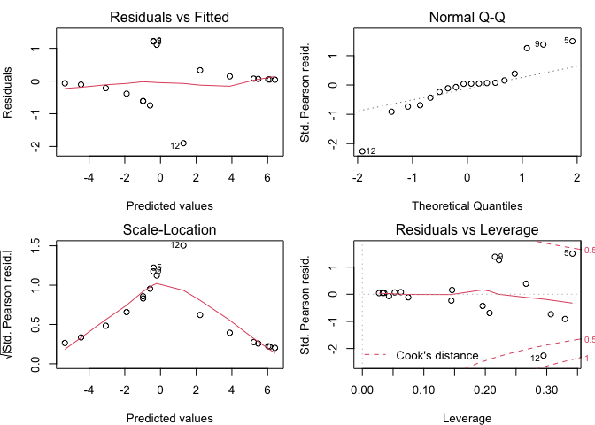<!-- -->

sites 5 and 12 could be are problematic… consider removing later

pretty plot of the predictions - start by making model predictions

``` r
## grad the inverse link function
ilink <- family(P3)$linkinv

ndata <- expand.grid(PC1_500m = seq(-3,3, length = 50), Field_Type = c("Manicured", "Natural"))
ndata$pres <- predict(P3, newdata = ndata, type = "response")
ndata <- bind_cols(ndata, setNames(as_tibble(predict(P3, ndata, se.fit = TRUE)[1:2]),
                                   c('fit_link','se_link')))
## create the interval and backtransform
ndata <- mutate(ndata,
                fit_resp  = ilink(fit_link),
                right_upr = ilink(fit_link + (2 * se_link)),
                right_lwr = ilink(fit_link - (2 * se_link)))
## show
ndata
```

    ##        PC1_500m Field_Type        pres    fit_link   se_link    fit_resp
    ## 1   -3.00000000  Manicured 0.001278294 -6.66094941 3.7690221 0.001278294
    ## 2   -2.87755102  Manicured 0.001571691 -6.45402999 3.6540551 0.001571691
    ## 3   -2.75510204  Manicured 0.001932299 -6.24711058 3.5393476 0.001932299
    ## 4   -2.63265306  Manicured 0.002375448 -6.04019116 3.4249259 0.002375448
    ## 5   -2.51020408  Manicured 0.002919929 -5.83327175 3.3108194 0.002919929
    ## 6   -2.38775510  Manicured 0.003588764 -5.62635233 3.1970619 0.003588764
    ## 7   -2.26530612  Manicured 0.004410123 -5.41943292 3.0836922 0.004410123
    ## 8   -2.14285714  Manicured 0.005418444 -5.21251350 2.9707545 0.005418444
    ## 9   -2.02040816  Manicured 0.006655764 -5.00559409 2.8583000 0.006655764
    ## 10  -1.89795918  Manicured 0.008173308 -4.79867467 2.7463882 0.008173308
    ## 11  -1.77551020  Manicured 0.010033364 -4.59175526 2.6350882 0.010033364
    ## 12  -1.65306122  Manicured 0.012311472 -4.38483584 2.5244809 0.012311472
    ## 13  -1.53061224  Manicured 0.015098943 -4.17791643 2.4146615 0.015098943
    ## 14  -1.40816327  Manicured 0.018505707 -3.97099701 2.3057425 0.018505707
    ## 15  -1.28571429  Manicured 0.022663449 -3.76407760 2.1978579 0.022663449
    ## 16  -1.16326531  Manicured 0.027728935 -3.55715818 2.0911677 0.027728935
    ## 17  -1.04081633  Manicured 0.033887346 -3.35023877 1.9858645 0.033887346
    ## 18  -0.91836735  Manicured 0.041355323 -3.14331935 1.8821811 0.041355323
    ## 19  -0.79591837  Manicured 0.050383239 -2.93639994 1.7804004 0.050383239
    ## 20  -0.67346939  Manicured 0.061256028 -2.72948052 1.6808682 0.061256028
    ## 21  -0.55102041  Manicured 0.074291620 -2.52256111 1.5840084 0.074291620
    ## 22  -0.42857143  Manicured 0.089835781 -2.31564169 1.4903421 0.089835781
    ## 23  -0.30612245  Manicured 0.108251948 -2.10872228 1.4005102 0.108251948
    ## 24  -0.18367347  Manicured 0.129904562 -1.90180286 1.3152986 0.129904562
    ## 25  -0.06122449  Manicured 0.155134699 -1.69488345 1.2356635 0.155134699
    ## 26   0.06122449  Manicured 0.184227512 -1.48796403 1.1627512 0.184227512
    ## 27   0.18367347  Manicured 0.217372459 -1.28104462 1.0979020 0.217372459
    ## 28   0.30612245  Manicured 0.254619377 -1.07412520 1.0426215 0.254619377
    ## 29   0.42857143  Manicured 0.295836053 -0.86720578 0.9985002 0.295836053
    ## 30   0.55102041  Manicured 0.340675286 -0.66028637 0.9670667 0.340675286
    ## 31   0.67346939  Manicured 0.388560541 -0.45336695 0.9495819 0.388560541
    ## 32   0.79591837  Manicured 0.438698073 -0.24644754 0.9468187 0.438698073
    ## 33   0.91836735  Manicured 0.490119255 -0.03952812 0.9589045 0.490119255
    ## 34   1.04081633  Manicured 0.541750382  0.16739129 0.9852931 0.541750382
    ## 35   1.16326531  Manicured 0.592500185  0.37431071 1.0248802 0.592500185
    ## 36   1.28571429  Manicured 0.641350408  0.58123012 1.0762103 0.641350408
    ## 37   1.40816327  Manicured 0.687433862  0.78814954 1.1376951 0.687433862
    ## 38   1.53061224  Manicured 0.730087972  0.99506895 1.2077847 0.730087972
    ## 39   1.65306122  Manicured 0.768878314  1.20198837 1.2850720 0.768878314
    ## 40   1.77551020  Manicured 0.803593615  1.40890778 1.3683378 0.803593615
    ## 41   1.89795918  Manicured 0.834218845  1.61582720 1.4565572 0.834218845
    ## 42   2.02040816  Manicured 0.860895372  1.82274661 1.5488841 0.860895372
    ## 43   2.14285714  Manicured 0.883876804  2.02966603 1.6446268 0.883876804
    ## 44   2.26530612  Manicured 0.903487125  2.23658544 1.7432226 0.903487125
    ## 45   2.38775510  Manicured 0.920085174  2.44350486 1.8442139 0.920085174
    ## 46   2.51020408  Manicured 0.934037136  2.65042427 1.9472280 0.934037136
    ## 47   2.63265306  Manicured 0.945697048  2.85734369 2.0519604 0.945697048
    ## 48   2.75510204  Manicured 0.955394327  3.06426310 2.1581609 0.955394327
    ## 49   2.87755102  Manicured 0.963426861  3.27118252 2.2656230 0.963426861
    ## 50   3.00000000  Manicured 0.970058240  3.47810193 2.3741754 0.970058240
    ## 51  -3.00000000    Natural 0.055962968 -2.82547521 1.8496684 0.055962968
    ## 52  -2.87755102    Natural 0.067953707 -2.61855579 1.7603681 0.067953707
    ## 53  -2.75510204    Natural 0.082289658 -2.41163638 1.6747509 0.082289658
    ## 54  -2.63265306    Natural 0.099327703 -2.20471696 1.5934108 0.099327703
    ## 55  -2.51020408    Natural 0.119434359 -1.99779755 1.5170357 0.119434359
    ## 56  -2.38775510    Natural 0.142965096 -1.79087813 1.4464125 0.142965096
    ## 57  -2.26530612    Natural 0.170235562 -1.58395872 1.3824229 0.170235562
    ## 58  -2.14285714    Natural 0.201484922 -1.37703930 1.3260277 0.201484922
    ## 59  -2.02040816    Natural 0.236833315 -1.17011989 1.2782325 0.236833315
    ## 60  -1.89795918    Natural 0.276237865 -0.96320047 1.2400320 0.276237865
    ## 61  -1.77551020    Natural 0.319454233 -0.75628106 1.2123335 0.319454233
    ## 62  -1.65306122    Natural 0.366012526 -0.54936164 1.1958671 0.366012526
    ## 63  -1.53061224    Natural 0.415216353 -0.34244223 1.1910987 0.415216353
    ## 64  -1.40816327    Natural 0.466171058 -0.13552281 1.1981679 0.466171058
    ## 65  -1.28571429    Natural 0.517841573  0.07139660 1.2168684 0.517841573
    ## 66  -1.16326531    Natural 0.569133325  0.27831602 1.2466770 0.569133325
    ## 67  -1.04081633    Natural 0.618983382  0.48523543 1.2868220 0.618983382
    ## 68  -0.91836735    Natural 0.666446112  0.69215485 1.3363720 0.666446112
    ## 69  -0.79591837    Natural 0.710759227  0.89907426 1.3943249 0.710759227
    ## 70  -0.67346939    Natural 0.751381455  1.10599368 1.4596801 0.751381455
    ## 71  -0.55102041    Natural 0.788000214  1.31291309 1.5314902 0.788000214
    ## 72  -0.42857143    Natural 0.820513816  1.51983251 1.6088912 0.820513816
    ## 73  -0.30612245    Natural 0.848996484  1.72675193 1.6911155 0.848996484
    ## 74  -0.18367347    Natural 0.873655225  1.93367134 1.7774940 0.873655225
    ## 75  -0.06122449    Natural 0.894786239  2.14059076 1.8674503 0.894786239
    ## 76   0.06122449    Natural 0.912736119  2.34751017 1.9604919 0.912736119
    ## 77   0.18367347    Natural 0.927870535  2.55442959 2.0562000 0.927870535
    ## 78   0.30612245    Natural 0.940551108  2.76134900 2.1542194 0.940551108
    ## 79   0.42857143    Natural 0.951119837  2.96826842 2.2542484 0.951119837
    ## 80   0.55102041    Natural 0.959889800  3.17518783 2.3560312 0.959889800
    ## 81   0.67346939    Natural 0.967140639  3.38210725 2.4593500 0.967140639
    ## 82   0.79591837    Natural 0.973117431  3.58902666 2.5640191 0.973117431
    ## 83   0.91836735    Natural 0.978031797  3.79594608 2.6698797 0.978031797
    ## 84   1.04081633    Natural 0.982064333  4.00286549 2.7767956 0.982064333
    ## 85   1.16326531    Natural 0.985367721  4.20978491 2.8846495 0.985367721
    ## 86   1.28571429    Natural 0.988070083  4.41670432 2.9933399 0.988070083
    ## 87   1.40816327    Natural 0.990278283  4.62362374 3.1027789 0.990278283
    ## 88   1.53061224    Natural 0.992081026  4.83054315 3.2128900 0.992081026
    ## 89   1.65306122    Natural 0.993551655  5.03746257 3.3236065 0.993551655
    ## 90   1.77551020    Natural 0.994750619  5.24438198 3.4348697 0.994750619
    ## 91   1.89795918    Natural 0.995727614  5.45130140 3.5466283 0.995727614
    ## 92   2.02040816    Natural 0.996523410  5.65822081 3.6588369 0.996523410
    ## 93   2.14285714    Natural 0.997171398  5.86514023 3.7714552 0.997171398
    ## 94   2.26530612    Natural 0.997698889  6.07205964 3.8844476 0.997698889
    ## 95   2.38775510    Natural 0.998128196  6.27897906 3.9977825 0.998128196
    ## 96   2.51020408    Natural 0.998477531  6.48589847 4.1114315 0.998477531
    ## 97   2.63265306    Natural 0.998761751  6.69281789 4.2253692 0.998761751
    ## 98   2.75510204    Natural 0.998992965  6.89973730 4.3395730 0.998992965
    ## 99   2.87755102    Natural 0.999181041  7.10665672 4.4540223 0.999181041
    ## 100  3.00000000    Natural 0.999334014  7.31357613 4.5686987 0.999334014
    ##     right_upr    right_lwr
    ## 1   0.7062198 6.814832e-07
    ## 2   0.7014223 1.054819e-06
    ## 3   0.6966899 1.631832e-06
    ## 4   0.6920372 2.523042e-06
    ## 5   0.6874806 3.898517e-06
    ## 6   0.6830386 6.019645e-06
    ## 7   0.6787322 9.287636e-06
    ## 8   0.6745848 1.431737e-05
    ## 9   0.6706234 2.204960e-05
    ## 10  0.6668788 3.392070e-05
    ## 11  0.6633862 5.211885e-05
    ## 12  0.6601866 7.996851e-05
    ## 13  0.6573274 1.225046e-04
    ## 14  0.6548638 1.873243e-04
    ## 15  0.6528608 2.858397e-04
    ## 16  0.6513951 4.351025e-04
    ## 17  0.6505574 6.604240e-04
    ## 18  0.6504557 9.990746e-04
    ## 19  0.6512188 1.505384e-03
    ## 20  0.6530008 2.257546e-03
    ## 21  0.6559857 3.366270e-03
    ## 22  0.6603922 4.984993e-03
    ## 23  0.6664780 7.320402e-03
    ## 24  0.6745406 1.064040e-02
    ## 25  0.6849131 1.527401e-02
    ## 26  0.6979465 2.159490e-02
    ## 27  0.7139731 2.997818e-02
    ## 28  0.7332389 4.072373e-02
    ## 29  0.7558010 5.395161e-02
    ## 30  0.7814006 6.949842e-02
    ## 31  0.8093507 8.686483e-02
    ## 32  0.8385109 1.052614e-01
    ## 33  0.8674136 1.237555e-01
    ## 34  0.8945400 1.414626e-01
    ## 35  0.9186445 1.576990e-01
    ## 36  0.9389833 1.720468e-01
    ## 37  0.9553635 1.843363e-01
    ## 38  0.9680354 1.945831e-01
    ## 39  0.9775143 2.029180e-01
    ## 40  0.9844126 2.095288e-01
    ## 41  0.9893231 2.146219e-01
    ## 42  0.9927575 2.183988e-01
    ## 43  0.9951258 2.210449e-01
    ## 44  0.9967409 2.227244e-01
    ## 45  0.9978323 2.235802e-01
    ## 46  0.9985646 2.237350e-01
    ## 47  0.9990530 2.232932e-01
    ## 48  0.9993772 2.223440e-01
    ## 49  0.9995914 2.209630e-01
    ## 50  0.9997326 2.192146e-01
    ## 51  0.7055486 1.464447e-03
    ## 52  0.7113974 2.151810e-03
    ## 53  0.7186683 3.137651e-03
    ## 54  0.7275256 4.534307e-03
    ## 55  0.7381304 6.484281e-03
    ## 56  0.7506247 9.160034e-03
    ## 57  0.7651073 1.275740e-02
    ## 58  0.7816002 1.747946e-02
    ## 59  0.8000081 2.350894e-02
    ## 60  0.8200761 3.097037e-02
    ## 61  0.8413605 3.988901e-02
    ## 62  0.8632291 5.015904e-02
    ## 63  0.8849083 6.153499e-02
    ## 64  0.9055792 7.365474e-02
    ## 65  0.9245009 8.608989e-02
    ## 66  0.9411256 9.840817e-02
    ## 67  0.9551643 1.102286e-01
    ## 68  0.9665893 1.212560e-01
    ## 69  0.9755822 1.312929e-01
    ## 70  0.9824562 1.402318e-01
    ## 71  0.9875793 1.480387e-01
    ## 72  0.9913165 1.547332e-01
    ## 73  0.9939941 1.603698e-01
    ## 74  0.9958836 1.650234e-01
    ## 75  0.9972004 1.687784e-01
    ## 76  0.9981085 1.717218e-01
    ## 77  0.9987292 1.739381e-01
    ## 78  0.9991503 1.755070e-01
    ## 79  0.9994342 1.765021e-01
    ## 80  0.9996246 1.769901e-01
    ## 81  0.9997517 1.770311e-01
    ## 82  0.9998363 1.766790e-01
    ## 83  0.9998923 1.759816e-01
    ## 84  0.9999293 1.749815e-01
    ## 85  0.9999536 1.737164e-01
    ## 86  0.9999697 1.722199e-01
    ## 87  0.9999802 1.705218e-01
    ## 88  0.9999871 1.686484e-01
    ## 89  0.9999916 1.666233e-01
    ## 90  0.9999945 1.644673e-01
    ## 91  0.9999964 1.621992e-01
    ## 92  0.9999977 1.598355e-01
    ## 93  0.9999985 1.573910e-01
    ## 94  0.9999990 1.548790e-01
    ## 95  0.9999994 1.523114e-01
    ## 96  0.9999996 1.496989e-01
    ## 97  0.9999997 1.470510e-01
    ## 98  0.9999998 1.443762e-01
    ## 99  0.9999999 1.416822e-01
    ## 100 0.9999999 1.389760e-01

plot

``` r
library(viridisLite)
mycol <- viridisLite::viridis(3)

v1 <- ggplot(data = join_path, aes(x = PC1_500m, y = pres, fill = Field_Type)) + 
  geom_point(cex = 4, alpha = 0.7, color = "black", pch = 21, position = position_jitter(w = 0.05, h = 0)) +
  scale_fill_manual(values = mycol) + 
  geom_line(data = ndata, aes(color = Field_Type), size = 1.5) +
  #geom_ribbon(data = ndata,
  #                aes(ymin = right_lwr, ymax = right_upr, fill=Field_Type),
  #                alpha = 0.1) + 
  scale_color_manual(values = mycol) + 
  theme(#axis.text.y= element_blank(),   
        #axis.ticks.y = element_blank(),
        panel.grid.major = element_blank(), 
        panel.grid.minor = element_blank(),
        panel.background = element_blank(),
        axis.line = element_line(colour = "black"),
        legend.position = "none") + 
  #scale_color_discrete(name = "Environment Type", labels = c("manicured", "natural")) + 
  ylab("Probability of Infected Tick") +
  xlab("Development Gradient")
v1
```

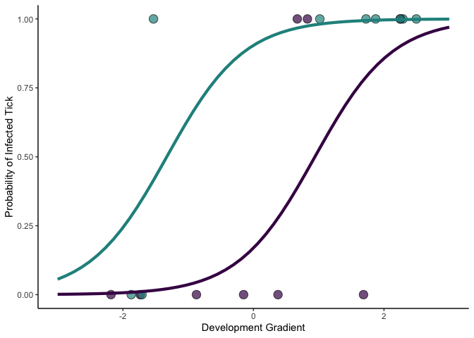<!-- -->

remove problematic sites

``` r
join_path_screen <- join_path[-c(5,12),]
```

binomial glm’s

``` r
P0 <- glm(pres ~ 1, family = binomial, data = join_path_screen)
P1 <- glm(pres ~ Field_Type, family = binomial, data = join_path_screen)
P2 <- glm(pres ~ PC1_500m, family = binomial, data = join_path_screen)
```

    ## Warning: glm.fit: algorithm did not converge

    ## Warning: glm.fit: fitted probabilities numerically 0 or 1 occurred

``` r
P3 <- glm(pres ~ PC1_500m + Field_Type, family = binomial, data = join_path_screen)
```

    ## Warning: glm.fit: algorithm did not converge

    ## Warning: glm.fit: fitted probabilities numerically 0 or 1 occurred

``` r
AICc(P0, P1, P2, P3)
```

    ##    df      AICc
    ## P0  1 24.215769
    ## P1  2 24.505451
    ## P2  2  4.923077
    ## P3  3  8.000000

compare the top models

``` r
stargazer(P2, P3, type = "text",
          intercept.bottom = FALSE, 
          single.row=FALSE,     
          notes.append = FALSE, 
          header=FALSE)
```

    ## 
    ## ==============================================
    ##                       Dependent variable:     
    ##                   ----------------------------
    ##                               pres            
    ##                        (1)            (2)     
    ## ----------------------------------------------
    ## Constant             -67.132        -67.296   
    ##                    (57,607.480)  (58,472.340) 
    ##                                               
    ## PC1_500m             125.194        125.644   
    ##                   (100,285.800)  (104,006.900)
    ##                                               
    ## Field_TypeNatural                   -29.500   
    ##                                  (156,671.300)
    ##                                               
    ## ----------------------------------------------
    ## Observations            16            16      
    ## Log Likelihood        -0.000        -0.000    
    ## Akaike Inf. Crit.     4.000          6.000    
    ## ==============================================
    ## Note:              *p<0.1; **p<0.05; ***p<0.01

models do not produce warning of “Warning: glm.fit: fitted probabilities
numerically 0 or 1 occurred” i use models that retain all sites to keep
the sample size as large as possible…

## abundance of infected ticks per site

``` r
hist(join_path$sum_path)
```

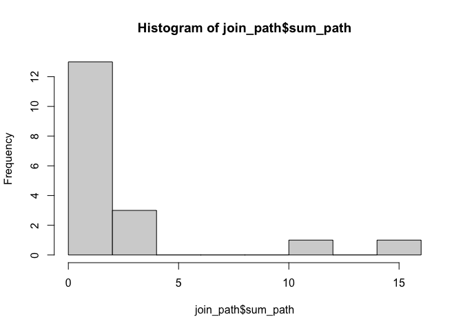<!-- -->

try a negative binomial glm

``` r
A0 <- glm.nb(sum_path ~ 1, data = join_path)
A1 <- glm.nb(sum_path ~ Field_Type, data = join_path)
A2 <- glm.nb(sum_path ~ PC1_500m, data = join_path)
A3 <- glm.nb(sum_path ~ PC1_500m + Field_Type, data = join_path)
A4 <- glm.nb(sum_path ~ PC1_500m * Field_Type, data = join_path)

AICc(A0, A1, A2, A3, A4)
```

    ##    df     AICc
    ## A0  2 76.32873
    ## A1  3 70.86368
    ## A2  3 71.27106
    ## A3  4 67.53486
    ## A4  5 71.38769

model summary and validation

``` r
summary(A3)
```

    ## 
    ## Call:
    ## glm.nb(formula = sum_path ~ PC1_500m + Field_Type, data = join_path, 
    ##     init.theta = 1.518537861, link = log)
    ## 
    ## Deviance Residuals: 
    ##      Min        1Q    Median        3Q       Max  
    ## -1.16608  -0.84234  -0.64030   0.07302   2.03967  
    ## 
    ## Coefficients:
    ##                   Estimate Std. Error z value Pr(>|z|)   
    ## (Intercept)        -1.1874     0.6254  -1.899  0.05762 . 
    ## PC1_500m            0.6075     0.2105   2.887  0.00389 **
    ## Field_TypeNatural   1.9453     0.6883   2.826  0.00471 **
    ## ---
    ## Signif. codes:  0 '***' 0.001 '**' 0.01 '*' 0.05 '.' 0.1 ' ' 1
    ## 
    ## (Dispersion parameter for Negative Binomial(1.5185) family taken to be 1)
    ## 
    ##     Null deviance: 37.806  on 17  degrees of freedom
    ## Residual deviance: 14.740  on 15  degrees of freedom
    ## AIC: 64.458
    ## 
    ## Number of Fisher Scoring iterations: 1
    ## 
    ## 
    ##               Theta:  1.519 
    ##           Std. Err.:  0.908 
    ## 
    ##  2 x log-likelihood:  -56.458

``` r
par(mfrow=c(2,2), mar=c(4,4,2,1))
plot(A3, which = 1)
plot(A3, which = 2)
plot(A3, which = 3)
#plot(A3, which = 4)
plot(A3, which = 5)
```

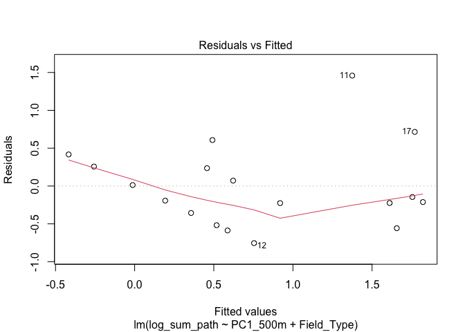<!-- -->

site 11 could be problematic…

pretty plot of the predictions

``` r
## grad the inverse link function
ilink <- family(A3)$linkinv
mydata <- expand.grid(PC1_500m = seq(-3,3, length = 50), Field_Type = c("Manicured", "Natural"))
mydata$sum_path <- predict(A3, newdata = mydata, type = "response")
mydata <- bind_cols(mydata, setNames(as_tibble(predict(A3, mydata, se.fit = TRUE)[1:2]),
                                   c('fit_link','se_link')))
## create the interval and backtransform
mydata <- mutate(mydata,
                fit_resp  = ilink(fit_link),
                right_upr = ilink(fit_link + (2 * se_link)),
                right_lwr = ilink(fit_link - (2 * se_link)))
## show
mydata
```

    ##        PC1_500m Field_Type    sum_path    fit_link   se_link    fit_resp
    ## 1   -3.00000000  Manicured  0.04929507 -3.00993117 1.0166916  0.04929507
    ## 2   -2.87755102  Manicured  0.05310202 -2.93554037 0.9959053  0.05310202
    ## 3   -2.75510204  Manicured  0.05720296 -2.86114957 0.9753569  0.05720296
    ## 4   -2.63265306  Manicured  0.06162062 -2.78675876 0.9550619  0.06162062
    ## 5   -2.51020408  Manicured  0.06637944 -2.71236796 0.9350367  0.06637944
    ## 6   -2.38775510  Manicured  0.07150577 -2.63797716 0.9152991  0.07150577
    ## 7   -2.26530612  Manicured  0.07702799 -2.56358635 0.8958680  0.07702799
    ## 8   -2.14285714  Manicured  0.08297669 -2.48919555 0.8767638  0.08297669
    ## 9   -2.02040816  Manicured  0.08938479 -2.41480475 0.8580084  0.08938479
    ## 10  -1.89795918  Manicured  0.09628777 -2.34041394 0.8396251  0.09628777
    ## 11  -1.77551020  Manicured  0.10372386 -2.26602314 0.8216390  0.10372386
    ## 12  -1.65306122  Manicured  0.11173421 -2.19163234 0.8040766  0.11173421
    ## 13  -1.53061224  Manicured  0.12036319 -2.11724153 0.7869663  0.12036319
    ## 14  -1.40816327  Manicured  0.12965856 -2.04285073 0.7703383  0.12965856
    ## 15  -1.28571429  Manicured  0.13967180 -1.96845993 0.7542245  0.13967180
    ## 16  -1.16326531  Manicured  0.15045833 -1.89406912 0.7386585  0.15045833
    ## 17  -1.04081633  Manicured  0.16207788 -1.81967832 0.7236756  0.16207788
    ## 18  -0.91836735  Manicured  0.17459478 -1.74528751 0.7093129  0.17459478
    ## 19  -0.79591837  Manicured  0.18807834 -1.67089671 0.6956087  0.18807834
    ## 20  -0.67346939  Manicured  0.20260320 -1.59650591 0.6826026  0.20260320
    ## 21  -0.55102041  Manicured  0.21824978 -1.52211510 0.6703355  0.21824978
    ## 22  -0.42857143  Manicured  0.23510471 -1.44772430 0.6588484  0.23510471
    ## 23  -0.30612245  Manicured  0.25326130 -1.37333350 0.6481829  0.25326130
    ## 24  -0.18367347  Manicured  0.27282010 -1.29894269 0.6383802  0.27282010
    ## 25  -0.06122449  Manicured  0.29388937 -1.22455189 0.6294805  0.29388937
    ## 26   0.06122449  Manicured  0.31658577 -1.15016109 0.6215227  0.31658577
    ## 27   0.18367347  Manicured  0.34103496 -1.07577028 0.6145434  0.34103496
    ## 28   0.30612245  Manicured  0.36737231 -1.00137948 0.6085762  0.36737231
    ## 29   0.42857143  Manicured  0.39574363 -0.92698868 0.6036511  0.39574363
    ## 30   0.55102041  Manicured  0.42630600 -0.85259787 0.5997938  0.42630600
    ## 31   0.67346939  Manicured  0.45922864 -0.77820707 0.5970251  0.45922864
    ## 32   0.79591837  Manicured  0.49469381 -0.70381627 0.5953600  0.49469381
    ## 33   0.91836735  Manicured  0.53289788 -0.62942546 0.5948079  0.53289788
    ## 34   1.04081633  Manicured  0.57405236 -0.55503466 0.5953718  0.57405236
    ## 35   1.16326531  Manicured  0.61838511 -0.48064386 0.5970487  0.61838511
    ## 36   1.28571429  Manicured  0.66614158 -0.40625305 0.5998291  0.66614158
    ## 37   1.40816327  Manicured  0.71758616 -0.33186225 0.6036978  0.71758616
    ## 38   1.53061224  Manicured  0.77300370 -0.25747144 0.6086341  0.77300370
    ## 39   1.65306122  Manicured  0.83270100 -0.18308064 0.6146122  0.83270100
    ## 40   1.77551020  Manicured  0.89700859 -0.10868984 0.6216021  0.89700859
    ## 41   1.89795918  Manicured  0.96628251 -0.03429903 0.6295701  0.96628251
    ## 42   2.02040816  Manicured  1.04090629  0.04009177 0.6384795  1.04090629
    ## 43   2.14285714  Manicured  1.12129310  0.11448257 0.6482916  1.12129310
    ## 44   2.26530612  Manicured  1.20788800  0.18887338 0.6589660  1.20788800
    ## 45   2.38775510  Manicured  1.30117042  0.26326418 0.6704616  1.30117042
    ## 46   2.51020408  Manicured  1.40165682  0.33765498 0.6827368  1.40165682
    ## 47   2.63265306  Manicured  1.50990357  0.41204579 0.6957505  1.50990357
    ## 48   2.75510204  Manicured  1.62650996  0.48643659 0.7094619  1.62650996
    ## 49   2.87755102  Manicured  1.75212160  0.56082739 0.7238314  1.75212160
    ## 50   3.00000000  Manicured  1.88743393  0.63521820 0.7388206  1.88743393
    ## 51  -3.00000000    Natural  0.34485143 -1.06464158 0.9744537  0.34485143
    ## 52  -2.87755102    Natural  0.37148352 -0.99025077 0.9502875  0.37148352
    ## 53  -2.75510204    Natural  0.40017234 -0.91585997 0.9262079  0.40017234
    ## 54  -2.63265306    Natural  0.43107673 -0.84146917 0.9022217  0.43107673
    ## 55  -2.51020408    Natural  0.46436780 -0.76707836 0.8783366  0.46436780
    ## 56  -2.38775510    Natural  0.50022986 -0.69268756 0.8545611  0.50022986
    ## 57  -2.26530612    Natural  0.53886147 -0.61829676 0.8309046  0.53886147
    ## 58  -2.14285714    Natural  0.58047650 -0.54390595 0.8073776  0.58047650
    ## 59  -2.02040816    Natural  0.62530537 -0.46951515 0.7839917  0.62530537
    ## 60  -1.89795918    Natural  0.67359627 -0.39512435 0.7607600  0.67359627
    ## 61  -1.77551020    Natural  0.72561657 -0.32073354 0.7376970  0.72561657
    ## 62  -1.65306122    Natural  0.78165428 -0.24634274 0.7148190  0.78165428
    ## 63  -1.53061224    Natural  0.84201964 -0.17195194 0.6921443  0.84201964
    ## 64  -1.40816327    Natural  0.90704689 -0.09756113 0.6696937  0.90704689
    ## 65  -1.28571429    Natural  0.97709604 -0.02317033 0.6474905  0.97709604
    ## 66  -1.16326531    Natural  1.05255493  0.05122047 0.6255609  1.05255493
    ## 67  -1.04081633    Natural  1.13384133  0.12561128 0.6039349  1.13384133
    ## 68  -0.91836735    Natural  1.22140530  0.20000208 0.5826461  1.22140530
    ## 69  -0.79591837    Natural  1.31573163  0.27439288 0.5617330  1.31573163
    ## 70  -0.67346939    Natural  1.41734257  0.34878369 0.5412390  1.41734257
    ## 71  -0.55102041    Natural  1.52680069  0.42317449 0.5212137  1.52680069
    ## 72  -0.42857143    Natural  1.64471200  0.49756530 0.5017132  1.64471200
    ## 73  -0.30612245    Natural  1.77172934  0.57195610 0.4828010  1.77172934
    ## 74  -0.18367347    Natural  1.90855594  0.64634690 0.4645490  1.90855594
    ## 75  -0.06122449    Natural  2.05594934  0.72073771 0.4470380  2.05594934
    ## 76   0.06122449    Natural  2.21472559  0.79512851 0.4303586  2.21472559
    ## 77   0.18367347    Natural  2.38576377  0.86951931 0.4146112  2.38576377
    ## 78   0.30612245    Natural  2.57001084  0.94391012 0.3999057  2.57001084
    ## 79   0.42857143    Natural  2.76848688  1.01830092 0.3863613  2.76848688
    ## 80   0.55102041    Natural  2.98229078  1.09269172 0.3741041  2.98229078
    ## 81   0.67346939    Natural  3.21260626  1.16708253 0.3632643  3.21260626
    ## 82   0.79591837    Natural  3.46070848  1.24147333 0.3539722  3.46070848
    ## 83   0.91836735    Natural  3.72797106  1.31586413 0.3463524  3.72797106
    ## 84   1.04081633    Natural  4.01587372  1.39025494 0.3405172  4.01587372
    ## 85   1.16326531    Natural  4.32601044  1.46464574 0.3365595  4.32601044
    ## 86   1.28571429    Natural  4.66009831  1.53903654 0.3345458  4.66009831
    ## 87   1.40816327    Natural  5.01998702  1.61342735 0.3345112  5.01998702
    ## 88   1.53061224    Natural  5.40766911  1.68781815 0.3364565  5.40766911
    ## 89   1.65306122    Natural  5.82529100  1.76220895 0.3403476  5.82529100
    ## 90   1.77551020    Natural  6.27516487  1.83659976 0.3461189  6.27516487
    ## 91   1.89795918    Natural  6.75978146  1.91099056 0.3536783  6.75978146
    ## 92   2.02040816    Natural  7.28182389  1.98538137 0.3629143  7.28182389
    ## 93   2.14285714    Natural  7.84418246  2.05977217 0.3737024  7.84418246
    ## 94   2.26530612    Natural  8.44997069  2.13416297 0.3859125  8.44997069
    ## 95   2.38775510    Natural  9.10254255  2.20855378 0.3994143  9.10254255
    ## 96   2.51020408    Natural  9.80551105  2.28294458 0.4140814  9.80551105
    ## 97   2.63265306    Natural 10.56276819  2.35733538 0.4297945 10.56276819
    ## 98   2.75510204    Natural 11.37850656  2.43172619 0.4464432 11.37850656
    ## 99   2.87755102    Natural 12.25724254  2.50611699 0.4639268 12.25724254
    ## 100  3.00000000    Natural 13.20384128  2.58050779 0.4821544 13.20384128
    ##      right_upr   right_lwr
    ## 1    0.3766089 0.006452328
    ## 2    0.3891736 0.007245672
    ## 3    0.4023489 0.008132691
    ## 4    0.4161810 0.009123675
    ## 5    0.4307211 0.010229890
    ## 6    0.4460256 0.011463636
    ## 7    0.4621571 0.012838301
    ## 8    0.4791853 0.014368411
    ## 9    0.4971876 0.016069672
    ## 10   0.5162502 0.017958995
    ## 11   0.5364697 0.020054513
    ## 12   0.5579538 0.022375572
    ## 13   0.5808232 0.024942698
    ## 14   0.6052134 0.027777544
    ## 15   0.6312767 0.030902787
    ## 16   0.6591843 0.034342005
    ## 17   0.6891288 0.038119492
    ## 18   0.7213277 0.042260043
    ## 19   0.7560261 0.046788678
    ## 20   0.7935009 0.051730321
    ## 21   0.8340648 0.057109430
    ## 22   0.8780713 0.062949587
    ## 23   0.9259198 0.069273053
    ## 24   0.9780619 0.076100303
    ## 25   1.0350080 0.083449558
    ## 26   1.0973348 0.091336341
    ## 27   1.1656939 0.099773061
    ## 28   1.2408205 0.108768683
    ## 29   1.3235447 0.118328471
    ## 30   1.4148023 0.128453858
    ## 31   1.5156480 0.139142430
    ## 32   1.6272699 0.150388062
    ## 33   1.7510057 0.162181173
    ## 34   1.8883605 0.174509114
    ## 35   2.0410277 0.187356664
    ## 36   2.2109120 0.200706590
    ## 37   2.4001550 0.214540270
    ## 38   2.6111655 0.228838315
    ## 39   2.8466524 0.243581180
    ## 40   3.1096629 0.258749725
    ## 41   3.4036252 0.274325710
    ## 42   3.7323975 0.290292211
    ## 43   4.1003231 0.306633938
    ## 44   4.5122929 0.323337480
    ## 45   4.9738160 0.340391450
    ## 46   5.4911002 0.357786562
    ## 47   6.0711419 0.375515650
    ## 48   6.7218292 0.393573622
    ## 49   7.4520574 0.411957386
    ## 50   8.2718603 0.430665739
    ## 51   2.4212064 0.049117049
    ## 52   2.4851284 0.055530333
    ## 53   2.5511794 0.062770145
    ## 54   2.6194757 0.070940590
    ## 55   2.6901442 0.080158325
    ## 56   2.7633249 0.090553924
    ## 57   2.8391721 0.102273364
    ## 58   2.9178565 0.115479622
    ## 59   2.9995682 0.130354368
    ## 60   3.0845188 0.147099751
    ## 61   3.1729456 0.165940255
    ## 62   3.2651156 0.187124585
    ## 63   3.3613300 0.210927544
    ## 64   3.4619304 0.237651818
    ## 65   3.5673060 0.267629601
    ## 66   3.6779016 0.301223906
    ## 67   3.7942283 0.338829419
    ## 68   3.9168756 0.380872677
    ## 69   4.0465264 0.427811297
    ## 70   4.1839750 0.480131919
    ## 71   4.3301490 0.538346454
    ## 72   4.4861355 0.602986153
    ## 73   4.6532133 0.674592942
    ## 74   4.8328908 0.753707437
    ## 75   5.0269516 0.840853073
    ## 76   5.2375079 0.936515904
    ## 77   5.4670637 1.041119892
    ## 78   5.7185862 1.154998022
    ## 79   5.9955863 1.278360323
    ## 80   6.3022068 1.411260934
    ## 81   6.6433150 1.553567616
    ## 82   7.0245961 1.704938322
    ## 83   7.4526448 1.864810216
    ## 84   7.9350481 2.032406308
    ## 85   8.4804599 2.206763137
    ## 86   9.0986684 2.386779606
    ## 87   9.8006608 2.571282714
    ## 88  10.5986974 2.759101816
    ## 89  11.5064077 2.949140699
    ## 90  12.5389208 3.140437271
    ## 91  13.7130404 3.332203805
    ## 92  15.0474707 3.523845311
    ## 93  16.5630939 3.714958008
    ## 94  18.2832998 3.905312793
    ## 95  20.2343658 4.094829646
    ## 96  22.4458877 4.283548423
    ## 97  24.9512633 4.471600119
    ## 98  27.7882330 4.659181146
    ## 99  30.9994857 4.846531842
    ## 100 34.6333362 5.033919441

``` r
v2 <- ggplot(join_path, aes(x = PC1_500m, y = sum_path, group = Field_Type)) + 
  geom_point(aes(fill = Field_Type), cex = 4, alpha = 0.7, 
             color = "black", pch = 21) +
  scale_fill_manual(values = mycol, name = "Habitat Type", labels = c("manicured", "natural")) + 
  geom_line(data = mydata, aes(color = Field_Type)) +
  geom_ribbon(data = mydata,
                  aes(ymin = right_lwr, ymax = right_upr, fill=Field_Type),
                  alpha = 0.2) + 
  scale_color_manual(values = mycol, name = "Habitat Type", labels = c("manicured", "natural")) +
  theme(panel.grid.major = element_blank(), 
        panel.grid.minor = element_blank(),
        panel.background = element_blank(),
        axis.line = element_line(colour = "black"),
        legend.position = c(0.2,0.6)) + 
  ylab("Abundance of Infected Ticks") +
  xlab("Development Gradient")
v2
```

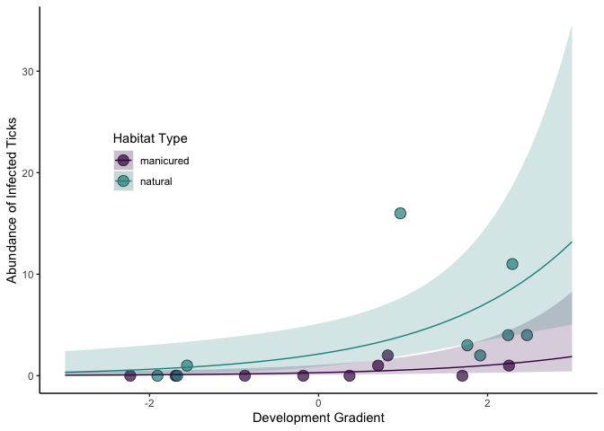<!-- -->

An alternative would be to log-transform data and run linear model…

``` r
join_path$log_sum_path <- log1p(join_path$sum_path)
join_path$log_all_rich <- log1p(join_path$all_rich)
```

try lms

``` r
L0 <- lm(log_sum_path ~ 1, data = join_path)
L1 <- lm(log_sum_path ~ Field_Type, data = join_path)
L2 <- lm(log_sum_path ~ PC1_500m, data = join_path)
L3 <- lm(log_sum_path ~ PC1_500m + Field_Type, data = join_path)
L4 <- lm(log_sum_path ~ PC1_500m * Field_Type, data = join_path)

AICc(L0, L1, L2, L3, L4)
```

    ##    df     AICc
    ## L0  2 51.30322
    ## L1  3 46.76247
    ## L2  3 44.60712
    ## L3  4 39.57587
    ## L4  5 41.18524

model summary and validation

``` r
summary(L3)
```

    ## 
    ## Call:
    ## lm(formula = log_sum_path ~ PC1_500m + Field_Type, data = join_path)
    ## 
    ## Residuals:
    ##     Min      1Q  Median      3Q     Max 
    ## -0.7544 -0.3238 -0.1692  0.2518  1.4585 
    ## 
    ## Coefficients:
    ##                   Estimate Std. Error t value Pr(>|t|)   
    ## (Intercept)        0.24723    0.19518   1.267  0.22459   
    ## PC1_500m           0.29810    0.08622   3.457  0.00352 **
    ## Field_TypeNatural  0.83889    0.28101   2.985  0.00925 **
    ## ---
    ## Signif. codes:  0 '***' 0.001 '**' 0.01 '*' 0.05 '.' 0.1 ' ' 1
    ## 
    ## Residual standard error: 0.585 on 15 degrees of freedom
    ## Multiple R-squared:  0.6322, Adjusted R-squared:  0.5832 
    ## F-statistic: 12.89 on 2 and 15 DF,  p-value: 0.0005521

``` r
par(mfrow=c(2,2), mar=c(4,4,2,1))
plot(L3, which = 1)
plot(L3, which = 2)
plot(L3, which = 3)
#plot(L3, which = 4)
plot(L3, which = 5)
```

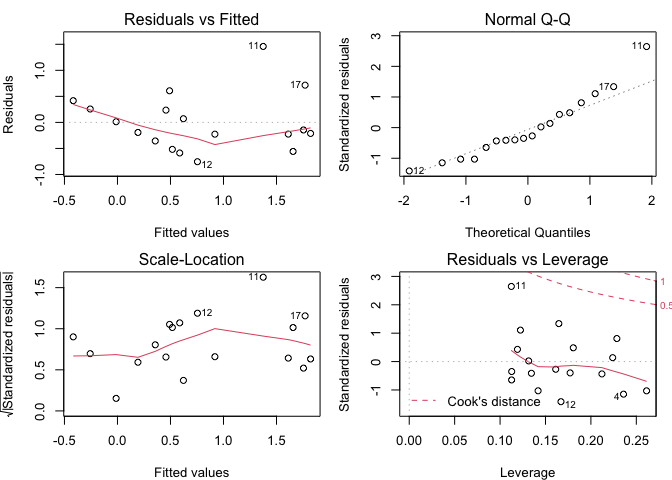<!-- -->

pretty plot of the predictions

``` r
mydata <- expand.grid(PC1_500m = seq(-3,3, length = 50), Field_Type = c("Manicured", "Natural"))
mydata$pred <- predict(L3, newdata = mydata, type = "response")

v3 <- ggplot(join_path, aes(x = PC1_500m, y = log_sum_path, group = Field_Type)) + 
  geom_point(aes(fill = Field_Type, cex = 1.5, alpha = 0.5), 
             color = "black", pch = 21) +
  scale_fill_manual(values = mycol) + 
  geom_line(data = mydata, aes(x = PC1_500m, y = pred, color = Field_Type)) +
  scale_color_manual(values = mycol) + 
  theme(panel.grid.major = element_blank(), 
        panel.grid.minor = element_blank(),
        panel.background = element_blank(),
        axis.line = element_line(colour = "black"),
        legend.position = "none") + 
  #scale_color_discrete(name = "Environment Type", labels = c("manicured", "natural")) + 
  ylab("log(Abundance of Infected Ticks)") +
  xlab("Development Gradient")
v3
```

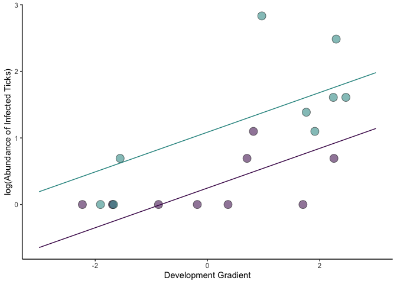<!-- -->

screen data to remove site 11

``` r
join_path_screen <- join_path[-11,]
```

try a negative binomial glm

``` r
A0 <- glm.nb(sum_path ~ 1, data = join_path_screen)
A1 <- glm.nb(sum_path ~ Field_Type, data = join_path_screen)
A2 <- glm.nb(sum_path ~ PC1_500m, data = join_path_screen)
A3 <- glm.nb(sum_path ~ PC1_500m + Field_Type, data = join_path_screen)
A4 <- glm.nb(sum_path ~ PC1_500m * Field_Type, data = join_path_screen)

AICc(A0, A1, A2, A3, A4)
```

    ##    df     AICc
    ## A0  2 64.15477
    ## A1  3 60.37962
    ## A2  3 52.90314
    ## A3  4 51.55698
    ## A4  5 55.65337

model summary and validation

``` r
summary(A3)
```

    ## 
    ## Call:
    ## glm.nb(formula = sum_path ~ PC1_500m + Field_Type, data = join_path_screen, 
    ##     init.theta = 10.15876665, link = log)
    ## 
    ## Deviance Residuals: 
    ##     Min       1Q   Median       3Q      Max  
    ## -1.3208  -0.7070  -0.4178  -0.2807   1.6724  
    ## 
    ## Coefficients:
    ##                   Estimate Std. Error z value Pr(>|z|)   
    ## (Intercept)        -1.3250     0.5913  -2.241  0.02505 * 
    ## PC1_500m            0.7238     0.2396   3.020  0.00252 **
    ## Field_TypeNatural   1.3305     0.5997   2.219  0.02650 * 
    ## ---
    ## Signif. codes:  0 '***' 0.001 '**' 0.01 '*' 0.05 '.' 0.1 ' ' 1
    ## 
    ## (Dispersion parameter for Negative Binomial(10.1588) family taken to be 1)
    ## 
    ##     Null deviance: 47.025  on 16  degrees of freedom
    ## Residual deviance: 12.893  on 14  degrees of freedom
    ## AIC: 48.224
    ## 
    ## Number of Fisher Scoring iterations: 1
    ## 
    ## 
    ##               Theta:  10.2 
    ##           Std. Err.:  17.2 
    ## 
    ##  2 x log-likelihood:  -40.224

``` r
par(mfrow=c(2,2), mar=c(4,4,2,1))
plot(A3, which = 1)
plot(A3, which = 2)
plot(A3, which = 3)
#plot(A3, which = 4)
plot(A3, which = 5)
```

<!-- -->

removing site 11 seems to do more harm than good…

## pathogen richness per site

``` r
hist(join_path$all_rich)
```

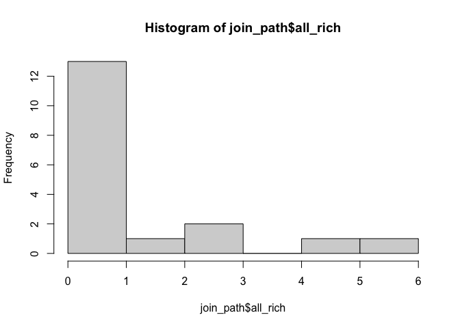<!-- -->

try a negative binomial glm

``` r
R0 <- glm.nb(all_rich ~ 1, data = join_path)
R1 <- glm.nb(all_rich ~ Field_Type, data = join_path)
R2 <- glm.nb(all_rich ~ PC1_500m, data = join_path)
R3 <- glm.nb(all_rich ~ PC1_500m + Field_Type, data = join_path)
R4 <- glm.nb(all_rich ~ PC1_500m * Field_Type, data = join_path)

AICc(R0, R1, R2, R3, R4)
```

    ##    df     AICc
    ## R0  2 62.10505
    ## R1  3 59.00055
    ## R2  3 56.02123
    ## R3  4 55.03053
    ## R4  5 58.78667

model summary and validation

``` r
summary(R3)
```

    ## 
    ## Call:
    ## glm.nb(formula = all_rich ~ PC1_500m + Field_Type, data = join_path, 
    ##     init.theta = 7.811830876, link = log)
    ## 
    ## Deviance Residuals: 
    ##     Min       1Q   Median       3Q      Max  
    ## -1.3877  -0.9288  -0.5067   0.4270   1.6195  
    ## 
    ## Coefficients:
    ##                   Estimate Std. Error z value Pr(>|z|)  
    ## (Intercept)        -1.0824     0.5498  -1.969   0.0490 *
    ## PC1_500m            0.4931     0.1968   2.505   0.0122 *
    ## Field_TypeNatural   1.2380     0.5999   2.064   0.0391 *
    ## ---
    ## Signif. codes:  0 '***' 0.001 '**' 0.01 '*' 0.05 '.' 0.1 ' ' 1
    ## 
    ## (Dispersion parameter for Negative Binomial(7.8118) family taken to be 1)
    ## 
    ##     Null deviance: 34.062  on 17  degrees of freedom
    ## Residual deviance: 15.628  on 15  degrees of freedom
    ## AIC: 51.954
    ## 
    ## Number of Fisher Scoring iterations: 1
    ## 
    ## 
    ##               Theta:  7.8 
    ##           Std. Err.:  15.9 
    ## 
    ##  2 x log-likelihood:  -43.954

``` r
par(mfrow=c(2,2), mar=c(4,4,2,1))
plot(R3, which = 1)
plot(R3, which = 2)
plot(R3, which = 3)
#plot(R3, which = 4)
plot(R3, which = 5)
```

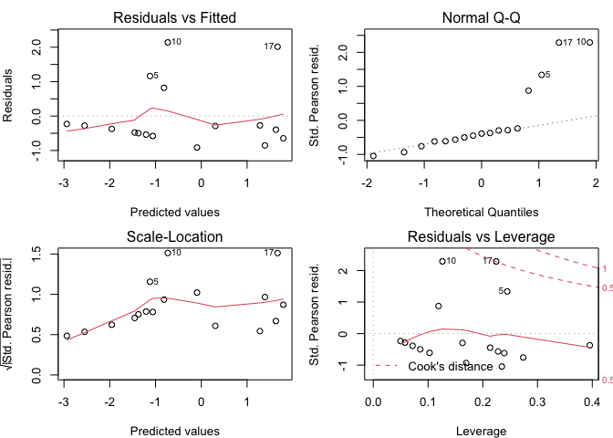<!-- -->

pretty plot of the predictions

``` r
ilink <- family(R3)$linkinv

mydata <- expand.grid(PC1_500m = seq(-3,3, length = 50), Field_Type = c("Manicured", "Natural"))
mydata$all_rich <- predict(R3, newdata = mydata, type = "response")

mydata <- bind_cols(mydata, setNames(as_tibble(predict(R3, ndata, se.fit = TRUE)[1:2]),
                                   c('fit_link','se_link')))

## create the interval and backtransform
mydata <- mutate(mydata,
                fit_resp  = ilink(fit_link),
                right_upr = ilink(fit_link + (2 * se_link)),
                right_lwr = ilink(fit_link - (2 * se_link)))
## show
mydata
```

    ##        PC1_500m Field_Type   all_rich     fit_link   se_link   fit_resp
    ## 1   -3.00000000  Manicured 0.07716890 -2.561758795 0.9289664 0.07716890
    ## 2   -2.87755102  Manicured 0.08197192 -2.501378569 0.9090866 0.08197192
    ## 3   -2.75510204  Manicured 0.08707388 -2.440998343 0.8894157 0.08707388
    ## 4   -2.63265306  Manicured 0.09249339 -2.380618118 0.8699677 0.09249339
    ## 5   -2.51020408  Manicured 0.09825021 -2.320237892 0.8507582 0.09825021
    ## 6   -2.38775510  Manicured 0.10436534 -2.259857666 0.8318034 0.10436534
    ## 7   -2.26530612  Manicured 0.11086107 -2.199477440 0.8131213 0.11086107
    ## 8   -2.14285714  Manicured 0.11776111 -2.139097214 0.7947311 0.11776111
    ## 9   -2.02040816  Manicured 0.12509060 -2.078716988 0.7766535 0.12509060
    ## 10  -1.89795918  Manicured 0.13287629 -2.018336763 0.7589109 0.13287629
    ## 11  -1.77551020  Manicured 0.14114655 -1.957956537 0.7415272 0.14114655
    ## 12  -1.65306122  Manicured 0.14993157 -1.897576311 0.7245284 0.14993157
    ## 13  -1.53061224  Manicured 0.15926336 -1.837196085 0.7079422 0.15926336
    ## 14  -1.40816327  Manicured 0.16917597 -1.776815859 0.6917983 0.16917597
    ## 15  -1.28571429  Manicured 0.17970554 -1.716435633 0.6761282 0.17970554
    ## 16  -1.16326531  Manicured 0.19089048 -1.656055408 0.6609658 0.19089048
    ## 17  -1.04081633  Manicured 0.20277157 -1.595675182 0.6463467 0.20277157
    ## 18  -0.91836735  Manicured 0.21539215 -1.535294956 0.6323087 0.21539215
    ## 19  -0.79591837  Manicured 0.22879824 -1.474914730 0.6188913 0.22879824
    ## 20  -0.67346939  Manicured 0.24303872 -1.414534504 0.6061357 0.24303872
    ## 21  -0.55102041  Manicured 0.25816554 -1.354154278 0.5940845 0.25816554
    ## 22  -0.42857143  Manicured 0.27423385 -1.293774053 0.5827814 0.27423385
    ## 23  -0.30612245  Manicured 0.29130227 -1.233393827 0.5722708 0.29130227
    ## 24  -0.18367347  Manicured 0.30943303 -1.173013601 0.5625971 0.30943303
    ## 25  -0.06122449  Manicured 0.32869225 -1.112633375 0.5538041 0.32869225
    ## 26   0.06122449  Manicured 0.34915017 -1.052253149 0.5459344 0.34915017
    ## 27   0.18367347  Manicured 0.37088141 -0.991872923 0.5390285 0.37088141
    ## 28   0.30612245  Manicured 0.39396520 -0.931492698 0.5331237 0.39396520
    ## 29   0.42857143  Manicured 0.41848574 -0.871112472 0.5282537 0.41848574
    ## 30   0.55102041  Manicured 0.44453244 -0.810732246 0.5244473 0.44453244
    ## 31   0.67346939  Manicured 0.47220030 -0.750352020 0.5217277 0.47220030
    ## 32   0.79591837  Manicured 0.50159022 -0.689971794 0.5201121 0.50159022
    ## 33   0.91836735  Manicured 0.53280937 -0.629591568 0.5196107 0.53280937
    ## 34   1.04081633  Manicured 0.56597162 -0.569211343 0.5202268 0.56597162
    ## 35   1.16326531  Manicured 0.60119790 -0.508831117 0.5219563 0.60119790
    ## 36   1.28571429  Manicured 0.63861667 -0.448450891 0.5247883 0.63861667
    ## 37   1.40816327  Manicured 0.67836440 -0.388070665 0.5287050 0.67836440
    ## 38   1.53061224  Manicured 0.72058605 -0.327690439 0.5336826 0.72058605
    ## 39   1.65306122  Manicured 0.76543559 -0.267310213 0.5396918 0.76543559
    ## 40   1.77551020  Manicured 0.81307657 -0.206929988 0.5466984 0.81307657
    ## 41   1.89795918  Manicured 0.86368275 -0.146549762 0.5546648 0.86368275
    ## 42   2.02040816  Manicured 0.91743868 -0.086169536 0.5635502 0.91743868
    ## 43   2.14285714  Manicured 0.97454039 -0.025789310 0.5733118 0.97454039
    ## 44   2.26530612  Manicured 1.03519614  0.034590916 0.5839058 1.03519614
    ## 45   2.38775510  Manicured 1.09962712  0.094971142 0.5952877 1.09962712
    ## 46   2.51020408  Manicured 1.16806831  0.155351367 0.6074132 1.16806831
    ## 47   2.63265306  Manicured 1.24076930  0.215731593 0.6202387 1.24076930
    ## 48   2.75510204  Manicured 1.31799523  0.276111819 0.6337217 1.31799523
    ## 49   2.87755102  Manicured 1.40002773  0.336492045 0.6478211 1.40002773
    ## 50   3.00000000  Manicured 1.48716596  0.396872271 0.6624976 1.48716596
    ## 51  -3.00000000    Natural 0.26612011 -1.323807541 0.9540908 0.26612011
    ## 52  -2.87755102    Natural 0.28268352 -1.263427315 0.9309306 0.28268352
    ## 53  -2.75510204    Natural 0.30027784 -1.203047089 0.9078195 0.30027784
    ## 54  -2.63265306    Natural 0.31896724 -1.142666863 0.8847613 0.31896724
    ## 55  -2.51020408    Natural 0.33881988 -1.082286638 0.8617603 0.33881988
    ## 56  -2.38775510    Natural 0.35990815 -1.021906412 0.8388211 0.35990815
    ## 57  -2.26530612    Natural 0.38230897 -0.961526186 0.8159490 0.38230897
    ## 58  -2.14285714    Natural 0.40610401 -0.901145960 0.7931499 0.40610401
    ## 59  -2.02040816    Natural 0.43138007 -0.840765734 0.7704301 0.43138007
    ## 60  -1.89795918    Natural 0.45822933 -0.780385508 0.7477969 0.45822933
    ## 61  -1.77551020    Natural 0.48674968 -0.720005283 0.7252584 0.48674968
    ## 62  -1.65306122    Natural 0.51704516 -0.659625057 0.7028238 0.51704516
    ## 63  -1.53061224    Natural 0.54922624 -0.599244831 0.6805033 0.54922624
    ## 64  -1.40816327    Natural 0.58341028 -0.538864605 0.6583084 0.58341028
    ## 65  -1.28571429    Natural 0.61972194 -0.478484379 0.6362524 0.61972194
    ## 66  -1.16326531    Natural 0.65829366 -0.418104153 0.6143502 0.65829366
    ## 67  -1.04081633    Natural 0.69926610 -0.357723928 0.5926189 0.69926610
    ## 68  -0.91836735    Natural 0.74278867 -0.297343702 0.5710780 0.74278867
    ## 69  -0.79591837    Natural 0.78902011 -0.236963476 0.5497498 0.78902011
    ## 70  -0.67346939    Natural 0.83812900 -0.176583250 0.5286601 0.83812900
    ## 71  -0.55102041    Natural 0.89029445 -0.116203024 0.5078386 0.89029445
    ## 72  -0.42857143    Natural 0.94570670 -0.055822798 0.4873197 0.94570670
    ## 73  -0.30612245    Natural 1.00456783  0.004557427 0.4671433 1.00456783
    ## 74  -0.18367347    Natural 1.06709249  0.064937653 0.4473557 1.06709249
    ## 75  -0.06122449    Natural 1.13350871  0.125317879 0.4280108 1.13350871
    ## 76   0.06122449    Natural 1.20405871  0.185698105 0.4091715 1.20405871
    ## 77   0.18367347    Natural 1.27899975  0.246078331 0.3909108 1.27899975
    ## 78   0.30612245    Natural 1.35860516  0.306458557 0.3733137 1.35860516
    ## 79   0.42857143    Natural 1.44316524  0.366838782 0.3564784 1.44316524
    ## 80   0.55102041    Natural 1.53298836  0.427219008 0.3405179 1.53298836
    ## 81   0.67346939    Natural 1.62840211  0.487599234 0.3255610 1.62840211
    ## 82   0.79591837    Natural 1.72975445  0.547979460 0.3117522 1.72975445
    ## 83   0.91836735    Natural 1.83741499  0.608359686 0.2992503 1.83741499
    ## 84   1.04081633    Natural 1.95177636  0.668739912 0.2882256 1.95177636
    ## 85   1.16326531    Natural 2.07325562  0.729120137 0.2788532 2.07325562
    ## 86   1.28571429    Natural 2.20229580  0.789500363 0.2713045 2.20229580
    ## 87   1.40816327    Natural 2.33936749  0.849880589 0.2657349 2.33936749
    ## 88   1.53061224    Natural 2.48497057  0.910260815 0.2622705 2.48497057
    ## 89   1.65306122    Natural 2.63963603  0.970641041 0.2609953 2.63963603
    ## 90   1.77551020    Natural 2.80392793  1.031021267 0.2619411 2.80392793
    ## 91   1.89795918    Natural 2.97844542  1.091401492 0.2650842 2.97844542
    ## 92   2.02040816    Natural 3.16382494  1.151781718 0.2703480 3.16382494
    ## 93   2.14285714    Natural 3.36074254  1.212161944 0.2776119 3.36074254
    ## 94   2.26530612    Natural 3.56991637  1.272542170 0.2867238 3.56991637
    ## 95   2.38775510    Natural 3.79210925  1.332922396 0.2975141 3.79210925
    ## 96   2.51020408    Natural 4.02813150  1.393302622 0.3098074 4.02813150
    ## 97   2.63265306    Natural 4.27884386  1.453682847 0.3234324 4.27884386
    ## 98   2.75510204    Natural 4.54516065  1.514063073 0.3382282 4.54516065
    ## 99   2.87755102    Natural 4.82805309  1.574443299 0.3540480 4.82805309
    ## 100  3.00000000    Natural 5.12855286  1.634823525 0.3707608 5.12855286
    ##      right_upr  right_lwr
    ## 1    0.4946890 0.01203794
    ## 2    0.5049957 0.01330585
    ## 3    0.5157325 0.01470115
    ## 4    0.5269326 0.01623552
    ## 5    0.5386326 0.01792150
    ## 6    0.5508731 0.01977247
    ## 7    0.5636990 0.02180273
    ## 8    0.5771604 0.02402743
    ## 9    0.5913129 0.02646257
    ## 10   0.6062183 0.02912500
    ## 11   0.6219460 0.03203228
    ## 12   0.6385729 0.03520268
    ## 13   0.6561856 0.03865495
    ## 14   0.6748807 0.04240825
    ## 15   0.6947667 0.04648191
    ## 16   0.7159651 0.05089518
    ## 17   0.7386126 0.05566695
    ## 18   0.7628625 0.06081539
    ## 19   0.7888871 0.06635758
    ## 20   0.8168799 0.07230906
    ## 21   0.8470587 0.07868339
    ## 22   0.8796676 0.08549162
    ## 23   0.9149808 0.09274185
    ## 24   0.9533059 0.10043869
    ## 25   0.9949875 0.10858287
    ## 26   1.0404109 0.11717087
    ## 27   1.0900069 0.12619463
    ## 28   1.1442561 0.13564147
    ## 29   1.2036937 0.14549408
    ## 30   1.2689152 0.15573073
    ## 31   1.3405815 0.16632567
    ## 32   1.4194259 0.17724966
    ## 33   1.5062602 0.18847064
    ## 34   1.6019829 0.19995462
    ## 35   1.7075873 0.21166643
    ## 36   1.8241710 0.22357074
    ## 37   1.9529467 0.23563278
    ## 38   2.0952541 0.24781923
    ## 39   2.2525735 0.26009879
    ## 40   2.4265412 0.27244273
    ## 41   2.6189666 0.28482528
    ## 42   2.8318516 0.29722381
    ## 43   3.0674123 0.30961895
    ## 44   3.3281031 0.32199455
    ## 45   3.6166439 0.33433754
    ## 46   3.9360501 0.34663776
    ## 47   4.2896662 0.35888771
    ## 48   4.6812030 0.37108227
    ## 49   5.1147792 0.38321843
    ## 50   5.5949673 0.39529500
    ## 51   1.7938679 0.03947889
    ## 52   1.8192674 0.04392426
    ## 53   1.8452078 0.04886538
    ## 54   1.8717161 0.05435659
    ## 55   1.8988223 0.06045795
    ## 56   1.9265595 0.06723586
    ## 57   1.9549642 0.07476359
    ## 58   1.9840770 0.08312201
    ## 59   2.0139429 0.09240022
    ## 60   2.0446126 0.10269628
    ## 61   2.0761425 0.11411801
    ## 62   2.1085965 0.12678372
    ## 63   2.1420465 0.14082302
    ## 64   2.1765743 0.15637764
    ## 65   2.2122729 0.17360213
    ## 66   2.2492489 0.19266456
    ## 67   2.2876244 0.21374709
    ## 68   2.3275408 0.23704633
    ## 69   2.3691615 0.26277345
    ## 70   2.4126770 0.29115386
    ## 71   2.4583101 0.32242645
    ## 72   2.5063227 0.35684198
    ## 73   2.5570238 0.39466059
    ## 74   2.6107800 0.43614797
    ## 75   2.6680277 0.48156997
    ## 76   2.7292888 0.53118503
    ## 77   2.7951895 0.58523415
    ## 78   2.8664831 0.64392774
    ## 79   2.9440775 0.70742904
    ## 80   3.0290676 0.77583389
    ## 81   3.1227728 0.84914710
    ## 82   3.2267770 0.92725665
    ## 83   3.3429722 1.00990784
    ## 84   3.4735982 1.09668151
    ## 85   3.6212761 1.18698183
    ## 86   3.7890270 1.28004017
    ## 87   3.9802727 1.37494104
    ## 88   4.1988131 1.47067246
    ## 89   4.4487876 1.56619712
    ## 90   4.7346296 1.66053367
    ## 91   5.0610297 1.75283246
    ## 92   5.4329255 1.84243061
    ## 93   5.8555251 1.92887748
    ## 94   6.3343663 2.01193019
    ## 95   6.8754052 2.09152657
    ## 96   7.4851227 2.16774581
    ## 97   8.1706431 2.24076668
    ## 98   8.9398553 2.31082995
    ## 99   9.8015375 2.37820819
    ## 100 10.7654837 2.44318370

``` r
v4 <- ggplot(join_path, aes(x = PC1_500m, y = all_rich, group = Field_Type)) + 
  geom_point(aes(fill = Field_Type), cex = 4, alpha = 0.7, 
             color = "black", pch = 21) +
  scale_fill_manual(values = mycol) + 
  geom_line(data = mydata, aes(color = Field_Type)) +
  geom_ribbon(data = mydata,
                  aes(ymin = right_lwr, ymax = right_upr, fill=Field_Type),
                  alpha = 0.2) + 
  scale_color_manual(values = mycol) +
  theme(panel.grid.major = element_blank(), 
        panel.grid.minor = element_blank(),
        panel.background = element_blank(),
        axis.line = element_line(colour = "black"),
        legend.position = "none") + 
  ylab("Pathogen Richness") +
  xlab("Development Gradient")
v4
```

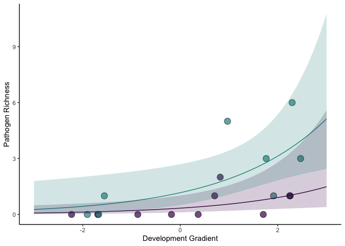<!-- -->

or does it makes sense to log-transform data and run linear models?

try lms

``` r
RL0 <- lm(log_all_rich ~ 1, data = join_path)
RL1 <- lm(log_all_rich ~ Field_Type, data = join_path)
RL2 <- lm(log_all_rich ~ PC1_500m, data = join_path)
RL3 <- lm(log_all_rich ~ PC1_500m + Field_Type, data = join_path)
RL4 <- lm(log_all_rich ~ PC1_500m * Field_Type, data = join_path)

AICc(RL0, RL1, RL2, RL3, RL4)
```

    ##     df     AICc
    ## RL0  2 40.44704
    ## RL1  3 37.66832
    ## RL2  3 33.78982
    ## RL3  4 31.26524
    ## RL4  5 34.30848

model summary and validation

``` r
summary(RL3)
```

    ## 
    ## Call:
    ## lm(formula = log_all_rich ~ PC1_500m + Field_Type, data = join_path)
    ## 
    ## Residuals:
    ##      Min       1Q   Median       3Q      Max 
    ## -0.63714 -0.35630 -0.00926  0.25049  0.78225 
    ## 
    ## Coefficients:
    ##                   Estimate Std. Error t value Pr(>|t|)   
    ## (Intercept)        0.25431    0.15494   1.641  0.12153   
    ## PC1_500m           0.22500    0.06845   3.287  0.00499 **
    ## Field_TypeNatural  0.53741    0.22308   2.409  0.02930 * 
    ## ---
    ## Signif. codes:  0 '***' 0.001 '**' 0.01 '*' 0.05 '.' 0.1 ' ' 1
    ## 
    ## Residual standard error: 0.4644 on 15 degrees of freedom
    ## Multiple R-squared:  0.5763, Adjusted R-squared:  0.5198 
    ## F-statistic:  10.2 on 2 and 15 DF,  p-value: 0.001595

``` r
par(mfrow=c(2,2), mar=c(4,4,2,1))
plot(RL3, which = 1)
plot(RL3, which = 2)
plot(RL3, which = 3)
#plot(RL3, which = 4)
plot(RL3, which = 5)
```

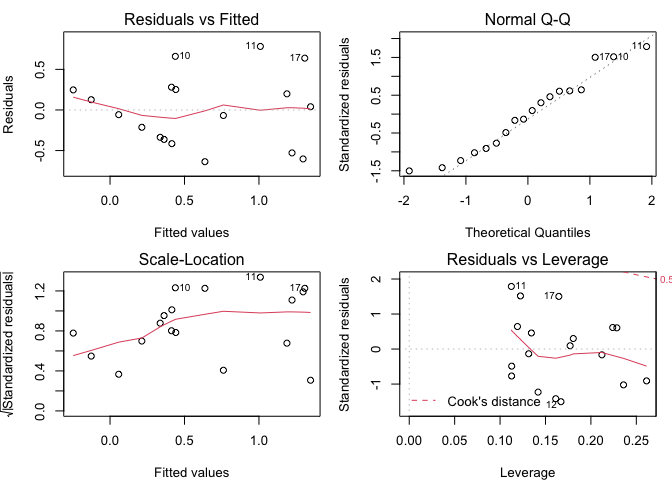<!-- -->

pretty plot of the predictions

``` r
mydata <- expand.grid(PC1_500m = seq(-3,3, length = 50), Field_Type = c("Manicured", "Natural"))
mydata$pred <- predict(RL3, newdata = mydata, type = "response")

v5 <- ggplot(join_path, aes(x = PC1_500m, y = log_all_rich, group = Field_Type)) + 
  geom_point(aes(fill = Field_Type, cex = 1.5, alpha = 0.5), 
             color = "black", pch = 21) +
  scale_fill_manual(values = mycol) + 
  geom_line(data = mydata, aes(x = PC1_500m, y = pred, color = Field_Type)) +
  scale_color_manual(values = mycol) + 
  theme(panel.grid.major = element_blank(), 
        panel.grid.minor = element_blank(),
        panel.background = element_blank(),
        axis.line = element_line(colour = "black"),
        legend.position = "none") + 
  #scale_color_discrete(name = "Environment Type", labels = c("manicured", "natural")) + 
  ylab("log(Pathogen Richness)") +
  xlab("Development Gradient")
v5
```

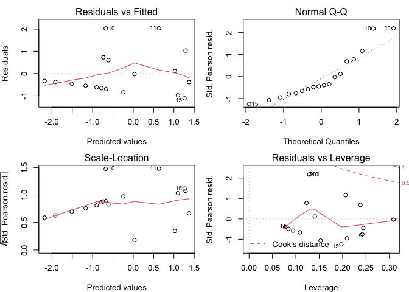<!-- -->

make final composite figure for manuscript

``` r
library(cowplot)

plot_grid(v1, v2, v4, labels= "AUTO", ncol=1)
```

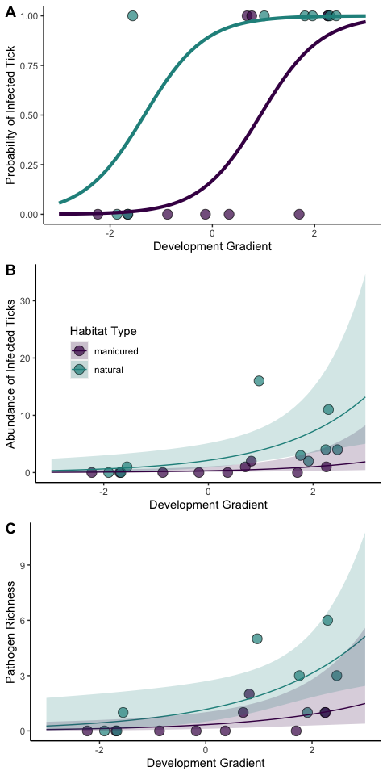<!-- -->
