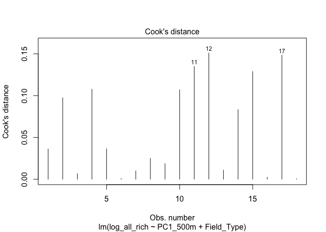

tick_pathogens
================
Kimberly Ledger
4/18/2022

Code for analyses of pathogens in Alachua County ticks.

load libraries

``` r
library(tidyverse) # for data manipulation
library(ggplot2) # for visualizations
library(lme4) #for glm()
library(MuMIn) # for AICc() 
library(stargazer) # for stargazer() model comparison
library(MASS) # for glm.nb()
```

# Part 1: Prepare the data

Read in raw Alachua County tick data

``` r
ticks <- read.csv("AlachuaTicksAllSites.csv")
str(ticks)
```

    ## 'data.frame':    1825 obs. of  15 variables:
    ##  $ Sample_Code      : chr  "HW_3May21_AA_A" "HW_13Apr21_IS" "29RD_12Mar21_AA_A" "29RD_12Mar21_AA_B" ...
    ##  $ Collection_Sample: chr  "AA1007" "IS83" "AA144" "AA145" ...
    ##  $ Collection_Box   : chr  "AAB13" "IXB2" "AAB2" "AAB2" ...
    ##  $ gDNA_Sample      : chr  "NymAA103" "IS83" "NymAA104" "NymAA105" ...
    ##  $ gDNA_Box         : chr  "NymAADNAB1Nat" "ISgDNAB1" "NymAADNAB1Nat" "NymAADNAB1Nat" ...
    ##  $ Field_Type       : chr  "Natural" "Natural" "Natural" "Natural" ...
    ##  $ Site             : chr  "Harmonic Woods" "Harmonic Woods" "29th Rd" "29th Rd" ...
    ##  $ Site_ID          : chr  "HW" "HW" "29RD" "29RD" ...
    ##  $ Visit            : int  9 7 5 5 7 9 9 12 9 10 ...
    ##  $ Date             : chr  "5/3/21" "4/13/21" "3/12/21" "3/12/21" ...
    ##  $ Tick_No_Tube     : int  1 1 1 1 1 1 1 1 1 1 ...
    ##  $ Species          : chr  "AA" "IS" "AA" "AA" ...
    ##  $ Lifestage        : chr  "N" "A" "N" "N" ...
    ##  $ Sex              : chr  NA "M" NA NA ...
    ##  $ Collection_Method: chr  "Flagging" "Dragging" "Dragging" "Dragging" ...

Read in raw pathogen data

``` r
pathogen <- read.csv("AlCo_Pathogens.csv")
str(pathogen)
```

    ## 'data.frame':    1187 obs. of  20 variables:
    ##  $ Collection_Sample          : chr  "AM01" "AM02" "DV01" "DV02" ...
    ##  $ gDNA_Sample                : chr  "AM01" "AM02" "DV01" "DV02" ...
    ##  $ Babesia_sp                 : int  0 0 0 0 0 0 0 0 0 0 ...
    ##  $ Babesia_sp_Coco            : int  0 0 0 0 0 0 0 0 0 0 ...
    ##  $ Babesia_odocoieli          : int  0 0 0 0 0 0 0 0 0 0 ...
    ##  $ Borrelia_lonestari         : int  0 0 0 0 0 0 0 0 0 0 ...
    ##  $ Cryptoplasma_sp            : int  0 0 0 0 0 0 0 0 0 0 ...
    ##  $ Cytauxozoon_felis          : int  0 0 0 0 0 0 0 0 0 0 ...
    ##  $ Ehrlichia_chaffeensis      : int  0 0 0 0 0 0 0 0 0 0 ...
    ##  $ Ehrlichia_ewingii          : int  0 0 0 0 0 0 0 0 0 0 ...
    ##  $ Ehrlichia_sp_PanolaMountain: int  0 0 0 0 0 0 0 0 0 0 ...
    ##  $ Hepatozoon_sp_A            : int  0 0 0 0 0 0 0 0 0 0 ...
    ##  $ Hepatozoon_sp_B            : int  0 0 0 0 0 0 0 0 0 0 ...
    ##  $ Rickettsia_amblyommatis    : int  0 0 0 0 0 0 0 0 0 0 ...
    ##  $ Rickettsia_andeanae        : int  1 0 0 0 0 0 0 0 0 0 ...
    ##  $ Rickettsia_parkeri         : int  0 0 0 0 0 0 0 0 0 0 ...
    ##  $ Rickettsia_rhiphicephali   : int  0 0 0 0 0 0 1 0 0 0 ...
    ##  $ Rickettsia_sp_Iaff         : int  0 0 0 0 0 0 0 0 0 0 ...
    ##  $ Rickettsia_sp_Iscap        : int  0 0 0 0 0 0 0 0 0 0 ...
    ##  $ Theileria_cervi            : int  0 0 0 0 0 0 0 0 0 0 ...

Join pathogen results with the raw tick data by the gDNA_Sample and
Collection_Sample identities

``` r
data <- ticks %>%
  dplyr::left_join(pathogen, by = c("gDNA_Sample", "Collection_Sample")) %>%
  mutate_all(na_if, "")

head(data)
```

    ##         Sample_Code Collection_Sample Collection_Box gDNA_Sample      gDNA_Box
    ## 1    HW_3May21_AA_A            AA1007          AAB13    NymAA103 NymAADNAB1Nat
    ## 2     HW_13Apr21_IS              IS83           IXB2        IS83      ISgDNAB1
    ## 3 29RD_12Mar21_AA_A             AA144           AAB2    NymAA104 NymAADNAB1Nat
    ## 4 29RD_12Mar21_AA_B             AA145           AAB2    NymAA105 NymAADNAB1Nat
    ## 5   29RD_20Apr21_AA             AA639           AAB8    NymAA106 NymAADNAB1Nat
    ## 6 29RD_17May21_AA_A            AA1238          AAB16    NymAA107 NymAADNAB1Nat
    ##   Field_Type           Site Site_ID Visit    Date Tick_No_Tube Species
    ## 1    Natural Harmonic Woods      HW     9  5/3/21            1      AA
    ## 2    Natural Harmonic Woods      HW     7 4/13/21            1      IS
    ## 3    Natural        29th Rd    29RD     5 3/12/21            1      AA
    ## 4    Natural        29th Rd    29RD     5 3/12/21            1      AA
    ## 5    Natural        29th Rd    29RD     7 4/20/21            1      AA
    ## 6    Natural        29th Rd    29RD     9 5/17/21            1      AA
    ##   Lifestage  Sex Collection_Method Babesia_sp Babesia_sp_Coco Babesia_odocoieli
    ## 1         N <NA>          Flagging          0               0                 0
    ## 2         A    M          Dragging          0               0                 0
    ## 3         N <NA>          Dragging          0               0                 0
    ## 4         N <NA>          Dragging          0               0                 0
    ## 5         N <NA>          Dragging          0               0                 0
    ## 6         N <NA>          Dragging          0               0                 0
    ##   Borrelia_lonestari Cryptoplasma_sp Cytauxozoon_felis Ehrlichia_chaffeensis
    ## 1                  0               0                 0                     0
    ## 2                  0               0                 0                     0
    ## 3                  0               0                 0                     0
    ## 4                  0               0                 0                     0
    ## 5                  0               0                 0                     0
    ## 6                  0               0                 0                     0
    ##   Ehrlichia_ewingii Ehrlichia_sp_PanolaMountain Hepatozoon_sp_A Hepatozoon_sp_B
    ## 1                 0                           0               0               0
    ## 2                 0                           0               0               0
    ## 3                 0                           0               0               0
    ## 4                 0                           0               0               0
    ## 5                 0                           0               0               0
    ## 6                 0                           0               0               0
    ##   Rickettsia_amblyommatis Rickettsia_andeanae Rickettsia_parkeri
    ## 1                       0                   0                  0
    ## 2                       0                   0                  0
    ## 3                       0                   0                  0
    ## 4                       0                   0                  0
    ## 5                       1                   0                  0
    ## 6                       0                   0                  0
    ##   Rickettsia_rhiphicephali Rickettsia_sp_Iaff Rickettsia_sp_Iscap
    ## 1                        0                  0                   0
    ## 2                        0                  0                   0
    ## 3                        0                  0                   0
    ## 4                        0                  0                   0
    ## 5                        0                  0                   0
    ## 6                        0                  0                   0
    ##   Theileria_cervi
    ## 1               0
    ## 2               0
    ## 3               0
    ## 4               0
    ## 5               0
    ## 6               0

note: there are NA’s in the data for any tick sample that was not
processed in the lab

Read in the covariate data for all 18 sites This site contains
information on if the environment type was manicured or natural, and the
forest, PC1 and PC2 landscape buffers

``` r
covar <- read.csv("AlCo_SitesCovariates.csv")  ## 18 sites 
head(covar)
```

    ##                 Site Site_ID  Easting Northing Field_Type Forest250m Forest500m
    ## 1       Reserve Park      RP 373075.5  3281598  Manicured  0.0000000  0.0259972
    ## 2 University Gardens      UG 368561.7  3280166  Manicured  0.4059153  0.2280836
    ## 3      Hogtown Creek      HT 370033.7  3285928  Manicured  0.6793893  0.4689848
    ## 4 Possum Creek Park       PC 365990.0  3286586  Manicured  0.4842319  0.3245446
    ## 5     Fred Cone Park      FC 375389.6  3280603  Manicured  0.1525510  0.4584023
    ## 6  Green Acres Park       GA 366138.7  3280294  Manicured  0.6352041  0.5656334
    ##     Forest1km  Forest2km Forest3km Forest4km   PC1_250m    PC2_250m   PC1_500m
    ## 1 0.009046603 0.04787764 0.1523864 0.2497138  3.0888399  1.25403665 -2.2285643
    ## 2 0.132940615 0.15290895 0.1432444 0.1541731  1.1042450 -2.71890707 -1.6918854
    ## 3 0.174897316 0.24949040 0.2753919 0.3340898 -0.4720229  0.26182597 -0.1811466
    ## 4 0.317132210 0.17751376 0.2416931 0.2822197  0.5823618  0.03426844 -0.8718743
    ## 5 0.415052873 0.40032172 0.4285704 0.4357618  1.0914845 -0.03089397  0.7046526
    ## 6 0.459594672 0.26329957 0.2377961 0.2197173 -0.2358455  0.56020279  0.3665116
    ##      PC2_500m    PC1_1km     PC2_1km    PC1_2km     PC2_2km    PC1_3km
    ## 1  1.14772157 -2.2237817  0.83389005 -2.2345973  0.29634256 -1.6579262
    ## 2 -4.17393010 -1.9912260 -1.90230643 -1.8760657 -0.08449422 -1.8529678
    ## 3  0.15115773 -1.4013427  0.04034195 -0.8045536 -0.19268275 -0.5241398
    ## 4  0.05922524 -0.5187457  0.44283357 -0.8368180 -0.25976343 -0.4419081
    ## 5  0.75143021  0.2710480 -0.96944716  0.2085390  0.28946092  0.2753296
    ## 6  0.53614632  0.5772039  0.23898928 -1.2213185  0.06781415 -1.5203214
    ##       PC2_3km    PC1_4km     PC2_4km
    ## 1  0.21477736 -1.7101280 -0.04952885
    ## 2 -0.29752137 -1.8570855 -0.11805117
    ## 3  0.06247605 -0.1973380  0.09175826
    ## 4  0.11303452 -0.2691747  0.27311929
    ## 5  0.36739258 -0.2885019  0.31535917
    ## 6 -0.17733426 -1.3869067 -0.04092310

# Part 2: Create summary table with response variables

-   = presence/absence of infected ticks by site
-   = abundance of infected ticks per site
-   = richness of pathogens per site

important: we are only considering microorganisms that are known to be
human or veterinary important pathogens as “pathogens” in these analyses

``` r
pathogen_df <- data %>%
  filter(!is.na(gDNA_Sample)) %>%
  group_by(Site_ID) %>%
  summarise(Babesia_sp_Coco = sum(Babesia_sp_Coco),
            Babesia_odocoieli = sum(Babesia_odocoieli),
            Cytauxozoon_felis = sum(Cytauxozoon_felis),
            Ehrlichia_chaffeensis = sum(Ehrlichia_chaffeensis),
            Ehrlichia_ewingii = sum(Ehrlichia_ewingii),
            Ehrlichia_sp_PanolaMountain = sum(Ehrlichia_sp_PanolaMountain),
            Rickettsia_parkeri = sum(Rickettsia_parkeri), 
            sum_path = sum(Babesia_sp_Coco, Babesia_odocoieli, Cytauxozoon_felis,
                           Ehrlichia_chaffeensis, Ehrlichia_ewingii, Ehrlichia_sp_PanolaMountain,
                           Rickettsia_parkeri))

pathogen_df[18,] <- list("GA", 0, 0, 0, 0, 0, 0, 0, 0)
```

create df for pathogen richness

``` r
richness_df <- pathogen_df

richness_df$Babesia_sp_Coco[richness_df$Babesia_sp_Coco > 0] <- 1 
richness_df$Babesia_odocoieli[richness_df$Babesia_odocoieli > 0] <- 1 
richness_df$Cytauxozoon_felis[richness_df$Cytauxozoon_felis > 0] <- 1 
richness_df$Ehrlichia_chaffeensis[richness_df$Ehrlichia_chaffeensis > 0] <- 1 
richness_df$Ehrlichia_ewingii[richness_df$Ehrlichia_ewingii > 0] <- 1 
richness_df$Ehrlichia_sp_PanolaMountain[richness_df$Ehrlichia_sp_PanolaMountain > 0] <- 1
richness_df$Rickettsia_parkeri[richness_df$Rickettsia_parkeri > 0] <- 1 
richness_df$Babesia_sp_Coco[richness_df$Babesia_sp_Coco > 0] <- 1 

richness_df <- richness_df %>%
  dplyr::select(!sum_path) %>%
  mutate(all_rich = rowSums(across(where(is.numeric))))
```

put the explanitory (field_type and PC1 @ 500m) and response variables
into one data frame

``` r
covar1 <- covar %>%
  dplyr::select(Site_ID, Field_Type, PC1_500m)

in_abun <- pathogen_df %>%
  dplyr::select(Site_ID, sum_path)

in_rich <- richness_df %>%
  dplyr::select(Site_ID, all_rich)

join_path <- covar1 %>%
  left_join(in_abun) %>%
  left_join(in_rich)
```

    ## Joining, by = "Site_ID"
    ## Joining, by = "Site_ID"

``` r
join_path$pres <- 0 
join_path$pres[join_path$all_rich > 0] <- 1  ## set coinfections to 1 

join_path <- join_path %>%
  arrange(PC1_500m)
```

# Part 3: model time!

## presence of pathogens at the site level

## (i.e. whether or not at least one infected tick was found with any pathogen in a site)

binomial glm’s

``` r
P0 <- glm(pres ~ 1, family = binomial, data = join_path)
P1 <- glm(pres ~ Field_Type, family = binomial, data = join_path)
P2 <- glm(pres ~ PC1_500m, family = binomial, data = join_path)
P3 <- glm(pres ~ PC1_500m + Field_Type, family = binomial, data = join_path)
#P4 <- glm(pres ~ PC1_500m * Field_Type, family = binomial, data = join_path)

AICc(P0, P1, P2, P3)
```

    ##    df     AICc
    ## P0  1 26.98062
    ## P1  2 25.79197
    ## P2  2 20.30559
    ## P3  3 18.86047

compare the top models

``` r
stargazer(P2, P3, type = "text",
          intercept.bottom = FALSE, 
          single.row=FALSE,     
          notes.append = FALSE, 
          header=FALSE)
```

    ## 
    ## ==============================================
    ##                       Dependent variable:     
    ##                   ----------------------------
    ##                               pres            
    ##                        (1)            (2)     
    ## ----------------------------------------------
    ## Constant              -0.180        -1.591    
    ##                      (0.668)        (1.198)   
    ##                                               
    ## PC1_500m             1.122**        1.690*    
    ##                      (0.475)        (0.971)   
    ##                                               
    ## Field_TypeNatural                    3.835    
    ##                                     (2.702)   
    ##                                               
    ## ----------------------------------------------
    ## Observations            18            18      
    ## Log Likelihood        -7.753        -5.573    
    ## Akaike Inf. Crit.     19.506        17.146    
    ## ==============================================
    ## Note:              *p<0.1; **p<0.05; ***p<0.01

top model summary and model validation plots

``` r
summary(P3)
```

    ## 
    ## Call:
    ## glm(formula = pres ~ PC1_500m + Field_Type, family = binomial, 
    ##     data = join_path)
    ## 
    ## Deviance Residuals: 
    ##      Min        1Q    Median        3Q       Max  
    ## -1.74832  -0.47195   0.06178   0.17763   1.35160  
    ## 
    ## Coefficients:
    ##                   Estimate Std. Error z value Pr(>|z|)  
    ## (Intercept)         -1.591      1.198  -1.328   0.1842  
    ## PC1_500m             1.690      0.971   1.740   0.0818 .
    ## Field_TypeNatural    3.836      2.702   1.419   0.1558  
    ## ---
    ## Signif. codes:  0 '***' 0.001 '**' 0.01 '*' 0.05 '.' 0.1 ' ' 1
    ## 
    ## (Dispersion parameter for binomial family taken to be 1)
    ## 
    ##     Null deviance: 24.731  on 17  degrees of freedom
    ## Residual deviance: 11.146  on 15  degrees of freedom
    ## AIC: 17.146
    ## 
    ## Number of Fisher Scoring iterations: 7

``` r
plot(P3, which = 1)
```

<!-- -->

``` r
plot(P3, which = 2)
```

<!-- -->

``` r
plot(P3, which = 3)
```

<!-- -->

``` r
plot(P3, which = 4)
```

<!-- -->

``` r
plot(P3, which = 5)
```

<!-- -->

sites 5, 9, and 12 could be are problematic… consider removing

pretty plot of the predictions

``` r
mydata <- expand.grid(PC1_500m = seq(-3,3, length = 50), Field_Type = c("Manicured", "Natural"))
mydata$pred <- predict(P3, newdata = mydata, type = "response")

v1 <- ggplot(join_path, aes(x = PC1_500m, y = pres, group = Field_Type)) + 
  geom_point(aes(fill = Field_Type, cex = 1.5, alpha = 0.5), 
             color = "black", pch = 21, position = position_jitter(w = 0.05, h = 0)) + 
  geom_line(data = mydata, aes(x = PC1_500m, y = pred, color = Field_Type)) +
  #theme_bw() + 
  theme(axis.text.y= element_blank(),   
        axis.ticks.y = element_blank(),
        panel.grid.major = element_blank(), 
        panel.grid.minor = element_blank(),
        panel.background = element_blank(),
        axis.line = element_line(colour = "black"),
        legend.position = "none") + 
  #scale_color_discrete(name = "Environment Type", labels = c("manicured", "natural")) + 
  ylab("Probability of Pathogen") +
  xlab("Development Gradient")
v1
```

<!-- -->

***UPDATE COLORS?***

## abundance of infected ticks per site

``` r
hist(join_path$sum_path)
```

<!-- -->

try a negative binomial glm

``` r
A0 <- glm.nb(sum_path ~ 1, data = join_path)
A1 <- glm.nb(sum_path ~ Field_Type, data = join_path)
A2 <- glm.nb(sum_path ~ PC1_500m, data = join_path)
A3 <- glm.nb(sum_path ~ PC1_500m + Field_Type, data = join_path)
A4 <- glm.nb(sum_path ~ PC1_500m * Field_Type, data = join_path)

AICc(A0, A1, A2, A3, A4)
```

    ##    df     AICc
    ## A0  2 76.32873
    ## A1  3 70.86368
    ## A2  3 71.27106
    ## A3  4 67.53486
    ## A4  5 71.38769

model summary and validation

``` r
summary(A3)
```

    ## 
    ## Call:
    ## glm.nb(formula = sum_path ~ PC1_500m + Field_Type, data = join_path, 
    ##     init.theta = 1.518537861, link = log)
    ## 
    ## Deviance Residuals: 
    ##      Min        1Q    Median        3Q       Max  
    ## -1.16608  -0.84234  -0.64030   0.07302   2.03967  
    ## 
    ## Coefficients:
    ##                   Estimate Std. Error z value Pr(>|z|)   
    ## (Intercept)        -1.1874     0.6254  -1.899  0.05762 . 
    ## PC1_500m            0.6075     0.2105   2.887  0.00389 **
    ## Field_TypeNatural   1.9453     0.6883   2.826  0.00471 **
    ## ---
    ## Signif. codes:  0 '***' 0.001 '**' 0.01 '*' 0.05 '.' 0.1 ' ' 1
    ## 
    ## (Dispersion parameter for Negative Binomial(1.5185) family taken to be 1)
    ## 
    ##     Null deviance: 37.806  on 17  degrees of freedom
    ## Residual deviance: 14.740  on 15  degrees of freedom
    ## AIC: 64.458
    ## 
    ## Number of Fisher Scoring iterations: 1
    ## 
    ## 
    ##               Theta:  1.519 
    ##           Std. Err.:  0.908 
    ## 
    ##  2 x log-likelihood:  -56.458

``` r
plot(A3, which = 1)
```

<!-- -->

``` r
plot(A3, which = 2)
```

<!-- -->

``` r
plot(A3, which = 3)
```

<!-- -->

``` r
plot(A3, which = 4)
```

<!-- -->

``` r
plot(A3, which = 5)
```

<!-- -->

site 11 could be problematic…

pretty plot of the predictions

``` r
mydata <- expand.grid(PC1_500m = seq(-3,3, length = 50), Field_Type = c("Manicured", "Natural"))
mydata$pred <- predict(A3, newdata = mydata, type = "response")

v2 <- ggplot(join_path, aes(x = PC1_500m, y = sum_path, group = Field_Type)) + 
  geom_point(aes(fill = Field_Type, cex = 1.5, alpha = 0.5), 
             color = "black", pch = 21) +
  geom_line(data = mydata, aes(x = PC1_500m, y = pred, color = Field_Type)) +
  #theme_bw() + 
  theme(panel.grid.major = element_blank(), 
        panel.grid.minor = element_blank(),
        panel.background = element_blank(),
        axis.line = element_line(colour = "black"),
        legend.position = "none") + 
  #scale_color_discrete(name = "Environment Type", labels = c("manicured", "natural")) + 
  ylab("Abundance of Infected Ticks") +
  xlab("Development Gradient")
v2
```

<!-- -->

An alternative would be to log-transform data and run linear model…

``` r
join_path$log_sum_path <- log1p(join_path$sum_path)
join_path$log_all_rich <- log1p(join_path$all_rich)
```

try lms

``` r
L0 <- lm(log_sum_path ~ 1, data = join_path)
L1 <- lm(log_sum_path ~ Field_Type, data = join_path)
L2 <- lm(log_sum_path ~ PC1_500m, data = join_path)
L3 <- lm(log_sum_path ~ PC1_500m + Field_Type, data = join_path)
L4 <- lm(log_sum_path ~ PC1_500m * Field_Type, data = join_path)

AICc(L0, L1, L2, L3, L4)
```

    ##    df     AICc
    ## L0  2 51.30322
    ## L1  3 46.76247
    ## L2  3 44.60712
    ## L3  4 39.57587
    ## L4  5 41.18524

model summary and validation

``` r
summary(L3)
```

    ## 
    ## Call:
    ## lm(formula = log_sum_path ~ PC1_500m + Field_Type, data = join_path)
    ## 
    ## Residuals:
    ##     Min      1Q  Median      3Q     Max 
    ## -0.7544 -0.3238 -0.1692  0.2518  1.4585 
    ## 
    ## Coefficients:
    ##                   Estimate Std. Error t value Pr(>|t|)   
    ## (Intercept)        0.24723    0.19518   1.267  0.22459   
    ## PC1_500m           0.29810    0.08622   3.457  0.00352 **
    ## Field_TypeNatural  0.83889    0.28101   2.985  0.00925 **
    ## ---
    ## Signif. codes:  0 '***' 0.001 '**' 0.01 '*' 0.05 '.' 0.1 ' ' 1
    ## 
    ## Residual standard error: 0.585 on 15 degrees of freedom
    ## Multiple R-squared:  0.6322, Adjusted R-squared:  0.5832 
    ## F-statistic: 12.89 on 2 and 15 DF,  p-value: 0.0005521

``` r
plot(L3, which = 1)
```

<!-- -->

``` r
plot(L3, which = 2)
```

<!-- -->

``` r
plot(L3, which = 3)
```

<!-- -->

``` r
plot(L3, which = 4)
```

<!-- -->

``` r
plot(L3, which = 5)
```

<!-- -->

pretty plot of the predictions

``` r
mydata <- expand.grid(PC1_500m = seq(-3,3, length = 50), Field_Type = c("Manicured", "Natural"))
mydata$pred <- predict(L3, newdata = mydata, type = "response")

v3 <- ggplot(join_path, aes(x = PC1_500m, y = log_sum_path, group = Field_Type)) + 
  geom_point(aes(fill = Field_Type, cex = 1.5, alpha = 0.5), 
             color = "black", pch = 21) +
  geom_line(data = mydata, aes(x = PC1_500m, y = pred, color = Field_Type)) +
  #theme_bw() + 
  theme(panel.grid.major = element_blank(), 
        panel.grid.minor = element_blank(),
        panel.background = element_blank(),
        axis.line = element_line(colour = "black"),
        legend.position = "none") + 
  #scale_color_discrete(name = "Environment Type", labels = c("manicured", "natural")) + 
  ylab("log(Abundance of Infected Ticks)") +
  xlab("Development Gradient")
v3
```

<!-- -->

## pathogen richness per site

``` r
hist(join_path$all_rich)
```

<!-- -->

try a negative binomial glm

``` r
R0 <- glm.nb(all_rich ~ 1, data = join_path)
R1 <- glm.nb(all_rich ~ Field_Type, data = join_path)
R2 <- glm.nb(all_rich ~ PC1_500m, data = join_path)
R3 <- glm.nb(all_rich ~ PC1_500m + Field_Type, data = join_path)
R4 <- glm.nb(all_rich ~ PC1_500m * Field_Type, data = join_path)

AICc(R0, R1, R2, R3, R4)
```

    ##    df     AICc
    ## R0  2 62.10505
    ## R1  3 59.00055
    ## R2  3 56.02123
    ## R3  4 55.03053
    ## R4  5 58.78667

model summary and validation

``` r
summary(R3)
```

    ## 
    ## Call:
    ## glm.nb(formula = all_rich ~ PC1_500m + Field_Type, data = join_path, 
    ##     init.theta = 7.811830876, link = log)
    ## 
    ## Deviance Residuals: 
    ##     Min       1Q   Median       3Q      Max  
    ## -1.3877  -0.9288  -0.5067   0.4270   1.6195  
    ## 
    ## Coefficients:
    ##                   Estimate Std. Error z value Pr(>|z|)  
    ## (Intercept)        -1.0824     0.5498  -1.969   0.0490 *
    ## PC1_500m            0.4931     0.1968   2.505   0.0122 *
    ## Field_TypeNatural   1.2380     0.5999   2.064   0.0391 *
    ## ---
    ## Signif. codes:  0 '***' 0.001 '**' 0.01 '*' 0.05 '.' 0.1 ' ' 1
    ## 
    ## (Dispersion parameter for Negative Binomial(7.8118) family taken to be 1)
    ## 
    ##     Null deviance: 34.062  on 17  degrees of freedom
    ## Residual deviance: 15.628  on 15  degrees of freedom
    ## AIC: 51.954
    ## 
    ## Number of Fisher Scoring iterations: 1
    ## 
    ## 
    ##               Theta:  7.8 
    ##           Std. Err.:  15.9 
    ## 
    ##  2 x log-likelihood:  -43.954

``` r
plot(R3, which = 1)
```

<!-- -->

``` r
plot(R3, which = 2)
```

<!-- -->

``` r
plot(R3, which = 3)
```

<!-- -->

``` r
plot(R3, which = 4)
```

<!-- -->

``` r
plot(R3, which = 5)
```

<!-- -->

pretty plot of the predictions

``` r
mydata <- expand.grid(PC1_500m = seq(-3,3, length = 50), Field_Type = c("Manicured", "Natural"))
mydata$pred <- predict(R3, newdata = mydata, type = "response")

v4 <- ggplot(join_path, aes(x = PC1_500m, y = all_rich, group = Field_Type)) + 
  geom_point(aes(fill = Field_Type, cex = 1.5, alpha = 0.5),  #jitter points? 
             color = "black", pch = 21) +
  geom_line(data = mydata, aes(x = PC1_500m, y = pred, color = Field_Type)) +
  #theme_bw() + 
  theme(panel.grid.major = element_blank(), 
        panel.grid.minor = element_blank(),
        panel.background = element_blank(),
        axis.line = element_line(colour = "black"),
        legend.position = "none") + 
  #scale_color_discrete(name = "Environment Type", labels = c("manicured", "natural")) + 
  ylab("Pathogen Richness") +
  xlab("Development Gradient")
v4
```

<!-- -->

or does it makes sense to log-transform data and run linear models?

try lms

``` r
RL0 <- lm(log_all_rich ~ 1, data = join_path)
RL1 <- lm(log_all_rich ~ Field_Type, data = join_path)
RL2 <- lm(log_all_rich ~ PC1_500m, data = join_path)
RL3 <- lm(log_all_rich ~ PC1_500m + Field_Type, data = join_path)
RL4 <- lm(log_all_rich ~ PC1_500m * Field_Type, data = join_path)

AICc(RL0, RL1, RL2, RL3, RL4)
```

    ##     df     AICc
    ## RL0  2 40.44704
    ## RL1  3 37.66832
    ## RL2  3 33.78982
    ## RL3  4 31.26524
    ## RL4  5 34.30848

model summary and validation

``` r
summary(RL3)
```

    ## 
    ## Call:
    ## lm(formula = log_all_rich ~ PC1_500m + Field_Type, data = join_path)
    ## 
    ## Residuals:
    ##      Min       1Q   Median       3Q      Max 
    ## -0.63714 -0.35630 -0.00926  0.25049  0.78225 
    ## 
    ## Coefficients:
    ##                   Estimate Std. Error t value Pr(>|t|)   
    ## (Intercept)        0.25431    0.15494   1.641  0.12153   
    ## PC1_500m           0.22500    0.06845   3.287  0.00499 **
    ## Field_TypeNatural  0.53741    0.22308   2.409  0.02930 * 
    ## ---
    ## Signif. codes:  0 '***' 0.001 '**' 0.01 '*' 0.05 '.' 0.1 ' ' 1
    ## 
    ## Residual standard error: 0.4644 on 15 degrees of freedom
    ## Multiple R-squared:  0.5763, Adjusted R-squared:  0.5198 
    ## F-statistic:  10.2 on 2 and 15 DF,  p-value: 0.001595

``` r
plot(RL3, which = 1)
```

<!-- -->

``` r
plot(RL3, which = 2)
```

<!-- -->

``` r
plot(RL3, which = 3)
```

<!-- -->

``` r
plot(RL3, which = 4)
```

<!-- -->

``` r
plot(RL3, which = 5)
```

<!-- -->

pretty plot of the predictions

``` r
mydata <- expand.grid(PC1_500m = seq(-3,3, length = 50), Field_Type = c("Manicured", "Natural"))
mydata$pred <- predict(RL3, newdata = mydata, type = "response")

v5 <- ggplot(join_path, aes(x = PC1_500m, y = log_all_rich, group = Field_Type)) + 
  geom_point(aes(fill = Field_Type, cex = 1.5, alpha = 0.5), 
             color = "black", pch = 21) +
  geom_line(data = mydata, aes(x = PC1_500m, y = pred, color = Field_Type)) +
  #theme_bw() + 
  theme(panel.grid.major = element_blank(), 
        panel.grid.minor = element_blank(),
        panel.background = element_blank(),
        axis.line = element_line(colour = "black"),
        legend.position = "none") + 
  #scale_color_discrete(name = "Environment Type", labels = c("manicured", "natural")) + 
  ylab("log(Pathogen Richness)") +
  xlab("Development Gradient")
v5
```

<!-- -->

To Do: plot with 95% CI’s jitter points? different colors?
