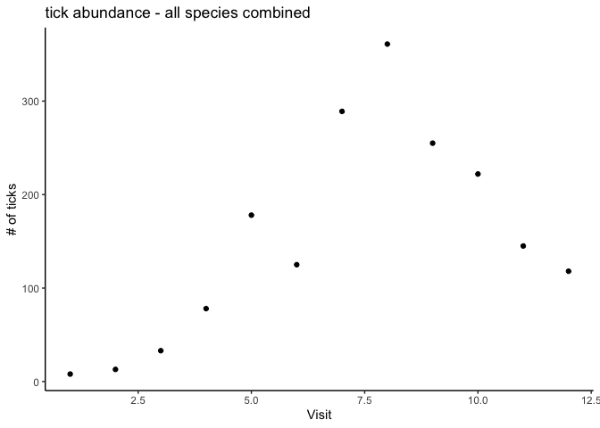
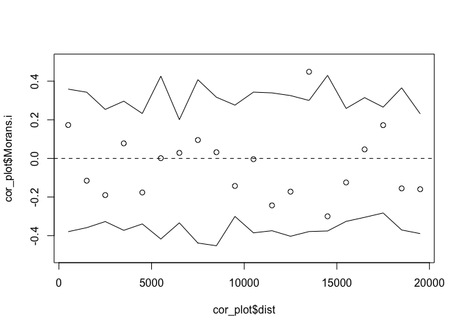
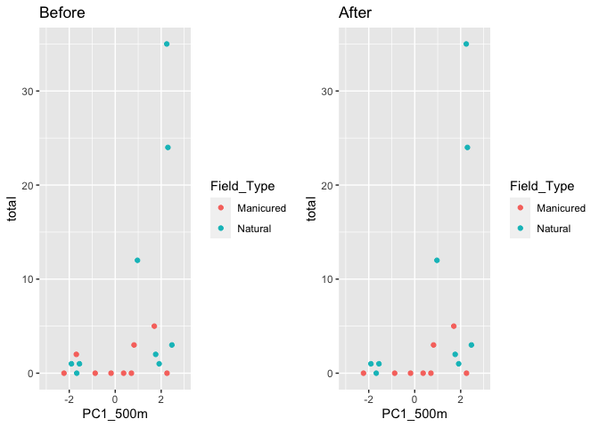

Alachua County Ticks
================
Kimberly Ledger
5/20/2022

-   [Part 1: Explore tick abundance
    data](#part-1-explore-tick-abundance-data)
-   [Part 2: Visualize *Amblyomma americanum*
    data](#part-2-visualize-amblyomma-americanum-data)
-   [Part 3: Visualize *Ixodes scapularis*
    data](#part-3-visualize-ixodes-scapularis-data)
-   [Part 4: Landscape analyses of *Amblyomma
    americanum*](#part-4-landscape-analyses-of-amblyomma-americanum)
    -   [4.1: Prepare data](#41-prepare-data)
    -   [4.2: Test for spatial “scale of
        effect”](#42-test-for-spatial-scale-of-effect)
        -   [PC1 - test for “scale of effect” using a buffer based
            approach](#pc1---test-for-scale-of-effect-using-a-buffer-based-approach)
    -   [4.3: Generalize linear models
        (GLMs)!](#43-generalize-linear-models-glms)
        -   [let’s run glms with a negative binomial
            distribution](#lets-run-glms-with-a-negative-binomial-distribution)
        -   [plot model residuals for top model (full
            dataset)](#plot-model-residuals-for-top-model-full-dataset)
        -   [test for spatial autocorrelation (Moran’s I) (full
            dataset)](#test-for-spatial-autocorrelation-morans-i-full-dataset)
        -   [summary of top model *Amblyomma americanum* model (full
            dataset)](#summary-of-top-model-amblyomma-americanum-model-full-dataset)
        -   [plot the top model for *Amblyomma americanum* (full
            dataset)](#plot-the-top-model-for-amblyomma-americanum-full-dataset)
        -   [screen data by removing potentially problimatic
            sites](#screen-data-by-removing-potentially-problimatic-sites)
        -   [summary of top model *Amblyomma americanum* model (screened
            dataset)](#summary-of-top-model-amblyomma-americanum-model-screened-dataset)
        -   [plot model residuals for top model (screened
            dataset)](#plot-model-residuals-for-top-model-screened-dataset)
        -   [plot the top model for *Amblyomma americanum* (screened
            dataset)](#plot-the-top-model-for-amblyomma-americanum-screened-dataset)
        -   [create a final plot for *A.americanum* (screened
            data)](#create-a-final-plot-for-aamericanum-screened-data)
-   [Part 5: Landscape analyses of *Ixodes
    scapularis*](#part-5-landscape-analyses-of-ixodes-scapularis)
    -   [5.1: Prepare data](#51-prepare-data)
    -   [5.2: Test for spatial “scale of
        effect”](#52-test-for-spatial-scale-of-effect)
        -   [PC1: test for “scale of effect” using a buffer based
            approach](#pc1-test-for-scale-of-effect-using-a-buffer-based-approach)
    -   [5.3: Generalize linear models
        (GLMs)!](#53-generalize-linear-models-glms)
        -   [let’s run glms with a negative binomial
            distribution](#lets-run-glms-with-a-negative-binomial-distribution-1)
        -   [plot model residuals for top model (full
            datset)](#plot-model-residuals-for-top-model-full-datset)
        -   [test for spatial autocorrelation (Moran’s I) (full
            datset)](#test-for-spatial-autocorrelation-morans-i-full-datset)
        -   [plot correlograms to check for spatial autocorrelation
            (full
            dataset)](#plot-correlograms-to-check-for-spatial-autocorrelation-full-dataset)
        -   [summary of top *I. scapularis* model (full
            dataset)](#summary-of-top-i-scapularis-model-full-dataset)
        -   [screen data by removing potentially problematic
            sites](#screen-data-by-removing-potentially-problematic-sites)
        -   [plot model residuals for top model (screened
            datset)](#plot-model-residuals-for-top-model-screened-datset)
        -   [test for spatial autocorrelation (screened
            dataset)](#test-for-spatial-autocorrelation-screened-dataset)
        -   [plot correlograms to check for spatial autocorrelation
            (screened
            dataset)](#plot-correlograms-to-check-for-spatial-autocorrelation-screened-dataset)
        -   [summary of the top *I. scapularis* model (screened
            dataset)](#summary-of-the-top-i-scapularis-model-screened-dataset)
        -   [create a final plot for *I. scapularis* (screened
            dataset)](#create-a-final-plot-for-i-scapularis-screened-dataset)

Load libraries

``` r
library(tidyverse)
library(car)
library(MASS)
library(stargazer)
library(effects)
library(ggplot2)
library(MuMIn)
library(spdep)
library(corrplot)
library(gridExtra)
```

# Part 1: Explore tick abundance data

Read in the raw Alachua County tick dataset

``` r
ticks <- read.csv("AlachuaTicksAllSites.csv")
head(ticks)
```

    ##         Sample_Code Collection_Sample Collection_Box gDNA_Sample      gDNA_Box
    ## 1    HW_3May21_AA_A            AA1007          AAB13    NymAA103 NymAADNAB1Nat
    ## 2     HW_13Apr21_IS              IS83           IXB2        IS83      ISgDNAB1
    ## 3 29RD_12Mar21_AA_A             AA144           AAB2    NymAA104 NymAADNAB1Nat
    ## 4 29RD_12Mar21_AA_B             AA145           AAB2    NymAA105 NymAADNAB1Nat
    ## 5   29RD_20Apr21_AA             AA639           AAB8    NymAA106 NymAADNAB1Nat
    ## 6 29RD_17May21_AA_A            AA1238          AAB16    NymAA107 NymAADNAB1Nat
    ##   Field_Type           Site Site_ID Visit    Date Tick_No_Tube Species
    ## 1    Natural Harmonic Woods      HW     9  5/3/21            1      AA
    ## 2    Natural Harmonic Woods      HW     7 4/13/21            1      IS
    ## 3    Natural        29th Rd    29RD     5 3/12/21            1      AA
    ## 4    Natural        29th Rd    29RD     5 3/12/21            1      AA
    ## 5    Natural        29th Rd    29RD     7 4/20/21            1      AA
    ## 6    Natural        29th Rd    29RD     9 5/17/21            1      AA
    ##   Lifestage  Sex Collection_Method
    ## 1         N <NA>          Flagging
    ## 2         A    M          Dragging
    ## 3         N <NA>          Dragging
    ## 4         N <NA>          Dragging
    ## 5         N <NA>          Dragging
    ## 6         N <NA>          Dragging

How many individuals of each species and life stage were collected?

``` r
ticks %>%
  group_by(Species, Lifestage) %>%
  dplyr::summarise(total = n())
```

    ## # A tibble: 7 × 3
    ## # Groups:   Species [6]
    ##   Species Lifestage total
    ##   <chr>   <chr>     <int>
    ## 1 AA      A           672
    ## 2 AA      N          1042
    ## 3 AM      N             2
    ## 4 DV      A            18
    ## 5 HAE     N             1
    ## 6 IA      A             1
    ## 7 IS      A            89

How many individuals of each species were collected in natural vs
manicured sites?

``` r
ticks %>%
  group_by(Species, Lifestage, Field_Type) %>%
  dplyr::summarise(total = n())
```

    ## # A tibble: 12 × 4
    ## # Groups:   Species, Lifestage [7]
    ##    Species Lifestage Field_Type total
    ##    <chr>   <chr>     <chr>      <int>
    ##  1 AA      A         Manicured     44
    ##  2 AA      A         Natural      628
    ##  3 AA      N         Manicured    102
    ##  4 AA      N         Natural      940
    ##  5 AM      N         Manicured      1
    ##  6 AM      N         Natural        1
    ##  7 DV      A         Manicured      2
    ##  8 DV      A         Natural       16
    ##  9 HAE     N         Natural        1
    ## 10 IA      A         Natural        1
    ## 11 IS      A         Manicured     10
    ## 12 IS      A         Natural       79

How many individuals were collected at each visit? First plot combined,
and then by species, and then by life stage of each species

``` r
visit <- ticks %>%
  group_by(Visit) %>%
  dplyr::summarise(total = n())

ggplot(data = visit, aes(x=Visit, y=total)) + 
  theme_classic() + 
  geom_point() + 
  labs(title = "tick abundance - all species combined", x = "Visit", y = "# of ticks")
```

<!-- -->

``` r
visit_species <- ticks %>%
  group_by(Species, Visit) %>%
  dplyr::summarise(total = n())

ggplot(data = visit_species, aes(x=Visit, y=total, fill = Species)) + 
  theme_classic() + 
  geom_point(aes(color = Species)) + 
  labs(title = "tick abundance - by species", x = "Visit", y = "# of ticks (adults and nymphs)")
```

<!-- -->

``` r
visit_species_lifestage <- ticks %>%
  unite("Spp_Lifestage", Species, Lifestage) %>%
  group_by(Spp_Lifestage, Visit) %>%
  dplyr::summarise(total = n())

ggplot(data = visit_species_lifestage, aes(x=Visit, y=total, fill = Spp_Lifestage)) + 
  theme_classic() + 
  geom_point(aes(color = Spp_Lifestage)) + 
  labs(title = "tick abundance - by species and life stage", x = "Visit", y = "# of ticks")
```

<!-- -->

Make a nice figure for the publication

``` r
require(ochRe)
```

    ## Loading required package: ochRe

    ## 
    ## Attaching package: 'ochRe'

    ## The following object is masked from 'package:spData':
    ## 
    ##     elev

``` r
pal_names <- names(ochre_palettes)

ggplot(data = visit_species, aes(x=Visit, y=total, fill = Species)) + 
  theme_classic() + 
  geom_bar(stat = "identity") + 
  labs(title = "", x = "", y = "number of ticks") + 
  theme(axis.title.x=element_blank(),
        axis.text.x=element_blank(),
        axis.ticks.x=element_blank()) +
  scale_fill_manual(labels = c("A. americanum", "A. maculatum", "D. variabilis", 
                                 "H. leporispalustris", "I. affinis", "I. scapularis"),
                    values = c("#486090", "#786060", "#d8c0a8", "#d8f0f0", "#a890a8", "#f0a860"))  # can change colors here 
```

<!-- -->

``` r
f1 <- ggplot(data = visit_species, aes(x=Visit, y=log1p(total), fill = Species)) + 
  theme_classic() + 
  geom_bar(stat = "identity") + 
  labs(title = "", x = "", y = "log(number of ticks)") + 
  theme(axis.title.x=element_blank(),
        axis.text.x=element_blank(),
        axis.ticks.x=element_blank()) +
  scale_fill_manual(labels = c("A. americanum", "A. maculatum", "D. variabilis", 
                                 "H. leporispalustris", "I. affinis", "I. scapularis"),
                      values = c("#486090", "#786060", "#d8c0a8", "#d8f0f0", "#a890a8", "#f0a860"))  # can change colors here 
f1
```

<!-- -->

Make a nice figure that is colorblindness friendly

``` r
library(viridisLite)

mycol <- viridisLite::viridis(6)

k1 <- ggplot(data = visit_species, aes(x=Visit, y=log1p(total), fill = Species)) + 
  theme_classic() + 
  geom_bar(stat = "identity") + 
  labs(title = "", x = "", y = "log(number of ticks)") + 
  theme(axis.title.x=element_blank(),
        axis.text.x=element_blank(),
        axis.ticks.x=element_blank()) +
  scale_fill_manual(labels = c("A. americanum", "A. maculatum", "D. variabilis", 
                                 "H. leporispalustris", "I. affinis", "I. scapularis"),
                      values = mycol)  # can change colors here 
k1
```

<!-- -->

``` r
#ggsave("Figures/TickAbundanceBySession.png", dpi = 300, width = 10)
```

How does each site differ in tick abundance? **remember:** GA had 0
ticks the entire study

``` r
site1 <- ticks %>%
  group_by(Site_ID) %>%
  dplyr::summarise(total = n())
site1[18,] <- list("GA", 0)

site <- ticks %>%
  group_by(Species, Site_ID, Field_Type) %>%
  dplyr::summarise(total = n())
site[38,] <- list("AA","GA","Manicured",0)

# sort manicured on left and natural on right
site$Site_ID <- factor(site$Site_ID, levels = c("GA","RP","UG","PC","FC","LL","DF","HT","MSM",
                                                "HW","JM","29RD","SW","HC","SF","PP","SR","MSN"))

p1 <- ggplot(data = site, aes(x=Site_ID, y=total, fill =Species)) + 
  theme_classic() + 
  geom_bar(stat = "identity") + 
  labs(x = "Site", y = "number of ticks") + 
  scale_fill_manual(labels = c("A. americanum", "A. maculatum", "D. variabilis", 
                                 "H. leporispalustris", "I. affinis", "I. scapularis"),
                      values = c("#486090", "#786060", "#d8c0a8", "#d8f0f0", "#a890a8", "#f0a860")) 

p2 <- ggplot(data = site, aes(x=Site_ID, y=log1p(total), fill =Species)) + 
  theme_classic() + 
  geom_bar(stat = "identity") + 
  labs(x = "Site", y = "log(number of ticks)") + 
  scale_fill_manual(labels = c("A. americanum", "A. maculatum", "D. variabilis", 
                                 "H. leporispalustris", "I. affinis", "I. scapularis"),
                      values = c("#486090", "#786060", "#d8c0a8", "#d8f0f0", "#a890a8", "#f0a860")) 

#gridExtra::grid.arrange(p1,p2, ncol=2)
p2
```

<!-- -->

``` r
#ggsave("alco_abund_bysite.tiff", dpi = 300)
```

# Part 2: Visualize *Amblyomma americanum* data

Let’s work some more with just *Amblyomma americanum* since it is by far
the most abundant species of tick collected during the study

``` r
aa <- ticks %>%
  filter(Species == "AA")
head(aa)
```

    ##         Sample_Code Collection_Sample Collection_Box gDNA_Sample      gDNA_Box
    ## 1    HW_3May21_AA_A            AA1007          AAB13    NymAA103 NymAADNAB1Nat
    ## 2 29RD_12Mar21_AA_A             AA144           AAB2    NymAA104 NymAADNAB1Nat
    ## 3 29RD_12Mar21_AA_B             AA145           AAB2    NymAA105 NymAADNAB1Nat
    ## 4   29RD_20Apr21_AA             AA639           AAB8    NymAA106 NymAADNAB1Nat
    ## 5 29RD_17May21_AA_A            AA1238          AAB16    NymAA107 NymAADNAB1Nat
    ## 6 29RD_17May21_AA_B            AA1239          AAB16    NymAA108 NymAADNAB1Nat
    ##   Field_Type           Site Site_ID Visit    Date Tick_No_Tube Species
    ## 1    Natural Harmonic Woods      HW     9  5/3/21            1      AA
    ## 2    Natural        29th Rd    29RD     5 3/12/21            1      AA
    ## 3    Natural        29th Rd    29RD     5 3/12/21            1      AA
    ## 4    Natural        29th Rd    29RD     7 4/20/21            1      AA
    ## 5    Natural        29th Rd    29RD     9 5/17/21            1      AA
    ## 6    Natural        29th Rd    29RD     9 5/17/21            1      AA
    ##   Lifestage  Sex Collection_Method
    ## 1         N <NA>          Flagging
    ## 2         N <NA>          Dragging
    ## 3         N <NA>          Dragging
    ## 4         N <NA>          Dragging
    ## 5         N <NA>          Dragging
    ## 6         N <NA>          Dragging

Let’s plot the count of *A.americanum* (nymphs and adults combined) by
visit and site

``` r
aa_visit <- aa %>%
  group_by(Site_ID, Visit) %>%
  dplyr::summarise(total = n())

ggplot(data = aa_visit, aes(x=Visit, y=total, col = Site_ID)) + 
  theme_classic() + 
  geom_point() + 
  labs(title = "A.americanum", x = "Visit", y = "# of ticks")
```

<!-- -->

Let’s take a closer look at the seasonality of *A.americanum* by
combining counts from all sites and keeping visits separate

``` r
aa_allsites <- aa %>%
  group_by(Lifestage, Visit) %>%
  dplyr::summarise(total = n())

g1 <- ggplot(data = aa_allsites, aes(x=Visit, y=total, fill = Lifestage)) + 
  theme_classic() + 
  geom_point(aes(color = Lifestage)) + 
  labs(title = "A.americanum", x = "Visit", y = "# of ticks")

g2 <- ggplot(data = aa_allsites, aes(x=Visit, y=total, fill = Lifestage)) + 
  theme_classic() + 
  geom_smooth(aes(color = Lifestage)) + 
  labs(title = "A.americanum", x = "Visit", y = "# of ticks")

gridExtra::grid.arrange(g1, g2, ncol =2)
```

<!-- -->

**interesting:** Both adults and nymphs of *Amblyomma americanum* have
similar seasonality of peak abundance in Alachua Co. (at least between
January and June)

Now let’s combine counts across all visits and keep the sites seperate

``` r
aa_allvisits <- aa %>%
  group_by(Site_ID, Lifestage) %>%
  dplyr::summarize(total = n(),
            density = (total/12000) * 100)

## add in rows for the sites and life stages with no observations
aa_allvisits[31,] <- list("29RD", "A", 0 , 0)
aa_allvisits[32,] <- list("HW", "A", 0 , 0)
aa_allvisits[33,] <- list("UG", "A", 0, 0)
aa_allvisits[34,] <- list("UG", "N", 0, 0)
aa_allvisits[35,] <- list("GA", "A", 0, 0)
aa_allvisits[36,] <- list("GA", "N", 0, 0)

aa_allvisits$Site_ID <- factor(aa_allvisits$Site_ID, levels = c("GA","UG","HW","RP","JM","PC","29RD","FC","LL","DF","MSM","HT","HC","SW","SF","PP","SR","MSN"
))

ggplot(data = aa_allvisits, aes(x=Site_ID, y=total, fill = Lifestage)) + 
  theme_classic() + 
  geom_bar(stat = "identity") + 
  labs(title = "A.americanum", x = "Site", y = "# of ticks")
```

<!-- -->

# Part 3: Visualize *Ixodes scapularis* data

Let’s investigate *Ixodes scapularis*, as it was the second most
abundant tick species in the study and is of great public health
interest

``` r
is <- ticks %>%
  filter(Species == "IS")
head(is)
```

    ##       Sample_Code Collection_Sample Collection_Box gDNA_Sample gDNA_Box
    ## 1   HW_13Apr21_IS              IS83           IXB2        IS83 ISgDNAB1
    ## 2   JM_04Feb21_IS              IS32           IXB1        IS32 ISgDNAB1
    ## 3 SW_03Feb21_IS_A              IS30           IXB1        IS30 ISgDNAB1
    ## 4 SW_03Feb21_IS_B              IS31           IXB1        IS31 ISgDNAB1
    ## 5   SR_21Dec20_IS              IS01           IXB1        IS01 ISgDNAB1
    ## 6   SR_18Jan21_IS              IS04           IXB1        IS04 ISgDNAB1
    ##   Field_Type           Site Site_ID Visit     Date Tick_No_Tube Species
    ## 1    Natural Harmonic Woods      HW     7  4/13/21            1      IS
    ## 2    Natural     John Mahon      JM     3   2/4/21            1      IS
    ## 3    Natural     Sweetwater      SW     3   2/3/21            1      IS
    ## 4    Natural     Sweetwater      SW     3   2/3/21            1      IS
    ## 5    Natural     Split Rock      SR     1 12/21/20            1      IS
    ## 6    Natural     Split Rock      SR     1  1/18/21            1      IS
    ##   Lifestage Sex Collection_Method
    ## 1         A   M          Dragging
    ## 2         A   F          Dragging
    ## 3         A   F          Flagging
    ## 4         A   M         On_Person
    ## 5         A   F          Flagging
    ## 6         A   F          Flagging

Now let’s plot the count of I.scapularis (rembember there were only
adults collected) by visit and site

``` r
is_visit <- is %>%
  group_by(Site_ID, Visit) %>%
  dplyr::summarise(total = n())

ggplot(data = is_visit, aes(x=Visit, y=total, col = Site_ID)) + 
  theme_classic() + 
  geom_point() + 
  labs(title = "I.scapularis", x = "Visit", y = "# of ticks")
```

<!-- -->
let’s take a closer look at the seasonality of I.scapularis by combining
counts from all sites and keeping visits separate

``` r
is_allsites <- is %>%
  group_by(Lifestage, Visit) %>%
  dplyr::summarise(total = n())

g3 <- ggplot(data = is_allsites, aes(x=Visit, y=total, fill = Lifestage)) + 
  theme_classic() + 
  geom_point(aes(color = Lifestage)) + 
  labs(title = "I.scapularis", x = "Visit", y = "# of ticks")

g4 <- ggplot(data = is_allsites, aes(x=Visit, y=total, fill = Lifestage)) + 
  theme_classic() + 
  geom_smooth(aes(color = Lifestage)) + 
  labs(title = "I.scapularis", x = "Visit", y = "# of ticks")

gridExtra::grid.arrange(g3,g4, ncol=2)
```

<!-- -->

now let’s combine counts across all visits and keep the sites seperate

``` r
is_allvisits <- is %>%
  group_by(Site_ID, Lifestage) %>%
  dplyr::summarize(total = n(),
            density = (total/12000) * 100)

## add in rows for the sites and life stages with no observations
is_allvisits[12,] <- list("29RD", "A", 0 , 0)
is_allvisits[13,] <- list("GA", "A", 0, 0)
is_allvisits[14,] <- list("RP", "A", 0, 0)
is_allvisits[15,] <- list("PC", "A", 0, 0)
is_allvisits[16,] <- list("FC", "A", 0, 0)
is_allvisits[17,] <- list("LL", "A", 0, 0)
is_allvisits[18,] <- list("HT", "A", 0, 0)

is_allvisits$Site_ID <- factor(is_allvisits$Site_ID, levels = c("GA","UG","HW","RP","JM","PC","29RD","FC","LL","DF","MSM","HT","HC","SW","SF","PP","SR","MSN"
))

ggplot(data = is_allvisits, aes(x=Site_ID, y=total, fill = Lifestage)) + 
  theme_classic() + 
  geom_bar(stat = "identity") + 
  labs(title = "I.scapularis", x = "Site", y = "# of ticks")
```

<!-- -->

The order of sites is the *I.scapularis* plot is the same as the *A.
americanum* plot earlier. Just using the eyeball test this shows many of
the sites with high *A. americanum* abundance also have *I.scapularis*,
but there are some deviations from this trend.

# Part 4: Landscape analyses of *Amblyomma americanum*

## 4.1: Prepare data

Read in the covariate data for all 18 sites This file contains
information on if the environment type was manicured or natural, the
proportion of forest landcover and the PC1 and PC2 scores at multiple
spatial scales (250m, 500m, 1km, 2km, 3km, 4km buffers)

``` r
covar <- read.csv("AlCo_SitesCovariates.csv")  ## 18 sites 
head(covar)
```

    ##                 Site Site_ID  Easting Northing Field_Type Forest250m Forest500m
    ## 1       Reserve Park      RP 373075.5  3281598  Manicured  0.0000000  0.0259972
    ## 2 University Gardens      UG 368561.7  3280166  Manicured  0.4059153  0.2280836
    ## 3      Hogtown Creek      HT 370033.7  3285928  Manicured  0.6793893  0.4689848
    ## 4 Possum Creek Park       PC 365990.0  3286586  Manicured  0.4842319  0.3245446
    ## 5     Fred Cone Park      FC 375389.6  3280603  Manicured  0.1525510  0.4584023
    ## 6  Green Acres Park       GA 366138.7  3280294  Manicured  0.6352041  0.5656334
    ##     Forest1km  Forest2km Forest3km Forest4km   PC1_250m    PC2_250m   PC1_500m
    ## 1 0.009046603 0.04787764 0.1523864 0.2497138  3.0888399  1.25403665 -2.2285643
    ## 2 0.132940615 0.15290895 0.1432444 0.1541731  1.1042450 -2.71890707 -1.6918854
    ## 3 0.174897316 0.24949040 0.2753919 0.3340898 -0.4720229  0.26182597 -0.1811466
    ## 4 0.317132210 0.17751376 0.2416931 0.2822197  0.5823618  0.03426844 -0.8718743
    ## 5 0.415052873 0.40032172 0.4285704 0.4357618  1.0914845 -0.03089397  0.7046526
    ## 6 0.459594672 0.26329957 0.2377961 0.2197173 -0.2358455  0.56020279  0.3665116
    ##      PC2_500m    PC1_1km     PC2_1km    PC1_2km     PC2_2km    PC1_3km
    ## 1  1.14772157 -2.2237817  0.83389005 -2.2345973  0.29634256 -1.6579262
    ## 2 -4.17393010 -1.9912260 -1.90230643 -1.8760657 -0.08449422 -1.8529678
    ## 3  0.15115773 -1.4013427  0.04034195 -0.8045536 -0.19268275 -0.5241398
    ## 4  0.05922524 -0.5187457  0.44283357 -0.8368180 -0.25976343 -0.4419081
    ## 5  0.75143021  0.2710480 -0.96944716  0.2085390  0.28946092  0.2753296
    ## 6  0.53614632  0.5772039  0.23898928 -1.2213185  0.06781415 -1.5203214
    ##       PC2_3km    PC1_4km     PC2_4km
    ## 1  0.21477736 -1.7101280 -0.04952885
    ## 2 -0.29752137 -1.8570855 -0.11805117
    ## 3  0.06247605 -0.1973380  0.09175826
    ## 4  0.11303452 -0.2691747  0.27311929
    ## 5  0.36739258 -0.2885019  0.31535917
    ## 6 -0.17733426 -1.3869067 -0.04092310

explore the relationship between different buffers by plotting them
using the package ‘corrplot’

``` r
covar_sub <- covar[,c(6:23)]
M <- cor(covar_sub)
#head(round(M,2))

corrplot(M, type = "upper", order = "hclust")
```

<!-- -->

There is high correlation between proportion of forest and PC1 across
all scales.  
We will need to compare models using individual covariates to determine
the appropriate scale and response variable.

join the covariate data to the *A.americanum* data and summarize total
and density by site

``` r
aa_var <- aa_allvisits %>%
  left_join(covar)
head(aa_var)
```

    ## # A tibble: 6 × 26
    ## # Groups:   Site_ID [4]
    ##   Site_ID Lifestage total density Site    Easting Northing Field_Type Forest250m
    ##   <chr>   <chr>     <int>   <dbl> <chr>     <dbl>    <dbl> <chr>           <dbl>
    ## 1 29RD    N             6  0.05   "29th … 370183. 3284095. Natural         0.338
    ## 2 DF      A            13  0.108  "Dudle… 350804. 3281711. Manicured       0.442
    ## 3 DF      N            14  0.117  "Dudle… 350804. 3281711. Manicured       0.442
    ## 4 FC      A             4  0.0333 "Fred … 375390. 3280603. Manicured       0.153
    ## 5 FC      N            10  0.0833 "Fred … 375390. 3280603. Manicured       0.153
    ## 6 HC      A            25  0.208  "Hatch… 381436. 3285055. Natural         0.833
    ## # … with 17 more variables: Forest500m <dbl>, Forest1km <dbl>, Forest2km <dbl>,
    ## #   Forest3km <dbl>, Forest4km <dbl>, PC1_250m <dbl>, PC2_250m <dbl>,
    ## #   PC1_500m <dbl>, PC2_500m <dbl>, PC1_1km <dbl>, PC2_1km <dbl>,
    ## #   PC1_2km <dbl>, PC2_2km <dbl>, PC1_3km <dbl>, PC2_3km <dbl>, PC1_4km <dbl>,
    ## #   PC2_4km <dbl>

``` r
aa_combined <- aa_allvisits %>%
  group_by(Site_ID) %>%
  dplyr::summarise(total = sum(total),
            density = sum(density)) %>%
  left_join(covar)
head(aa_combined)
```

    ## # A tibble: 6 × 25
    ##   Site_ID total density Site   Easting Northing Field_Type Forest250m Forest500m
    ##   <chr>   <int>   <dbl> <chr>    <dbl>    <dbl> <chr>           <dbl>      <dbl>
    ## 1 GA          0 0       "Gree… 366139. 3280294. Manicured       0.635     0.566 
    ## 2 UG          0 0       "Univ… 368562. 3280166. Manicured       0.406     0.228 
    ## 3 HW          1 0.00833 "Harm… 368536. 3280276. Natural         0.290     0.192 
    ## 4 RP          2 0.0167  "Rese… 373075. 3281598. Manicured       0         0.0260
    ## 5 JM          3 0.025   "John… 365650. 3281144. Natural         0.286     0.134 
    ## 6 PC          5 0.0417  "Poss… 365990. 3286586. Manicured       0.484     0.325 
    ## # … with 16 more variables: Forest1km <dbl>, Forest2km <dbl>, Forest3km <dbl>,
    ## #   Forest4km <dbl>, PC1_250m <dbl>, PC2_250m <dbl>, PC1_500m <dbl>,
    ## #   PC2_500m <dbl>, PC1_1km <dbl>, PC2_1km <dbl>, PC1_2km <dbl>, PC2_2km <dbl>,
    ## #   PC1_3km <dbl>, PC2_3km <dbl>, PC1_4km <dbl>, PC2_4km <dbl>

``` r
aa_combined$Field_Type <- as.factor(aa_combined$Field_Type)
```

## 4.2: Test for spatial “scale of effect”

here I will work with combined adults and nymphs (adults and nymphs have
similar patterns over space and time so it makes sense to combine their
analyses)

### PC1 - test for “scale of effect” using a buffer based approach

``` r
pres.250m<-glm(total ~ PC1_250m, family = "poisson", data = aa_combined)
pres.500m<-glm(total ~ PC1_500m, family = "poisson", data = aa_combined)
pres.1km<-glm(total ~ PC1_1km, family = "poisson", data = aa_combined)
pres.2km<-glm(total ~ PC1_2km, family = "poisson", data = aa_combined)
pres.3km<-glm(total ~ PC1_3km, family = "poisson", data = aa_combined)
pres.4km<-glm(total ~ PC1_4km, family = "poisson", data = aa_combined)


comb.mod<-model.sel(pres.250m, pres.500m, pres.1km, pres.2km, pres.3km, pres.4km)
comb.mod
```

    ## Model selection table 
    ##           (Int) PC1_250 PC1_500 PC1_1km PC1_2km PC1_3km PC1_4km       family df
    ## pres.500m 3.525          0.8293                                 poisson(log)  2
    ## pres.250m 3.884 -0.8437                                         poisson(log)  2
    ## pres.1km  4.062                  0.4287                         poisson(log)  2
    ## pres.2km  4.244                          0.3055                 poisson(log)  2
    ## pres.3km  4.416                                  0.1748         poisson(log)  2
    ## pres.4km  4.474                                          0.1186 poisson(log)  2
    ##              logLik   AICc   delta weight
    ## pres.500m -1016.522 2037.8    0.00      1
    ## pres.250m -1098.726 2202.3  164.41      0
    ## pres.1km  -1373.671 2752.1  714.30      0
    ## pres.2km  -1489.073 2982.9  945.10      0
    ## pres.3km  -1683.140 3371.1 1333.24      0
    ## pres.4km  -1734.343 3473.5 1435.64      0
    ## Models ranked by AICc(x)

``` r
scales<-c(250,500,1000,2000,3000,4000)

ll<-c(logLik(pres.250m),logLik(pres.500m),logLik(pres.1km),logLik(pres.2km),logLik(pres.3km),logLik(pres.4km))
plot(scales,ll, ylab="Log-likelihood", main = "PC1")
lines(scales,ll)
```

<!-- -->

these results indicate that 500m for PC1 is the best scale for Amblyomma
americanum

## 4.3: Generalize linear models (GLMs)!

### let’s run glms with a negative binomial distribution

``` r
nb.glm0 <- glm.nb(total ~ 1, data = aa_combined)
nb.glm2 <- glm.nb(total ~ Field_Type, data = aa_combined)
nb.glm11 <- glm.nb(total ~ PC1_500m, data = aa_combined)
nb.glm12 <- glm.nb(total ~ PC1_500m + Field_Type, data = aa_combined)
nb.glm13 <- glm.nb(total ~ PC1_500m * Field_Type, data = aa_combined)

### compare AICc of models 
MuMIn::AICc(nb.glm0, nb.glm2, nb.glm11, nb.glm12, nb.glm13)
```

    ##          df     AICc
    ## nb.glm0   2 187.2285
    ## nb.glm2   3 181.6323
    ## nb.glm11  3 174.1242
    ## nb.glm12  4 173.4902
    ## nb.glm13  5 176.1766

``` r
stargazer(nb.glm0, nb.glm2, nb.glm11, nb.glm12, nb.glm13, type = "text",
          intercept.bottom = FALSE, 
          single.row=FALSE,     
          notes.append = FALSE, 
          header=FALSE)
```

    ## 
    ## ===============================================================================================================
    ##                                                            Dependent variable:                                 
    ##                            ------------------------------------------------------------------------------------
    ##                                                                   total                                        
    ##                                  (1)              (2)              (3)              (4)              (5)       
    ## ---------------------------------------------------------------------------------------------------------------
    ## Constant                       4.556***         2.786***         3.144***         2.461***         2.474***    
    ##                                (0.405)          (0.478)          (0.305)          (0.377)          (0.361)     
    ##                                                                                                                
    ## Field_TypeNatural                               2.374***                          1.238**          1.058**     
    ##                                                 (0.672)                           (0.525)          (0.532)     
    ##                                                                                                                
    ## PC1_500m:Field_TypeNatural                                                                          0.472      
    ##                                                                                                    (0.330)     
    ##                                                                                                                
    ## PC1_500m                                                         1.129***         0.945***         0.650**     
    ##                                                                  (0.182)          (0.165)          (0.259)     
    ##                                                                                                                
    ## ---------------------------------------------------------------------------------------------------------------
    ## Observations                      18               18               18               18               18       
    ## Log Likelihood                 -92.214          -87.959          -84.205          -82.207          -81.588     
    ## theta                      0.341*** (0.100) 0.501*** (0.156) 0.715*** (0.233) 0.899*** (0.310) 0.967*** (0.338)
    ## Akaike Inf. Crit.              186.429          179.918          172.410          170.413          171.177     
    ## ===============================================================================================================
    ## Note:                                                                               *p<0.1; **p<0.05; ***p<0.01

lowest AICc is for **PC1 at 500m scale** and **Field_Type**  
lowest AICc does not include the interaction term - but many models are
within 2 delta AIC

### plot model residuals for top model (full dataset)

``` r
par(mfrow=c(2,2), mar=c(4,4,2,1))
plot(nb.glm12)
```

<!-- -->
sites 12 and 17 are problimatic…

### test for spatial autocorrelation (Moran’s I) (full dataset)

Before we interpret the models, let’s check whether the assumption of
independent residuals is violated by spatial autocorrelation in the
residuals. To calculate and test Moran’s I, we first need to define
neighbours and spatial weights. There are many ways to define weights.

start by defining weights matrix using several graph types

``` r
coords <- cbind(aa_combined$Easting, aa_combined$Northing)
colnames(coords) <- c("x", "y")
distmat <- as.matrix(dist(coords))
maxdist <- 2/3 * max(distmat) # this is the maximum distance to consider in correlogram/variogram

nb.gab <- spdep::graph2nb(spdep::gabrielneigh(coords), sym = TRUE) 
#plot(nb.gab, coords)
listw.gab <- spdep::nb2listw(nb.gab)

nb.rel <- spdep::graph2nb(spdep::relativeneigh(coords), sym = TRUE) 
#plot(nb.rel, coords)
listw.rel <- spdep::nb2listw(nb.rel)

#distance-based neighbors - can change the distance at which to consider 
neigh <- dnearneigh(x=coords, d1=0, d2=0.5*maxdist, longlat = F)
#plot(neigh, coords)
listw.neigh <- nb2listw(neigh, style = "W")
```

inverse distance weights

``` r
dlist <- spdep::nbdists(nb.gab, coords)
dlist <- lapply(dlist, function(x) 1/x)
listw.d1 <- spdep::nb2listw(nb.gab, style = "W", glist=dlist)

spdep::lm.morantest(nb.glm12, listw.d1) 
```

    ## 
    ##  Global Moran I for regression residuals
    ## 
    ## data:  
    ## model: glm.nb(formula = total ~ PC1_500m + Field_Type, data =
    ## aa_combined, init.theta = 0.899499891, link = log)
    ## weights: listw.d1
    ## 
    ## Moran I statistic standard deviate = 1.2648, p-value = 0.103
    ## alternative hypothesis: greater
    ## sample estimates:
    ## Observed Moran I      Expectation         Variance 
    ##       0.16765296      -0.09688980       0.04374652

test for spatial autocorrelation in explainatory and predictor variables

``` r
spdep::moran.test(aa_combined$total, listw.gab)
```

    ## 
    ##  Moran I test under randomisation
    ## 
    ## data:  aa_combined$total  
    ## weights: listw.gab    
    ## 
    ## Moran I statistic standard deviate = -0.18395, p-value = 0.573
    ## alternative hypothesis: greater
    ## sample estimates:
    ## Moran I statistic       Expectation          Variance 
    ##       -0.08892680       -0.05882353        0.02678138

``` r
spdep::moran.test(aa_combined$PC1_500m, listw.gab)
```

    ## 
    ##  Moran I test under randomisation
    ## 
    ## data:  aa_combined$PC1_500m  
    ## weights: listw.gab    
    ## 
    ## Moran I statistic standard deviate = 3.2639, p-value = 0.0005494
    ## alternative hypothesis: greater
    ## sample estimates:
    ## Moran I statistic       Expectation          Variance 
    ##        0.55781767       -0.05882353        0.03569368

now test model for autocorrelation in the model residuals

``` r
spdep::lm.morantest(nb.glm12, listw.gab) 
```

    ## 
    ##  Global Moran I for regression residuals
    ## 
    ## data:  
    ## model: glm.nb(formula = total ~ PC1_500m + Field_Type, data =
    ## aa_combined, init.theta = 0.899499891, link = log)
    ## weights: listw.gab
    ## 
    ## Moran I statistic standard deviate = 1.3116, p-value = 0.09483
    ## alternative hypothesis: greater
    ## sample estimates:
    ## Observed Moran I      Expectation         Variance 
    ##       0.12865654      -0.10474641       0.03166904

``` r
spdep::lm.morantest(nb.glm12, listw.rel) 
```

    ## 
    ##  Global Moran I for regression residuals
    ## 
    ## data:  
    ## model: glm.nb(formula = total ~ PC1_500m + Field_Type, data =
    ## aa_combined, init.theta = 0.899499891, link = log)
    ## weights: listw.rel
    ## 
    ## Moran I statistic standard deviate = 1.4577, p-value = 0.07247
    ## alternative hypothesis: greater
    ## sample estimates:
    ## Observed Moran I      Expectation         Variance 
    ##       0.20089111      -0.11043964       0.04561667

``` r
spdep::lm.morantest(nb.glm12, listw.neigh) 
```

    ## 
    ##  Global Moran I for regression residuals
    ## 
    ## data:  
    ## model: glm.nb(formula = total ~ PC1_500m + Field_Type, data =
    ## aa_combined, init.theta = 0.899499891, link = log)
    ## weights: listw.neigh
    ## 
    ## Moran I statistic standard deviate = 0.77701, p-value = 0.2186
    ## alternative hypothesis: greater
    ## sample estimates:
    ## Observed Moran I      Expectation         Variance 
    ##      0.004266432     -0.081010163      0.012045134

**no significant spatial autocorrelation** in residuals for any of the
weight matrices

### summary of top model *Amblyomma americanum* model (full dataset)

``` r
stargazer(nb.glm12, type = "text",
          intercept.bottom = FALSE, 
          single.row=FALSE,     
          notes.append = FALSE, 
          header=FALSE)
```

    ## 
    ## =============================================
    ##                       Dependent variable:    
    ##                   ---------------------------
    ##                              total           
    ## ---------------------------------------------
    ## Constant                   2.461***          
    ##                             (0.377)          
    ##                                              
    ## PC1_500m                   0.945***          
    ##                             (0.165)          
    ##                                              
    ## Field_TypeNatural           1.238**          
    ##                             (0.525)          
    ##                                              
    ## ---------------------------------------------
    ## Observations                  18             
    ## Log Likelihood              -82.207          
    ## theta                  0.899*** (0.310)      
    ## Akaike Inf. Crit.           170.413          
    ## =============================================
    ## Note:             *p<0.1; **p<0.05; ***p<0.01

``` r
summary(nb.glm12)
```

    ## 
    ## Call:
    ## glm.nb(formula = total ~ PC1_500m + Field_Type, data = aa_combined, 
    ##     init.theta = 0.899499891, link = log)
    ## 
    ## Deviance Residuals: 
    ##      Min        1Q    Median        3Q       Max  
    ## -2.30982  -1.12039  -0.37648   0.03739   1.79071  
    ## 
    ## Coefficients:
    ##                   Estimate Std. Error z value Pr(>|z|)    
    ## (Intercept)         2.4607     0.3766   6.534 6.42e-11 ***
    ## PC1_500m            0.9446     0.1655   5.709 1.14e-08 ***
    ## Field_TypeNatural   1.2378     0.5249   2.358   0.0184 *  
    ## ---
    ## Signif. codes:  0 '***' 0.001 '**' 0.01 '*' 0.05 '.' 0.1 ' ' 1
    ## 
    ## (Dispersion parameter for Negative Binomial(0.8995) family taken to be 1)
    ## 
    ##     Null deviance: 54.865  on 17  degrees of freedom
    ## Residual deviance: 20.811  on 15  degrees of freedom
    ## AIC: 170.41
    ## 
    ## Number of Fisher Scoring iterations: 1
    ## 
    ## 
    ##               Theta:  0.899 
    ##           Std. Err.:  0.310 
    ## 
    ##  2 x log-likelihood:  -162.413

pseudo r-squared of model

``` r
100*(54.865-20.811)/54.865
```

    ## [1] 62.06871

The pseudo r-squared of the top model = **62.1**.

### plot the top model for *Amblyomma americanum* (full dataset)

``` r
df1 <- expand.grid(PC1_500m = c(-3,-2.5,-2,-1.5,-1,-0.5,0,0.5,1,1.5,2,2.5,3), Field_Type = c("Natural","Manicured"), total = NA)
df1$total <- predict(nb.glm12, newdata = data.frame(df1), type="response")

#plot
plot <-ggplot(data = aa_combined, aes(x=PC1_500m, y=total, group=Field_Type))+
                    geom_point(aes(color=Field_Type, size = 2)) +
                    geom_line(data=df1, size = 2, aes(color=Field_Type)) + 
                    ylab("A.americanum abundance") +
                    xlab("PC1 at 500m")+
                    #ggtitle("PC1 and Environment Type as Predictors of tick count")+
                    theme_bw()+ 
                    theme(panel.grid.major=element_blank(),
                    panel.grid.minor=element_blank(),
                    legend.position = c(0.3,0.8)) +
                    scale_color_discrete(name = "Environment Type", labels = c("manicured", "natural")) +
                    scale_size(guide = 'none')
  

plot.log <-ggplot(data = aa_combined, aes(x=PC1_500m, y=total, group=Field_Type))+
                    geom_point(aes(color=Field_Type, size =2)) +
                    geom_line(data=df1, size = 2, aes(color=Field_Type)) + 
                    ylab("A.americanum abundance") +
                    xlab("PC1 at 500m")+
                    scale_y_log10() +  ## may or may not want to use a log axis.... 
                    #ggtitle("PC1 and Environment Type as Predictors of tick count")+
                    theme_bw()+ 
                    theme(panel.grid.major=element_blank(),
                    panel.grid.minor=element_blank(),
                    legend.position = c(0.3,0.8)) +
                    scale_color_discrete(name = "Environment Type", labels = c("manicured", "natural")) +
                    scale_size(guide = 'none')

grid.arrange(plot, plot.log, ncol = 2)
```

    ## Warning: Transformation introduced infinite values in continuous y-axis

<!-- -->

### screen data by removing potentially problimatic sites

let’s now remove the two sites (12 and 17) that fall outside model
assumptions

``` r
aa_screen <- aa_combined[-c(12,17), ]

plot1 <- ggplot(data = aa_combined, aes(x = PC1_500m, y = total)) +
  geom_point(aes(col = Field_Type)) + 
  xlim(-3,3) + 
  ggtitle("Before")
plot2 <- ggplot(data = aa_screen, aes(x = PC1_500m, y = total)) +
  geom_point(aes(col = Field_Type)) + 
  xlim(-3,3) + 
  ggtitle("After")

gridExtra::grid.arrange(plot1, plot2, ncol=2)
```

<!-- -->

compared all screened models

``` r
nb.glm0.screen <- glm.nb(total ~ 1, data = aa_screen)
nb.glm2.screen <- glm.nb(total ~ Field_Type, data = aa_screen)
nb.glm11.screen <- glm.nb(total ~ PC1_500m, data = aa_screen)
nb.glm12.screen <- glm.nb(total ~ PC1_500m + Field_Type, data = aa_screen)
nb.glm13.screen <- glm.nb(total ~ PC1_500m * Field_Type, data = aa_screen)

AICc(nb.glm0.screen,nb.glm2.screen,nb.glm11.screen,nb.glm12.screen,nb.glm13.screen)
```

    ##                 df     AICc
    ## nb.glm0.screen   2 159.3597
    ## nb.glm2.screen   3 155.2060
    ## nb.glm11.screen  3 140.6958
    ## nb.glm12.screen  4 138.2847
    ## nb.glm13.screen  5 141.4477

### summary of top model *Amblyomma americanum* model (screened dataset)

``` r
summary(nb.glm12.screen)
```

    ## 
    ## Call:
    ## glm.nb(formula = total ~ PC1_500m + Field_Type, data = aa_screen, 
    ##     init.theta = 1.881768818, link = log)
    ## 
    ## Deviance Residuals: 
    ##      Min        1Q    Median        3Q       Max  
    ## -2.59291  -1.08740   0.00373   0.52410   1.45657  
    ## 
    ## Coefficients:
    ##                   Estimate Std. Error z value Pr(>|z|)    
    ## (Intercept)         1.8675     0.3151   5.927 3.09e-09 ***
    ## PC1_500m            1.0032     0.1308   7.667 1.75e-14 ***
    ## Field_TypeNatural   1.2399     0.4132   3.001  0.00269 ** 
    ## ---
    ## Signif. codes:  0 '***' 0.001 '**' 0.01 '*' 0.05 '.' 0.1 ' ' 1
    ## 
    ## (Dispersion parameter for Negative Binomial(1.8818) family taken to be 1)
    ## 
    ##     Null deviance: 96.922  on 15  degrees of freedom
    ## Residual deviance: 18.974  on 13  degrees of freedom
    ## AIC: 134.65
    ## 
    ## Number of Fisher Scoring iterations: 1
    ## 
    ## 
    ##               Theta:  1.882 
    ##           Std. Err.:  0.828 
    ## 
    ##  2 x log-likelihood:  -126.648

``` r
stargazer(nb.glm12, nb.glm12.screen, type = "text",
          intercept.bottom = FALSE, 
          single.row=FALSE,     
          notes.append = FALSE, 
          header=FALSE)
```

    ## 
    ## ==================================================
    ##                         Dependent variable:       
    ##                   --------------------------------
    ##                                total              
    ##                         (1)              (2)      
    ## --------------------------------------------------
    ## Constant              2.461***        1.868***    
    ##                       (0.377)          (0.315)    
    ##                                                   
    ## PC1_500m              0.945***        1.003***    
    ##                       (0.165)          (0.131)    
    ##                                                   
    ## Field_TypeNatural     1.238**         1.240***    
    ##                       (0.525)          (0.413)    
    ##                                                   
    ## --------------------------------------------------
    ## Observations             18              16       
    ## Log Likelihood        -82.207          -64.324    
    ## theta             0.899*** (0.310) 1.882** (0.828)
    ## Akaike Inf. Crit.     170.413          134.648    
    ## ==================================================
    ## Note:                  *p<0.1; **p<0.05; ***p<0.01

``` r
stargazer(nb.glm0.screen, nb.glm2.screen, nb.glm11.screen, nb.glm12.screen, type = "text",
          intercept.bottom = FALSE, 
          single.row=FALSE,     
          notes.append = FALSE, 
          header=FALSE)
```

    ## 
    ## ===================================================================================
    ##                                          Dependent variable:                       
    ##                   -----------------------------------------------------------------
    ##                                                 total                              
    ##                         (1)              (2)              (3)             (4)      
    ## -----------------------------------------------------------------------------------
    ## Constant              4.355***         2.575***        2.598***        1.868***    
    ##                       (0.439)          (0.524)          (0.278)         (0.315)    
    ##                                                                                    
    ## Field_TypeNatural                      2.386***                        1.240***    
    ##                                        (0.735)                          (0.413)    
    ##                                                                                    
    ## PC1_500m                                               1.100***        1.003***    
    ##                                                         (0.158)         (0.131)    
    ##                                                                                    
    ## -----------------------------------------------------------------------------------
    ## Observations             16               16              16              16       
    ## Log Likelihood        -78.218          -74.603          -67.348         -64.324    
    ## theta             0.325*** (0.102) 0.472*** (0.157) 1.143** (0.447) 1.882** (0.828)
    ## Akaike Inf. Crit.     158.437          153.206          138.696         134.648    
    ## ===================================================================================
    ## Note:                                                   *p<0.1; **p<0.05; ***p<0.01

pseudo r-squared of screened model

``` r
100*(96.922-18.974)/96.922
```

    ## [1] 80.42343

the pseudo r-squared of the screened model = **80.4**.

The AIC and LL are also much better for the screened data set. And, the
models estimates and significance are minimally affected by the sites
that fall outside assumptions.

### plot model residuals for top model (screened dataset)

``` r
par(mfrow=c(2,2), mar=c(4,4,2,1))
plot(nb.glm12.screen)
```

<!-- --> the
screened model looks good!

### plot the top model for *Amblyomma americanum* (screened dataset)

``` r
df1 <- expand.grid(PC1_500m = c(-3,-2.5,-2,-1.5,-1,-0.5,0,0.5,1,1.5,2,2.5,3), Field_Type = c("Natural","Manicured"), total = NA)
df1$total <- predict(nb.glm12.screen, newdata = data.frame(df1), type="response")

#plot
plot <-ggplot(data = aa_combined, aes(x=PC1_500m, y=total, group=Field_Type))+
                    geom_point(aes(color=Field_Type, size = 2)) +
                    geom_line(data=df1, size = 2, aes(color=Field_Type)) + 
                    ylab("A.americanum abundance") +
                    xlab("PC1 at 500m")+
                    #ggtitle("PC1 and Environment Type as Predictors of tick count")+
                    theme_bw()+ 
                    theme(panel.grid.major=element_blank(),
                    panel.grid.minor=element_blank(),
                    legend.position = c(0.3,0.8)) +
                    scale_color_discrete(name = "Environment Type", labels = c("manicured", "natural")) +
                    scale_size(guide = 'none')
  

plot.log <-ggplot(data = aa_combined, aes(x=PC1_500m, y=total, group=Field_Type))+
                    geom_point(aes(color=Field_Type, size =2)) +
                    geom_line(data=df1, size = 2, aes(color=Field_Type)) + 
                    ylab("A.americanum abundance") +
                    xlab("PC1 at 500m")+
                    scale_y_log10() +  ## may or may not want to use a log axis.... 
                    #ggtitle("PC1 and Environment Type as Predictors of tick count")+
                    theme_bw()+ 
                    theme(panel.grid.major=element_blank(),
                    panel.grid.minor=element_blank(),
                    legend.position = c(0.3,0.8)) +
                    scale_color_discrete(name = "Environment Type", labels = c("manicured", "natural")) +
                    scale_size(guide = 'none')

grid.arrange(plot, plot.log, ncol = 2)
```

    ## Warning: Transformation introduced infinite values in continuous y-axis

<!-- -->

### create a final plot for *A.americanum* (screened data)

get 95%CI for model prediction

``` r
## grad the inverse link function
ilink <- family(nb.glm12.screen)$linkinv
## add predition, fit, and se.fit on the **link** scale
ndata <- expand.grid(PC1_500m = c(-3,-2.5,-2,-1.5,-1,-0.5,0,0.5,1,1.5,2,2.5,3), Field_Type = c("Manicured", "Natural"))
ndata$total <- predict(nb.glm12.screen, newdata = data.frame(ndata), type = "response")
ndata <- bind_cols(ndata, setNames(as_tibble(predict(nb.glm12.screen, ndata, se.fit = TRUE)[1:2]),
                                   c('fit_link','se_link')))
## create the interval and backtransform
ndata <- mutate(ndata,
                fit_resp  = ilink(fit_link),
                right_upr = ilink(fit_link + (2 * se_link)),
                right_lwr = ilink(fit_link - (2 * se_link)))
## show
ndata
```

    ##    PC1_500m Field_Type       total   fit_link   se_link    fit_resp   right_upr
    ## 1      -3.0  Manicured   0.3191457 -1.1421075 0.5648655   0.3191457   0.9876997
    ## 2      -2.5  Manicured   0.5270281 -0.6405015 0.5109234   0.5270281   1.4642532
    ## 3      -2.0  Manicured   0.8703190 -0.1388955 0.4599697   0.8703190   2.1837508
    ## 4      -1.5  Manicured   1.4372198  0.3627105 0.4131116   1.4372198   3.2835784
    ## 5      -1.0  Manicured   2.3733834  0.8643165 0.3719005   2.3733834   4.9934023
    ## 6      -0.5  Manicured   3.9193371  1.3659225 0.3384056   3.9193371   7.7116629
    ## 7       0.0  Manicured   6.4722807  1.8675285 0.3150976   6.4722807  12.1547940
    ## 8       0.5  Manicured  10.6881383  2.3691346 0.3043259  10.6881383  19.6442812
    ## 9       1.0  Manicured  17.6500842  2.8707406 0.3074112  17.6500842  32.6407978
    ## 10      1.5  Manicured  29.1468417  3.3723466 0.3239579  29.1468417  55.7157255
    ## 11      2.0  Manicured  48.1322564  3.8739526 0.3520732  48.1322564  97.3291833
    ## 12      2.5  Manicured  79.4842244  4.3755586 0.3892582  79.4842244 173.1355730
    ## 13      3.0  Manicured 131.2579629  4.8771646 0.4331836 131.2579629 312.1649666
    ## 14     -3.0    Natural   1.1026948  0.0977570 0.5932716   1.1026948   3.6121396
    ## 15     -2.5    Natural   1.8209585  0.5993630 0.5362093   1.8209585   5.3216402
    ## 16     -2.0    Natural   3.0070785  1.1009690 0.4812787   3.0070785   7.8736872
    ## 17     -1.5    Natural   4.9658030  1.6025750 0.4292991   4.9658030  11.7185514
    ## 18     -1.0    Natural   8.2003842  2.1041810 0.3814785   8.2003842  17.5866141
    ## 19     -0.5    Natural  13.5418788  2.6057870 0.3395787  13.5418788  26.7074993
    ## 20      0.0    Natural  22.3626693  3.1073930 0.3060411  22.3626693  41.2427490
    ## 21      0.5    Natural  36.9290691  3.6089990 0.2838456  36.9290691  65.1498700
    ## 22      1.0    Natural  60.9836031  4.1106050 0.2757448  60.9836031 105.8575774
    ## 23      1.5    Natural 100.7065689  4.6122110 0.2829517 100.7065689 177.3481059
    ## 24      2.0    Natural 166.3039325  5.1138170 0.3043811 166.3039325 305.6923608
    ## 25      2.5    Natural 274.6295330  5.6154230 0.3373332 274.6295330 539.2015643
    ## 26      3.0    Natural 453.5153152  6.1170290 0.3788129 453.5153152 967.4413645
    ##      right_lwr
    ## 1    0.1031224
    ## 2    0.1896930
    ## 3    0.3468597
    ## 4    0.6290700
    ## 5    1.1280783
    ## 6    1.9919444
    ## 7    3.4464111
    ## 8    5.8152446
    ## 9    9.5440521
    ## 10  15.2477307
    ## 11  23.8028721
    ## 12  36.4901436
    ## 13  55.1908596
    ## 14   0.3366248
    ## 15   0.6230955
    ## 16   1.1484481
    ## 17   2.1042873
    ## 18   3.8237208
    ## 19   6.8663291
    ## 20  12.1255006
    ## 21  20.9325997
    ## 22  35.1321080
    ## 23  57.1859111
    ## 24  90.4733043
    ## 25 139.8760415
    ## 26 212.5980434

plot it - FIGURE FOR PUBLICATIONS

``` r
mycol <- viridisLite::viridis(3)

aa.plt <- ggplot(aa_screen, aes(x = PC1_500m, y = total, group = Field_Type)) +
  geom_point(aes(fill=Field_Type), cex = 4, alpha = 0.7, 
             color = "black", pch = 21) + 
  scale_fill_manual(values = mycol, name = "Habitat Type", labels = c("manicured", "natural")) +
  geom_line(data = ndata, size =2, aes(color=Field_Type)) + 
  geom_ribbon(data = ndata,
                  aes(ymin = right_lwr, ymax = right_upr, fill=Field_Type),
                  alpha = 0.2) +
  scale_color_manual(values = mycol, name = "Habitat Type", labels = c("manicured", "natural")) +
  theme_bw() +
  theme(panel.grid.major=element_blank(),
                    panel.grid.minor=element_blank(),
                    legend.position = c(0.3,0.7)) +
                    scale_size(guide = 'none') +
  ylab("A. americanum abundance") +
  xlab("Development Gradient")

#aa.plt

#remove the two sites with zeros so that they do not make the plot look funny on the log axis 
aa_screen2 <- aa_screen[-c(1,2),]

aa.plt.log <- ggplot(aa_screen2, aes(x = PC1_500m, y = total, group = Field_Type)) +
  geom_point(aes(fill=Field_Type), cex = 4, alpha = 0.7, 
             color = "black", pch = 21) +
  scale_fill_manual(values = mycol, name = "Habitat Type", labels = c("manicured", "natural")) + 
  geom_line(data = ndata, size =2, aes(color=Field_Type)) + 
  geom_ribbon(data = ndata,
                  aes(ymin = right_lwr, ymax = right_upr, fill=Field_Type),
                  alpha = 0.2)+ 
    scale_color_manual(values = mycol, name = "Habitat Type", labels = c("manicured", "natural")) +
  theme_bw() +
  theme(legend.position = "none") +
  theme(panel.grid.major=element_blank(),
                    panel.grid.minor=element_blank()) +
  scale_y_log10(labels = scales::number_format(accuracy = 1)) +
  ylab("A. americanum abundance") +
  xlab("Development Gradient")

grid.arrange(aa.plt, aa.plt.log, ncol = 2)
```

<!-- -->

# Part 5: Landscape analyses of *Ixodes scapularis*

## 5.1: Prepare data

join the covariate data to the *Ixodes scapularis* data

``` r
is_var <- is_allvisits %>%
  left_join(covar)
head(is_var)
```

    ## # A tibble: 6 × 26
    ## # Groups:   Site_ID [6]
    ##   Site_ID Lifestage total density Site    Easting Northing Field_Type Forest250m
    ##   <chr>   <chr>     <int>   <dbl> <chr>     <dbl>    <dbl> <chr>           <dbl>
    ## 1 DF      A             3 0.025   "Dudle… 350804. 3281711. Manicured       0.442
    ## 2 HC      A            35 0.292   "Hatch… 381436. 3285055. Natural         0.833
    ## 3 HW      A             1 0.00833 "Harmo… 368536. 3280276. Natural         0.290
    ## 4 JM      A             1 0.00833 "John … 365650. 3281144. Natural         0.286
    ## 5 MSM     A             5 0.0417  "Morni… 376482. 3281179. Manicured       0.767
    ## 6 MSN     A            24 0.2     "Morni… 376592. 3281485. Natural         0.737
    ## # … with 17 more variables: Forest500m <dbl>, Forest1km <dbl>, Forest2km <dbl>,
    ## #   Forest3km <dbl>, Forest4km <dbl>, PC1_250m <dbl>, PC2_250m <dbl>,
    ## #   PC1_500m <dbl>, PC2_500m <dbl>, PC1_1km <dbl>, PC2_1km <dbl>,
    ## #   PC1_2km <dbl>, PC2_2km <dbl>, PC1_3km <dbl>, PC2_3km <dbl>, PC1_4km <dbl>,
    ## #   PC2_4km <dbl>

``` r
is_combined <- is_allvisits %>%
  group_by(Site_ID) %>%
  dplyr::summarise(total = sum(total),
            density = sum(density)) %>%
  left_join(covar)
head(is_combined)
```

    ## # A tibble: 6 × 25
    ##   Site_ID total density Site   Easting Northing Field_Type Forest250m Forest500m
    ##   <chr>   <int>   <dbl> <chr>    <dbl>    <dbl> <chr>           <dbl>      <dbl>
    ## 1 GA          0 0       "Gree… 366139. 3280294. Manicured       0.635     0.566 
    ## 2 UG          2 0.0167  "Univ… 368562. 3280166. Manicured       0.406     0.228 
    ## 3 HW          1 0.00833 "Harm… 368536. 3280276. Natural         0.290     0.192 
    ## 4 RP          0 0       "Rese… 373075. 3281598. Manicured       0         0.0260
    ## 5 JM          1 0.00833 "John… 365650. 3281144. Natural         0.286     0.134 
    ## 6 PC          0 0       "Poss… 365990. 3286586. Manicured       0.484     0.325 
    ## # … with 16 more variables: Forest1km <dbl>, Forest2km <dbl>, Forest3km <dbl>,
    ## #   Forest4km <dbl>, PC1_250m <dbl>, PC2_250m <dbl>, PC1_500m <dbl>,
    ## #   PC2_500m <dbl>, PC1_1km <dbl>, PC2_1km <dbl>, PC1_2km <dbl>, PC2_2km <dbl>,
    ## #   PC1_3km <dbl>, PC2_3km <dbl>, PC1_4km <dbl>, PC2_4km <dbl>

``` r
is_combined$Field_Type <- as.factor(is_combined$Field_Type)
```

## 5.2: Test for spatial “scale of effect”

test for “scale of effect” using a buffer based approach for the final
go i should probably derive more scales but for now i will work with
what there is

### PC1: test for “scale of effect” using a buffer based approach

``` r
pres.250m<-glm(total ~ PC1_250m, family = "poisson", data = is_combined)
pres.500m<-glm(total ~ PC1_500m, family = "poisson", data = is_combined)
pres.1km<-glm(total ~ PC1_1km, family = "poisson", data = is_combined)
pres.2km<-glm(total ~ PC1_2km, family = "poisson", data = is_combined)
pres.3km<-glm(total ~ PC1_3km, family = "poisson", data = is_combined)
pres.4km<-glm(total ~ PC1_4km, family = "poisson", data = is_combined)

comb.mod<-model.sel(pres.250m, pres.500m, pres.1km, pres.2km, pres.3km, pres.4km)
comb.mod
```

    ## Model selection table 
    ##            (Int) PC1_250 PC1_500 PC1_1km PC1_2km PC1_3km PC1_4km       family
    ## pres.500m 0.4867           0.874                                 poisson(log)
    ## pres.1km  0.7729                  0.6031                         poisson(log)
    ## pres.2km  0.9631                          0.4771                 poisson(log)
    ## pres.250m 1.0190 -0.7698                                         poisson(log)
    ## pres.4km  1.2460                                          0.3047 poisson(log)
    ## pres.3km  1.2240                                   0.331         poisson(log)
    ##           df   logLik  AICc delta weight
    ## pres.500m  2  -80.669 166.1  0.00  0.997
    ## pres.1km   2  -86.667 178.1 12.00  0.002
    ## pres.2km   2  -89.088 183.0 16.84  0.000
    ## pres.250m  2  -91.228 187.3 21.12  0.000
    ## pres.4km   2 -102.680 210.2 44.02  0.000
    ## pres.3km   2 -103.464 211.7 45.59  0.000
    ## Models ranked by AICc(x)

``` r
scales<-c(250,500,1000,2000,3000,4000)

ll<-c(logLik(pres.250m),logLik(pres.500m),logLik(pres.1km),logLik(pres.2km),logLik(pres.3km),logLik(pres.4km))
plot(scales,ll, ylab="Log-likelihood", main = "PC1")
lines(scales,ll)
```

<!-- -->
these results indicate that 500m and 1km for PC1 is the best scale for
*I.scapularis adults*

## 5.3: Generalize linear models (GLMs)!

### let’s run glms with a negative binomial distribution

``` r
nb.glm0 <- glm.nb(total ~ 1, data = is_combined)
nb.glm1 <- glm.nb(total ~ Field_Type, data = is_combined)
nb.glm8 <- glm.nb(total ~ PC1_500m, data = is_combined)
nb.glm9 <- glm.nb(total ~ PC1_500m + Field_Type, data = is_combined)
nb.glm10 <- glm.nb(total ~ PC1_500m * Field_Type, data = is_combined)

### compare AICc of models
MuMIn::AICc(nb.glm0, nb.glm1, nb.glm8, nb.glm9, nb.glm10)
```

    ##          df     AICc
    ## nb.glm0   2 91.54595
    ## nb.glm1   3 88.92499
    ## nb.glm8   3 86.52100
    ## nb.glm9   4 86.69970
    ## nb.glm10  5 89.86801

``` r
stargazer(nb.glm0, nb.glm1, nb.glm8, nb.glm9, nb.glm10, type = "text",
          intercept.bottom = FALSE, 
          single.row=FALSE,     
          notes.append = FALSE, 
          header=FALSE)
```

    ## 
    ## ==========================================================================================================
    ##                                                          Dependent variable:                              
    ##                            -------------------------------------------------------------------------------
    ##                                                                 total                                     
    ##                                  (1)             (2)             (3)             (4)             (5)      
    ## ----------------------------------------------------------------------------------------------------------
    ## Constant                      1.598***          0.105           0.645          -0.169          -0.052     
    ##                                (0.438)         (0.580)         (0.410)         (0.531)         (0.520)    
    ##                                                                                                           
    ## Field_TypeNatural                             2.067***                         1.371**          1.088     
    ##                                                (0.765)                         (0.666)         (0.739)    
    ##                                                                                                           
    ## PC1_500m:Field_TypeNatural                                                                      0.404     
    ##                                                                                                (0.458)    
    ##                                                                                                           
    ## PC1_500m                                                      0.752***        0.620***          0.354     
    ##                                                                (0.242)         (0.216)         (0.371)    
    ##                                                                                                           
    ## ----------------------------------------------------------------------------------------------------------
    ## Observations                     18              18              18              18              18       
    ## Log Likelihood                 -44.373         -41.605         -40.403         -38.811         -38.434    
    ## theta                      0.308** (0.121) 0.470** (0.205) 0.576** (0.264) 0.802** (0.407) 0.832** (0.422)
    ## Akaike Inf. Crit.              90.746          87.211          84.807          83.623          84.868     
    ## ==========================================================================================================
    ## Note:                                                                          *p<0.1; **p<0.05; ***p<0.01

top model (using AIC) includes both **PC1** and **field type** variable
but **no interaction term**

### plot model residuals for top model (full datset)

``` r
par(mfrow=c(2,2), mar=c(4,4,2,1))
plot(nb.glm9) #PC1 @ 500m
```

<!-- --> site
2 could be probematic for PC1

### test for spatial autocorrelation (Moran’s I) (full datset)

start by defining weights matrix using several graph types (this is a
repeat of the same code used for *A.americanum*)

``` r
coords <- cbind(aa_combined$Easting, aa_combined$Northing)
colnames(coords) <- c("x", "y")
distmat <- as.matrix(dist(coords))
maxdist <- 2/3 * max(distmat) # this is the maximum distance to consider in correlogram/variogram

nb.gab <- spdep::graph2nb(spdep::gabrielneigh(coords), sym = TRUE) 
#plot(nb.gab, coords)
listw.gab <- spdep::nb2listw(nb.gab)

nb.rel <- spdep::graph2nb(spdep::relativeneigh(coords), sym = TRUE) 
#plot(nb.rel, coords)
listw.rel <- spdep::nb2listw(nb.rel)

#distance-based neighbors - can change the distance at which to consider 
neigh <- dnearneigh(x=coords, d1=0, d2=0.5*maxdist, longlat = F)
#plot(neigh, coords)
listw.neigh <- nb2listw(neigh, style = "W")
```

test for spatial autocorrelation in explainatory and predictor variables
- gabrial

``` r
spdep::moran.test(is_combined$total, listw.gab)
```

    ## 
    ##  Moran I test under randomisation
    ## 
    ## data:  is_combined$total  
    ## weights: listw.gab    
    ## 
    ## Moran I statistic standard deviate = 2.875, p-value = 0.00202
    ## alternative hypothesis: greater
    ## sample estimates:
    ## Moran I statistic       Expectation          Variance 
    ##        0.36996484       -0.05882353        0.02224464

``` r
spdep::moran.test(is_combined$PC1_500m, listw.gab)
```

    ## 
    ##  Moran I test under randomisation
    ## 
    ## data:  is_combined$PC1_500m  
    ## weights: listw.gab    
    ## 
    ## Moran I statistic standard deviate = 3.2639, p-value = 0.0005494
    ## alternative hypothesis: greater
    ## sample estimates:
    ## Moran I statistic       Expectation          Variance 
    ##        0.55781767       -0.05882353        0.03569368

yes there is autocorrelation in the response and predictor variables
(using the gabriel weights)

test for spatial autocorrelation in explainatory and predictor variables
- relative

``` r
spdep::moran.test(is_combined$total, listw.rel)
```

    ## 
    ##  Moran I test under randomisation
    ## 
    ## data:  is_combined$total  
    ## weights: listw.rel    
    ## 
    ## Moran I statistic standard deviate = 3.8904, p-value = 5.004e-05
    ## alternative hypothesis: greater
    ## sample estimates:
    ## Moran I statistic       Expectation          Variance 
    ##        0.65430075       -0.05882353        0.03360027

``` r
spdep::moran.test(is_combined$PC1_500m, listw.rel)
```

    ## 
    ##  Moran I test under randomisation
    ## 
    ## data:  is_combined$PC1_500m  
    ## weights: listw.rel    
    ## 
    ## Moran I statistic standard deviate = 2.0962, p-value = 0.01803
    ## alternative hypothesis: greater
    ## sample estimates:
    ## Moran I statistic       Expectation          Variance 
    ##        0.42816186       -0.05882353        0.05397205

yes there is autocorrelation in the response and predictor variables
(using the relative weights)

test for spatial autocorrelation in explainatory and predictor variables
- neighbor

``` r
spdep::moran.test(is_combined$total, listw.neigh)
```

    ## 
    ##  Moran I test under randomisation
    ## 
    ## data:  is_combined$total  
    ## weights: listw.neigh    
    ## 
    ## Moran I statistic standard deviate = 0.39793, p-value = 0.3453
    ## alternative hypothesis: greater
    ## sample estimates:
    ## Moran I statistic       Expectation          Variance 
    ##      -0.021024161      -0.058823529       0.009022961

``` r
spdep::moran.test(is_combined$PC1_500m, listw.neigh)
```

    ## 
    ##  Moran I test under randomisation
    ## 
    ## data:  is_combined$PC1_500m  
    ## weights: listw.neigh    
    ## 
    ## Moran I statistic standard deviate = 1.8916, p-value = 0.02928
    ## alternative hypothesis: greater
    ## sample estimates:
    ## Moran I statistic       Expectation          Variance 
    ##        0.16771013       -0.05882353        0.01434256

there is autocorrelation in the predictor variables, but NOT response
(using the neighborhood weights)

now test model for autocorrelation in the residuals - PC1 at 500m

``` r
spdep::lm.morantest(nb.glm9, listw.gab) 
```

    ## 
    ##  Global Moran I for regression residuals
    ## 
    ## data:  
    ## model: glm.nb(formula = total ~ PC1_500m + Field_Type, data =
    ## is_combined, init.theta = 0.80187564, link = log)
    ## weights: listw.gab
    ## 
    ## Moran I statistic standard deviate = 1.6445, p-value = 0.05004
    ## alternative hypothesis: greater
    ## sample estimates:
    ## Observed Moran I      Expectation         Variance 
    ##       0.14399039      -0.18175250       0.03923694

``` r
spdep::lm.morantest(nb.glm9, listw.rel) 
```

    ## 
    ##  Global Moran I for regression residuals
    ## 
    ## data:  
    ## model: glm.nb(formula = total ~ PC1_500m + Field_Type, data =
    ## is_combined, init.theta = 0.80187564, link = log)
    ## weights: listw.rel
    ## 
    ## Moran I statistic standard deviate = 1.9896, p-value = 0.02332
    ## alternative hypothesis: greater
    ## sample estimates:
    ## Observed Moran I      Expectation         Variance 
    ##       0.23380474      -0.19068724       0.04552036

``` r
spdep::lm.morantest(nb.glm9, listw.neigh) 
```

    ## 
    ##  Global Moran I for regression residuals
    ## 
    ## data:  
    ## model: glm.nb(formula = total ~ PC1_500m + Field_Type, data =
    ## is_combined, init.theta = 0.80187564, link = log)
    ## weights: listw.neigh
    ## 
    ## Moran I statistic standard deviate = 2.0888, p-value = 0.01836
    ## alternative hypothesis: greater
    ## sample estimates:
    ## Observed Moran I      Expectation         Variance 
    ##       0.13353396      -0.14203771       0.01740528

there is spatial autocorrelation in model residuals using the relative
and neighbor weights

check correlograms for where the spatial autocorrelation may be occuring
in the model

### plot correlograms to check for spatial autocorrelation (full dataset)

add a function to plot correlograms

``` r
icorrelogram <- function(locations,z, binsize, maxdist){
  
  distbin <- seq(0,maxdist,by=binsize)
  Nbin <- length(distbin)-1
  moran.results <- data.frame("dist"= rep(NA,Nbin), "Morans.i"=NA,"null.lcl"=NA, "null.ucl"=NA)
  
  for (i in 1:Nbin){
    d.start<-distbin[i] 
    d.end<-distbin[i+1]
    neigh <- dnearneigh(x=locations, d1=d.start, d.end, longlat=F)
    wts <- nb2listw(neighbours=neigh, style='B', zero.policy=T)
    mor.i <- moran.mc(x=z, listw=wts, nsim=200, alternative="greater", zero.policy=T)  #note alternative is for P-value, so only 'significant if positive autocorrelation
    
    moran.results[i, "dist"]<-(d.end+d.start)/2 
    moran.results[i, "Morans.i"]<-mor.i$statistic                                               #observed moran's i
    moran.results[i, "null.lcl"]<-quantile(mor.i$res, probs = 0.025,na.rm = T)#95% null envelope    
    moran.results[i, "null.ucl"]<-quantile(mor.i$res, probs = 0.975,na.rm = T)#95% null envelope
  }
  return(moran.results)
}
```

plot a correlogram for the models using the indicator correlogram
function

``` r
# save residuals for negative binomial models 
nb.glm9.res <- residuals(nb.glm9, type = "deviance")

#models 
cor_plot <-icorrelogram(locations=coords, z=nb.glm9.res, binsize=1000,maxdist= 20000)

round(head(cor_plot ,3),2)
```

    ##   dist Morans.i null.lcl null.ucl
    ## 1  500     0.17    -0.38     0.36
    ## 2 1500    -0.12    -0.36     0.34
    ## 3 2500    -0.19    -0.33     0.25

``` r
#plot correlogram
plot(cor_plot$dist, cor_plot$Morans.i, ylim = c(-0.5, 0.5))
abline(h=0, lty = "dashed")
lines(cor_plot$dist, cor_plot$null.lcl)
lines(cor_plot$dist, cor_plot$null.ucl)
```

<!-- -->

there is only spatial autocorrelation at one point and it is at a fairly
large lag distance

from what i can see from Fletcher’s book, methods to account for spatial
autocorrelation mostly address the issue at small lag distances, not
intermediate to large. so i am going to move forward with the model as
is.

### summary of top *I. scapularis* model (full dataset)

``` r
summary(nb.glm9)
```

    ## 
    ## Call:
    ## glm.nb(formula = total ~ PC1_500m + Field_Type, data = is_combined, 
    ##     init.theta = 0.80187564, link = log)
    ## 
    ## Deviance Residuals: 
    ##     Min       1Q   Median       3Q      Max  
    ## -1.6320  -1.1464  -0.7445   0.6170   1.5476  
    ## 
    ## Coefficients:
    ##                   Estimate Std. Error z value Pr(>|z|)   
    ## (Intercept)        -0.1689     0.5306  -0.318  0.75019   
    ## PC1_500m            0.6205     0.2160   2.873  0.00406 **
    ## Field_TypeNatural   1.3714     0.6655   2.061  0.03934 * 
    ## ---
    ## Signif. codes:  0 '***' 0.001 '**' 0.01 '*' 0.05 '.' 0.1 ' ' 1
    ## 
    ## (Dispersion parameter for Negative Binomial(0.8019) family taken to be 1)
    ## 
    ##     Null deviance: 36.215  on 17  degrees of freedom
    ## Residual deviance: 18.487  on 15  degrees of freedom
    ## AIC: 83.623
    ## 
    ## Number of Fisher Scoring iterations: 1
    ## 
    ## 
    ##               Theta:  0.802 
    ##           Std. Err.:  0.407 
    ## 
    ##  2 x log-likelihood:  -75.623

pseudo r-squared of model

``` r
100*(36.215-18.487)/36.215 
```

    ## [1] 48.95209

plot the effects of PC1 and Enviro type

``` r
df1 <- expand.grid(PC1_500m = c(-3,-2.5,-2,-1.5,-1,-0.5,0,0.5,1,1.5,2,2.5,3), Field_Type = c("Natural","Manicured"), total = NA)

df1$total <- predict(nb.glm9, newdata = data.frame(df1), type="response")

#plot
plot <-ggplot(data = is_combined, aes(x=PC1_500m, y=total, group=Field_Type))+
                    geom_point(aes(color=Field_Type, size = 2)) +
                    geom_line(data=df1, size = 2, aes(color=Field_Type)) + 
                    ylab("I. scapularis abundance") +
                    xlab("PC1 at 500m")+
                    #ggtitle("PC1 and Environment Type as Predictors of tick count")+
                    theme_bw()+ 
                    theme(panel.grid.major=element_blank(),
                    panel.grid.minor=element_blank(),
                    legend.position = c(0.3,0.8)) +
                    scale_color_discrete(name = "Environment Type", labels = c("manicured", "natural"))+
                    scale_size(guide = 'none')
  

plot.log <- ggplot(data = is_combined, aes(x=PC1_500m, y=total, group=Field_Type))+
                    geom_point(aes(color=Field_Type, size =2)) +
                    geom_line(data=df1, size = 2, aes(color=Field_Type)) + 
                    ylab("I. scapularis abundance") +
                    xlab("PC1 at 500m")+
                    scale_y_log10() +  ## may or may not want to use a log axis.... 
                    #ggtitle("PC1 and Environment Type as Predictors of tick count")+
                    theme_bw()+ 
                    theme(panel.grid.major=element_blank(),
                    panel.grid.minor=element_blank(),
                    legend.position = c(0.3,0.8)) +
                    scale_color_discrete(name = "Environment Type", labels = c("manicured", "natural")) +
                    scale_size(guide = 'none')

grid.arrange(plot, plot.log, ncol = 2)
```

    ## Warning: Transformation introduced infinite values in continuous y-axis

<!-- -->

### screen data by removing potentially problematic sites

how does removing the sites that were violating models influence things?
for now just remove site 2 for PC1 analyses

``` r
is_screen <- is_combined[-c(2), ]

plot1 <- ggplot(data = is_combined, aes(x = PC1_500m, y = total)) +
  geom_point(aes(col = Field_Type)) + 
  xlim(-3,3) + 
  ggtitle("Before")
plot2 <- ggplot(data = is_screen, aes(x = PC1_500m, y = total)) +
  geom_point(aes(col = Field_Type)) + 
  xlim(-3,3) + 
  ggtitle("After")

gridExtra::grid.arrange(plot1, plot2, ncol=2)
```

<!-- -->

rerun models using the screened dataset

``` r
#### compare model results for full and screened glm 
nb.glm0.reduced <- glm.nb(total ~ 1, data = is_screen)
nb.glm1.reduced <- glm.nb(total ~ Field_Type, data = is_screen)
nb.glm8.reduced <- glm.nb(total ~ PC1_500m , data = is_screen)
nb.glm9.reduced <- glm.nb(total ~ PC1_500m + Field_Type, data = is_screen)
nb.glm10.reduced <- glm.nb(total ~ PC1_500m * Field_Type, data = is_screen)

AICc(nb.glm0.reduced, nb.glm1.reduced ,nb.glm8.reduced ,nb.glm9.reduced ,nb.glm10.reduced )
```

    ##                  df     AICc
    ## nb.glm0.reduced   2 86.35672
    ## nb.glm1.reduced   3 84.30552
    ## nb.glm8.reduced   3 80.97665
    ## nb.glm9.reduced   4 79.38121
    ## nb.glm10.reduced  5 83.04529

``` r
stargazer(nb.glm8.reduced, nb.glm9.reduced, type = "text",
          intercept.bottom = FALSE, 
          single.row=FALSE,     
          notes.append = FALSE, 
          header=FALSE)
```

    ## 
    ## =================================================
    ##                         Dependent variable:      
    ##                   -------------------------------
    ##                                total             
    ##                         (1)             (2)      
    ## -------------------------------------------------
    ## Constant               0.361          -0.765     
    ##                       (0.483)         (0.628)    
    ##                                                  
    ## PC1_500m             0.908***        0.825***    
    ##                       (0.284)         (0.248)    
    ##                                                  
    ## Field_TypeNatural                     1.721**    
    ##                                       (0.716)    
    ##                                                  
    ## -------------------------------------------------
    ## Observations            17              17       
    ## Log Likelihood        -37.565         -35.024    
    ## theta             0.570** (0.272) 0.846** (0.429)
    ## Akaike Inf. Crit.     79.131          76.048     
    ## =================================================
    ## Note:                 *p<0.1; **p<0.05; ***p<0.01

``` r
stargazer(nb.glm0.reduced, nb.glm1.reduced, nb.glm8.reduced, nb.glm9.reduced, type = "text",
          intercept.bottom = FALSE, 
          single.row=FALSE,     
          notes.append = FALSE, 
          header=FALSE)
```

    ## 
    ## =================================================================================
    ##                                         Dependent variable:                      
    ##                   ---------------------------------------------------------------
    ##                                                total                             
    ##                         (1)             (2)             (3)             (4)      
    ## ---------------------------------------------------------------------------------
    ## Constant             1.633***          0.000           0.361          -0.765     
    ##                       (0.469)         (0.646)         (0.483)         (0.628)    
    ##                                                                                  
    ## Field_TypeNatural                    2.172***                         1.721**    
    ##                                       (0.831)                         (0.716)    
    ##                                                                                  
    ## PC1_500m                                             0.908***        0.825***    
    ##                                                       (0.284)         (0.248)    
    ##                                                                                  
    ## ---------------------------------------------------------------------------------
    ## Observations            17              17              17              17       
    ## Log Likelihood        -41.750         -39.230         -37.565         -35.024    
    ## theta             0.282** (0.115) 0.427** (0.192) 0.570** (0.272) 0.846** (0.429)
    ## Akaike Inf. Crit.     85.500          82.459          79.131          76.048     
    ## =================================================================================
    ## Note:                                                 *p<0.1; **p<0.05; ***p<0.01

### plot model residuals for top model (screened datset)

``` r
par(mfrow=c(2,2), mar=c(4,4,2,1))
plot(nb.glm9.reduced)
```

<!-- --> the
reduced model for PC1_500m is looking pretty good

### test for spatial autocorrelation (screened dataset)

the PC1 at 500m is an improvement to the original model so i will move
forwared using the screened dataset

``` r
#must redo weigh matrices to not include site 2
coords.screen <- coords[-2, ]

nb.gab.screen <- spdep::graph2nb(spdep::gabrielneigh(coords.screen), sym = TRUE) 
#plot(nb.gab.screen, coords.screen)
listw.gab.screen <- spdep::nb2listw(nb.gab.screen)

nb.rel.screen <- spdep::graph2nb(spdep::relativeneigh(coords.screen), sym = TRUE) 
#plot(nb.rel.screen, coords.screen)
listw.rel.screen <- spdep::nb2listw(nb.rel.screen)

#distance-based neighbors 
neigh.screen <- dnearneigh(x=coords.screen, d1=0, d2=0.5*maxdist, longlat = F)
#plot(neigh.screen, coords.screen)
listw.neigh.screen <- nb2listw(neigh.screen, style = "W")


spdep::lm.morantest(nb.glm9.reduced, listw.gab.screen) 
```

    ## 
    ##  Global Moran I for regression residuals
    ## 
    ## data:  
    ## model: glm.nb(formula = total ~ PC1_500m + Field_Type, data =
    ## is_screen, init.theta = 0.8463850464, link = log)
    ## weights: listw.gab.screen
    ## 
    ## Moran I statistic standard deviate = 1.3158, p-value = 0.09411
    ## alternative hypothesis: greater
    ## sample estimates:
    ## Observed Moran I      Expectation         Variance 
    ##       0.06366157      -0.24622154       0.05546174

``` r
spdep::lm.morantest(nb.glm9.reduced, listw.rel.screen) 
```

    ## 
    ##  Global Moran I for regression residuals
    ## 
    ## data:  
    ## model: glm.nb(formula = total ~ PC1_500m + Field_Type, data =
    ## is_screen, init.theta = 0.8463850464, link = log)
    ## weights: listw.rel.screen
    ## 
    ## Moran I statistic standard deviate = 1.514, p-value = 0.06502
    ## alternative hypothesis: greater
    ## sample estimates:
    ## Observed Moran I      Expectation         Variance 
    ##       0.09787073      -0.25365580       0.05391202

``` r
spdep::lm.morantest(nb.glm9.reduced, listw.neigh.screen) 
```

    ## 
    ##  Global Moran I for regression residuals
    ## 
    ## data:  
    ## model: glm.nb(formula = total ~ PC1_500m + Field_Type, data =
    ## is_screen, init.theta = 0.8463850464, link = log)
    ## weights: listw.neigh.screen
    ## 
    ## Moran I statistic standard deviate = 1.9585, p-value = 0.02509
    ## alternative hypothesis: greater
    ## sample estimates:
    ## Observed Moran I      Expectation         Variance 
    ##       0.14264019      -0.17240174       0.02587631

now only the neighboorhood matrix has significant spatial
autocorrelation

### plot correlograms to check for spatial autocorrelation (screened dataset)

``` r
# save residuals for negative binomial models 
nb.glm9.reduced.res <- residuals(nb.glm9.reduced, type = "deviance")


cor_plot <-icorrelogram(locations=coords.screen, z=nb.glm9.reduced.res, binsize=1000,maxdist= 20000)

round(head(cor_plot ,3),2)
```

    ##   dist Morans.i null.lcl null.ucl
    ## 1  500     0.07    -0.34     0.29
    ## 2 1500    -0.14    -0.31     0.26
    ## 3 2500    -0.06    -0.35     0.26

``` r
#plot correlogram
plot(cor_plot$dist, cor_plot$Morans.i, ylim = c(-0.5, 0.5))
abline(h=0, lty = "dashed")
lines(cor_plot$dist, cor_plot$null.lcl)
lines(cor_plot$dist, cor_plot$null.ucl)
```

<!-- -->

only one point barely falls outside the 95% CI so i believe we are good
to go

### summary of the top *I. scapularis* model (screened dataset)

``` r
summary(nb.glm9.reduced)
```

    ## 
    ## Call:
    ## glm.nb(formula = total ~ PC1_500m + Field_Type, data = is_screen, 
    ##     init.theta = 0.8463850464, link = log)
    ## 
    ## Deviance Residuals: 
    ##     Min       1Q   Median       3Q      Max  
    ## -1.5995  -1.0769  -0.6338   0.4178   1.0562  
    ## 
    ## Coefficients:
    ##                   Estimate Std. Error z value Pr(>|z|)    
    ## (Intercept)        -0.7645     0.6276  -1.218 0.223128    
    ## PC1_500m            0.8254     0.2483   3.324 0.000888 ***
    ## Field_TypeNatural   1.7212     0.7156   2.405 0.016159 *  
    ## ---
    ## Signif. codes:  0 '***' 0.001 '**' 0.01 '*' 0.05 '.' 0.1 ' ' 1
    ## 
    ## (Dispersion parameter for Negative Binomial(0.8464) family taken to be 1)
    ## 
    ##     Null deviance: 37.133  on 16  degrees of freedom
    ## Residual deviance: 15.421  on 14  degrees of freedom
    ## AIC: 76.048
    ## 
    ## Number of Fisher Scoring iterations: 1
    ## 
    ## 
    ##               Theta:  0.846 
    ##           Std. Err.:  0.429 
    ## 
    ##  2 x log-likelihood:  -68.048

pseudo r-squared of model

``` r
100*(37.133-15.421)/37.133 
```

    ## [1] 58.4709

the reduced model has a much better R2 than the original

### create a final plot for *I. scapularis* (screened dataset)

get model predictions and 95%CI - this is using the screened dataset

``` r
## grad the inverse link function
ilink <- family(nb.glm9.reduced)$linkinv
## add predition, fit, and se.fit on the **link** scale
ndata <- expand.grid(PC1_500m = c(-3,-2.5,-2,-1.5,-1,-0.5,0,0.5,1,1.5,2,2.5,3), Field_Type = c("Manicured", "Natural"))
ndata$total <- predict(nb.glm9.reduced, newdata = data.frame(ndata), type = "response")
ndata <- bind_cols(ndata, setNames(as_tibble(predict(nb.glm9.reduced, ndata, se.fit = TRUE)[1:2]),
                                   c('fit_link','se_link')))
## create the interval and backtransform
ndata <- mutate(ndata,
                fit_resp  = ilink(fit_link),
                right_upr = ilink(fit_link + (2 * se_link)),
                right_lwr = ilink(fit_link - (2 * se_link)))
## show
ndata
```

    ##    PC1_500m Field_Type       total    fit_link   se_link    fit_resp
    ## 1      -3.0  Manicured  0.03913889 -3.24063868 1.1445431  0.03913889
    ## 2      -2.5  Manicured  0.05913360 -2.82795602 1.0393343  0.05913360
    ## 3      -2.0  Manicured  0.08934291 -2.41527335 0.9387665  0.08934291
    ## 4      -1.5  Manicured  0.13498513 -2.00259068 0.8444994  0.13498513
    ## 5      -1.0  Manicured  0.20394437 -1.58990801 0.7588844  0.20394437
    ## 6      -0.5  Manicured  0.30813251 -1.17722535 0.6851728  0.30813251
    ## 7       0.0  Manicured  0.46554679 -0.76454268 0.6275730  0.46554679
    ## 8       0.5  Manicured  0.70337858 -0.35186001 0.5908162  0.70337858
    ## 9       1.0  Manicured  1.06271043  0.06082266 0.5788864  1.06271043
    ## 10      1.5  Manicured  1.60561253  0.47350533 0.5932833  1.60561253
    ## 11      2.0  Manicured  2.42586459  0.88618799 0.6322108  2.42586459
    ## 12      2.5  Manicured  3.66515513  1.29887066 0.6915387  3.66515513
    ## 13      3.0  Manicured  5.53755644  1.71155333 0.7665447  5.53755644
    ## 14     -3.0    Natural  0.21883326 -1.51944520 1.1391423  0.21883326
    ## 15     -2.5    Natural  0.33062763 -1.10676254 1.0244772  0.33062763
    ## 16     -2.0    Natural  0.49953387 -0.69407987 0.9123002  0.49953387
    ## 17     -1.5    Natural  0.75472850 -0.28139720 0.8036539  0.75472850
    ## 18     -1.0    Natural  1.14029325  0.13128547 0.7001838  1.14029325
    ## 19     -0.5    Natural  1.72282974  0.54396813 0.6045535  1.72282974
    ## 20      0.0    Natural  2.60296402  0.95665080 0.5210972  2.60296402
    ## 21      0.5    Natural  3.93272854  1.36933347 0.4565409  3.93272854
    ## 22      1.0    Natural  5.94182388  1.78201614 0.4196984  5.94182388
    ## 23      1.5    Natural  8.97729673  2.19469880 0.4179637  8.97729673
    ## 24      2.0    Natural 13.56348795  2.60738147 0.4517416 13.56348795
    ## 25      2.5    Natural 20.49260604  3.02006414 0.5140789 20.49260604
    ## 26      3.0    Natural 30.96157154  3.43274681 0.5960818 30.96157154
    ##      right_upr   right_lwr
    ## 1    0.3861411 0.003967080
    ## 2    0.4727033 0.007397415
    ## 3    0.5840666 0.013666518
    ## 4    0.7308172 0.024932343
    ## 5    0.9304014 0.044704691
    ## 6    1.2130287 0.078271560
    ## 7    1.6333013 0.132696776
    ## 8    2.2927967 0.215780767
    ## 9    3.3824338 0.333887827
    ## 10   5.2596891 0.490141442
    ## 11   8.5900932 0.685070449
    ## 12  14.6135331 0.919241227
    ## 13  25.6525457 1.195379660
    ## 14   2.1357962 0.022421613
    ## 15   2.5655987 0.042607843
    ## 16   3.0972682 0.080565865
    ## 17   3.7656125 0.151267583
    ## 18   4.6258169 0.281089527
    ## 19   5.7723257 0.514202148
    ## 20   7.3805288 0.918013044
    ## 21   9.8003226 1.578147417
    ## 22  13.7551441 2.566695832
    ## 23  20.7101981 3.891409264
    ## 24  33.4772009 5.495328181
    ## 25  57.2954879 7.329493436
    ## 26 101.9936405 9.398810624

plot it

``` r
mycol <- viridisLite::viridis(3)

is.plt <- ggplot(is_screen, aes(x = PC1_500m, y = total, group = Field_Type)) +
  geom_point(aes(fill=Field_Type), cex = 4, alpha = 0.7, 
             color = "black", pch = 21) +
  scale_fill_manual(values = mycol, name = "Habitat Type", labels = c("manicured", "natural")) +
  geom_line(data = ndata, size =2, aes(color=Field_Type)) + 
  geom_ribbon(data = ndata,
                  aes(ymin = right_lwr, ymax = right_upr, fill=Field_Type),
                  alpha = 0.2)+ 
  scale_color_manual(values = mycol, name = "Habitat Type", labels = c("manicured", "natural")) +
  theme_bw() +
  theme(legend.position = "none") +
  theme(panel.grid.major=element_blank(),
                    panel.grid.minor=element_blank()) +
  scale_size(guide = 'none') +
  ylab("I. scapularis abundance") +
  xlab("Development Gradient")

is_screen2 <- is_screen[-c(1,3,5,6,7,8,11),]

is.plt.log <- ggplot(is_screen2, aes(x = PC1_500m, y = total, group = Field_Type)) +
  geom_point(aes(fill=Field_Type), cex = 4, alpha = 0.7, 
             color = "black", pch = 21) +
  scale_fill_manual(values = mycol, name = "Habitat Type", labels = c("manicured", "natural")) +
  geom_line(data = ndata, size =2, aes(color=Field_Type)) + 
  geom_ribbon(data = ndata,
                  aes(ymin = right_lwr, ymax = right_upr, fill=Field_Type),
                  alpha = 0.1)+ 
  scale_color_manual(values = mycol, name = "Habitat Type", labels = c("manicured", "natural")) +
  theme_bw() +
  theme(legend.position = "none") +
  theme(panel.grid.major=element_blank(),
                    panel.grid.minor=element_blank()) +
  scale_size(guide = 'none') +
  scale_y_log10(labels = scales::number_format(accuracy = 1)) +
  ylab("I. scapularis abundance") +
  xlab("Development Gradient")

grid.arrange(is.plt, is.plt.log, ncol = 2)
```

<!-- -->

put all the plots together…

``` r
#grid.arrange(aa.plt, aa.plt.log, is.plt, is.plt.log, ncol = 2)
```

``` r
library(cowplot)

final_plot <- ggdraw()+
  draw_plot(aa.plt, x=0, y=0.5, width = 0.5, height =0.5)+
  draw_plot(aa.plt.log, x=0.5, y=0.5, width = 0.5, height =0.5)+
  draw_plot(is.plt,x=0, y=0, width = 0.5, height =0.5 )+
  draw_plot(is.plt.log, x=0.5, y=0, width = 0.5, height =0.5)+
  draw_plot_label(c("A","B","C","D"), c(0, 0.5, 0, 0.5), c(1,1,0.5,0.5), size=10)

final_plot
```

<!-- -->

``` r
#ggsave("Figures/TickAbundanceModels.png", dpi = 300)
```
